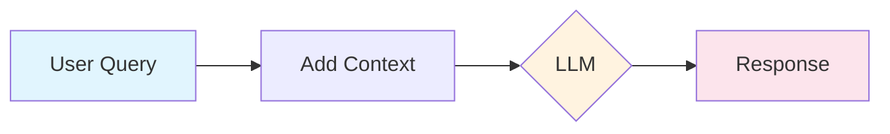
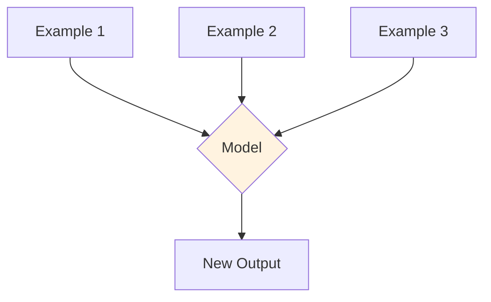
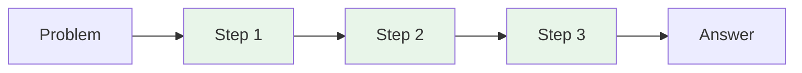
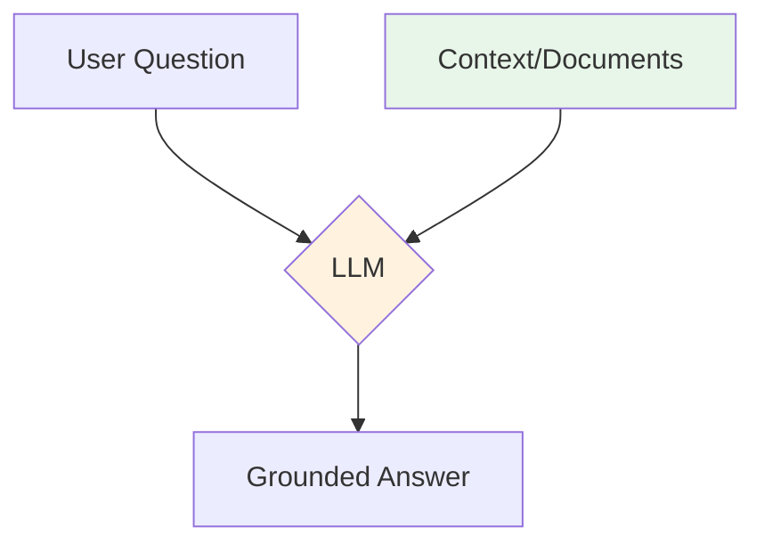
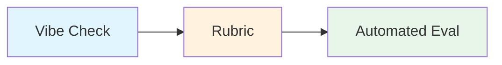
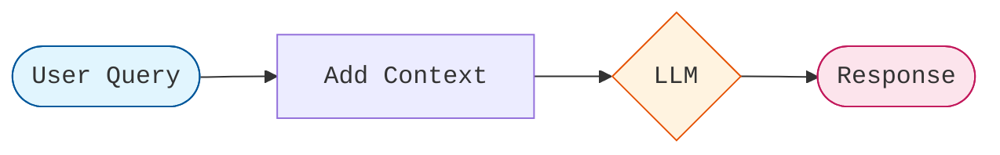
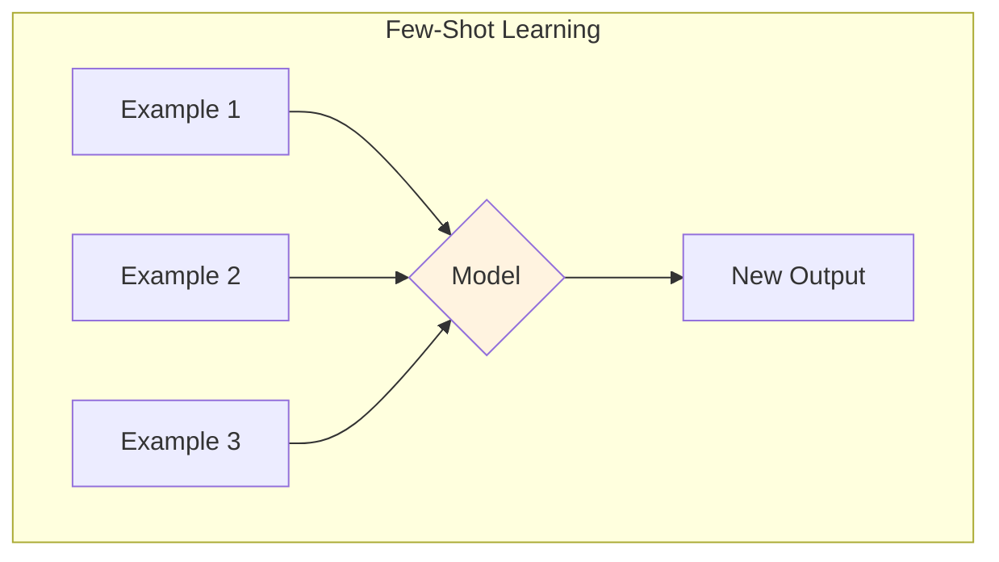

# Session 1: Vibe Check
## Slide Deck Specification

*AIE9 - AI Engineering Bootcamp*
*January 2026*

---

## Slide 1: Title Slide

### Content
**Session 1: Vibe Check**

Check the Vibes on Your LLM Application

*AI Engineering Bootcamp - Cohort 9*

### Visual
- AI Makerspace logo
- Session number badge
- Welcoming imagery

### Speaker Notes
Welcome to the AI Engineering Bootcamp, Cohort 9! This is Session 1: Vibe Check. Today we'll cover the fundamentals of building LLM applications, learn about prompt engineering, and introduce our first evaluation methodology — the vibe check. By the end, you'll understand how to prototype LLM apps and assess their quality.

---

## Slide 2: Learning Objectives

### Content
By the end of this session, you will:

1. **Understand** course structure and certification requirements
2. **Master** the Chat Completions API and message roles
3. **Apply** few-shot learning and chain-of-thought prompting
4. **Implement** context engineering to improve responses
5. **Evaluate** outputs using vibe checks

### Visual
- Five objective cards with icons
- Progress tracker showing Session 1 of 21

### Speaker Notes
These objectives build from understanding to application. First we cover the course mechanics, then dive into the technical fundamentals of prompt engineering, and finally learn how to evaluate your work. The vibe check is your introduction to systematic evaluation.

---

## Slide 3: What is an LLM Application?

### Content
**The Simplest LLM App:**

```
User Query → Context → LLM → Response
```

**Key insight**: The quality of output depends on the quality of input.

**Components:**
- Input: User's question or task
- Context: Relevant information
- Model: GPT-4o, GPT-4o-mini, etc.
- Output: Generated response

### Visual


### Speaker Notes
Every LLM application follows this basic pattern. The user provides input, we add relevant context, the model processes it, and returns a response. What makes AI engineering challenging is optimizing each step — especially the context. This is what we call context engineering.

---

## Slide 4: The Chat Completions API

### Content
**Three Message Roles:**

| Role | Purpose |
|------|---------|
| `system` | Sets behavior and personality |
| `user` | Human input |
| `assistant` | Model's responses |

```python
messages = [
    {"role": "system", "content": "You are helpful."},
    {"role": "user", "content": "Hello!"},
    {"role": "assistant", "content": "Hi! How can I help?"},
    {"role": "user", "content": "What is AI?"}
]
```

### Visual
- Diagram showing message flow
- Color-coded role labels

### Speaker Notes
The Chat Completions API uses a message-based format. System sets the model's behavior — think of it as the model's persona and instructions. User contains human input. Assistant contains the model's previous responses, which is useful for conversation history and few-shot learning. Understanding this structure is foundational.

**Reference:** https://platform.openai.com/docs/guides/chat-completions

---

## Slide 5: Prompt Engineering Fundamentals

### Content
> **"Prompt engineering is the core skill of AI engineering."**

**The Three Pillars:**
1. **Clarity** — Be specific about what you want
2. **Context** — Provide relevant background
3. **Constraints** — Define boundaries and format

**Bad**: "Summarize this"
**Good**: "Summarize in 3 bullet points, each under 20 words"

### Visual
- Three pillar diagram
- Before/after prompt comparison

### Speaker Notes
Prompt engineering is crafting inputs to get desired outputs. The three pillars are clarity, context, and constraints. Clarity means being specific. Context means providing background information. Constraints means defining the format and boundaries. The difference between a bad prompt and a good one can be dramatic.

**Reference:** https://platform.claude.com/docs/en/build-with-claude/prompt-engineering/overview

---

## Slide 6: Few-Shot Learning

### Content
> **"Scaling language models dramatically improves few-shot performance."**
> — Brown et al., GPT-3 Paper, 2020

**The Pattern:**
1. Provide examples of the task
2. Model learns the pattern
3. Apply to new inputs

**No fine-tuning required!**

### Visual


### Speaker Notes
Few-shot learning is one of the most powerful prompting techniques. Instead of fine-tuning the model, you simply show it examples of what you want. The GPT-3 paper demonstrated that larger models get dramatically better at learning from examples. You can use this for classification, formatting, style matching, and many other tasks.

**Reference:** https://arxiv.org/abs/2005.14165

---

## Slide 7: Few-Shot in Practice

### Content
**Sentiment Classification Example:**

```python
messages = [
    {"role": "system", "content": "Classify sentiment."},
    # Example 1
    {"role": "user", "content": "Love it!"},
    {"role": "assistant", "content": "Positive"},
    # Example 2
    {"role": "user", "content": "Terrible!"},
    {"role": "assistant", "content": "Negative"},
    # Actual query
    {"role": "user", "content": "It's okay I guess."}
]
# Output: Neutral
```

### Visual
- Code with annotations
- Arrow showing pattern flow

### Speaker Notes
Here's few-shot learning in practice. We use the assistant role to show example outputs. The model sees the pattern: input text, classification label. When we provide the actual query, it follows the pattern. Notice we didn't tell the model the rules — we showed them. This is more reliable than describing what you want.

---

## Slide 8: Chain-of-Thought Prompting

### Content
> **"Generating a chain of thought — a series of intermediate reasoning steps — significantly improves the ability of large language models to perform complex reasoning."**
> — Wei et al., 2022

**The Magic Words:**
```
"Think step by step."
```

### Visual


### Speaker Notes
Chain-of-thought prompting asks the model to show its reasoning. This dramatically improves performance on math, logic, and multi-step problems. The simplest way to trigger it is adding "Think step by step" to your prompt. The model will break down the problem before giving an answer, which reduces errors.

**Reference:** https://arxiv.org/abs/2201.11903

---

## Slide 9: CoT in Action

### Content
**Without CoT:**
"What is 23 × 17?" → "391" *(sometimes wrong)*

**With CoT:**
"What is 23 × 17? Think step by step."

→ "Let me work through this:
   - 23 × 17 = 23 × (10 + 7)
   - = 23 × 10 + 23 × 7
   - = 230 + 161
   - = 391"

**Result:** More accurate, explainable answers

### Visual
- Side-by-side comparison
- Highlighted reasoning steps

### Speaker Notes
Here's the dramatic difference. Without chain-of-thought, the model might make errors on multi-step problems. With it, the model shows its work, catches mistakes, and arrives at correct answers more reliably. The bonus is you can see the reasoning, which helps with debugging and building trust.

---

## Slide 10: Context Engineering

### Content
**The Core Pattern:**

```python
prompt = f"""Context:
{relevant_information}

Question: {user_question}

Answer based on the context above."""
```

**Why it works:**
- Grounds responses in specific information
- Reduces hallucinations
- Enables domain-specific answers

### Visual


### Speaker Notes
Context engineering is adding relevant information to your prompts. This is the foundation of RAG — Retrieval-Augmented Generation — which we'll formalize in Session 2. The key insight is that LLMs can only use what's in their training data OR what you provide in the prompt. By adding context, you give them information they couldn't otherwise access.

**Reference:** https://arxiv.org/abs/2005.11401

---

## Slide 11: What is a Vibe Check?

### Content
> **"LLM outputs are non-deterministic, which makes response quality hard to assess."**
> — LangSmith Documentation

**A vibe check is:**
- Informal, qualitative evaluation
- Manual review of outputs
- Building intuition about model behavior

**Questions to ask:**
- Does this feel right?
- Is it helpful? Accurate? Appropriate?
- What patterns do you notice?

### Visual
- Checklist illustration
- Human reviewing outputs

### Speaker Notes
Before building formal evaluation systems, AI engineers run vibe checks. This is manual review of model outputs to build intuition. You test with various queries, read the responses, and note patterns. What works? What doesn't? What tone does it use? This human judgment is the starting point for all evaluation.

**Reference:** https://docs.langchain.com/langsmith/evaluation-concepts

---

## Slide 12: The VibeCheck Research

### Content
**ICLR 2025 Finding:**

> "Users have found Llama3 outputs tend to be more friendly compared to outputs from GPT-4 and Claude which tend to be more formal."
> — Dunlap et al., 2024

**Key Insight:**
"Vibes" — tone, formatting, style — predict user preferences with 61% accuracy.

### Visual
- Paper citation
- Comparison diagram of model "vibes"

### Speaker Notes
The VibeCheck paper from ICLR 2025 validated what practitioners intuited: models have distinct "vibes" that users notice. These subtle differences in tone, formatting, and style influence preferences. The research shows vibes can be discovered automatically and quantified. This connects informal vibe checks to systematic evaluation.

**Reference:** https://arxiv.org/abs/2410.12851

---

## Slide 13: From Vibes to Metrics

### Content
**The Evolution:**

```
Vibe Check → Rubric → Automated Eval
   (informal)  (structured)  (scalable)
```

**Success Criteria (Anthropic):**
- **Specific**: What exactly is "good"?
- **Measurable**: How do you quantify it?
- **Achievable**: Is 100% realistic?
- **Relevant**: Does it matter for users?

### Visual


### Speaker Notes
Vibe checks are step one. Next, you formalize observations into a rubric with specific criteria and scores. Finally, you automate with programmatic evaluators or LLM-as-judge systems. This progression from informal to formal is how you build reliable AI applications. Later sessions will cover automated evals in depth.

**Reference:** https://platform.claude.com/docs/en/test-and-evaluate/define-success

---

## Slide 14: FastAPI for LLM Backends

### Content
**Why FastAPI?**
- Fast (built on Starlette)
- Easy (Python type hints)
- Documented (auto-generated OpenAPI)
- Async (native support)

```python
from fastapi import FastAPI
app = FastAPI()

@app.post("/chat")
async def chat(message: str):
    # Call LLM here
    return {"response": result}
```

### Visual
- FastAPI logo
- Code snippet with annotations

### Speaker Notes
FastAPI is our recommended backend framework for LLM applications. It's fast, easy to use, and generates API documentation automatically. You define your endpoints with Python functions and type hints, and FastAPI handles validation, serialization, and documentation. This lets you focus on the LLM logic.

**Reference:** https://fastapi.tiangolo.com/

---

## Slide 15: Key Takeaways

### Content
1. **LLM apps = Input + Context + Model** — Context engineering is the key skill
2. **System/User/Assistant roles** — Structure your conversations
3. **Few-shot learning** — Show, don't tell
4. **Chain-of-thought** — "Think step by step" for complex reasoning
5. **Context engineering** — Add relevant information to prompts
6. **Vibe checks first** — Build intuition before metrics
7. **Iterate** — Prompt engineering is experimental

### Visual
- Seven takeaway cards with checkmarks

### Speaker Notes
Let's recap. LLM applications depend on context quality. The Chat API uses three roles. Few-shot learning shows examples instead of explaining rules. Chain-of-thought prompting improves reasoning. Context engineering adds information to prompts. Start with vibe checks before formal metrics. And always iterate — prompt engineering is experimental by nature.

---

## Slide 16: Next Steps & Resources

### Content
**Today's Homework:**
1. Complete the AI Engineering Challenge
2. Run vibe checks on your application
3. Apply few-shot and chain-of-thought techniques
4. Record a Loom walkthrough

**Essential Reading:**
- [Language Models are Few-Shot Learners](https://arxiv.org/abs/2005.14165)
- [Chain-of-Thought Prompting](https://arxiv.org/abs/2201.11903)
- [OpenAI Cookbook](https://github.com/openai/openai-cookbook)

### Visual
- QR codes to resources
- Homework checklist

### Speaker Notes
Your homework is to complete the AI Engineering Challenge, evaluate your application with vibe checks, improve it using the techniques we learned, and record a Loom video explaining your work. The papers listed here are foundational — they introduced the concepts we covered today. See you in Session 2 for Dense Vector Retrieval!

---

## Appendix: Mermaid Diagrams (For Export)

### LLM Application Flow


### Few-Shot Learning Pattern


### Chain-of-Thought Flow


### Context Engineering Pattern


### Evaluation Evolution


---

## Design Notes

### Color Palette
- **Primary**: #1976D2 (Blue)
- **Secondary**: #FF9800 (Orange)
- **Accent**: #4CAF50 (Green)
- **Background**: #FAFAFA (Light Gray)

### Fonts
- **Headings**: Inter Bold
- **Body**: Inter Regular
- **Code**: JetBrains Mono

### Slide Layout Guidelines
- Title slides: Centered, large text
- Content slides: Left-aligned, with visual on right
- Diagram slides: Diagram centered, minimal text
- Code slides: Syntax highlighted, large font

---

## References (Full List)

1. Brown, Tom B., et al. "Language Models are Few-Shot Learners." arXiv:2005.14165, May 2020. https://arxiv.org/abs/2005.14165

2. Wei, Jason, et al. "Chain-of-Thought Prompting Elicits Reasoning in Large Language Models." arXiv:2201.11903, January 2022. https://arxiv.org/abs/2201.11903

3. Lewis, Patrick, et al. "Retrieval-Augmented Generation for Knowledge-Intensive NLP Tasks." arXiv:2005.11401, May 2020. https://arxiv.org/abs/2005.11401

4. Dunlap, Lisa, et al. "VibeCheck: Discover and Quantify Qualitative Differences in Large Language Models." arXiv:2410.12851, ICLR 2025. https://arxiv.org/abs/2410.12851

5. OpenAI. "Chat Completions Guide." https://platform.openai.com/docs/guides/chat-completions

6. OpenAI. "OpenAI Cookbook." https://github.com/openai/openai-cookbook

7. Anthropic. "Prompt Engineering Overview." https://platform.claude.com/docs/en/build-with-claude/prompt-engineering/overview

8. Anthropic. "Define Your Success Criteria." https://platform.claude.com/docs/en/test-and-evaluate/define-success

9. LangSmith. "Evaluation Concepts." https://docs.langchain.com/langsmith/evaluation-concepts

10. FastAPI. "Tutorial - First Steps." https://fastapi.tiangolo.com/tutorial/first-steps/

11. Vercel. "Documentation." https://vercel.com/docs

---

*Slide deck specification for AIE9 Session 1*
*Export to PowerPoint using preferred tool (python-pptx, reveal.js, etc.)*
