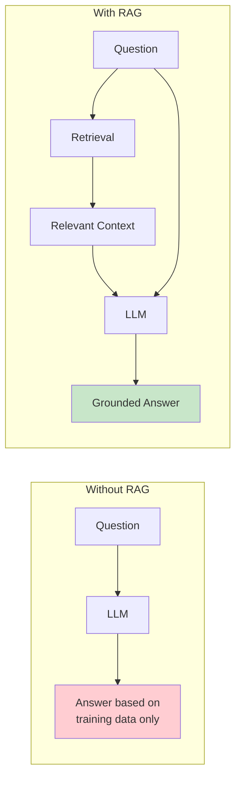
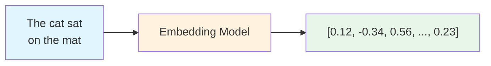
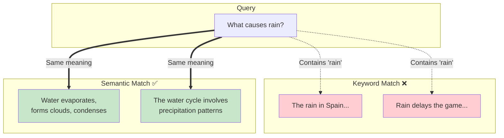
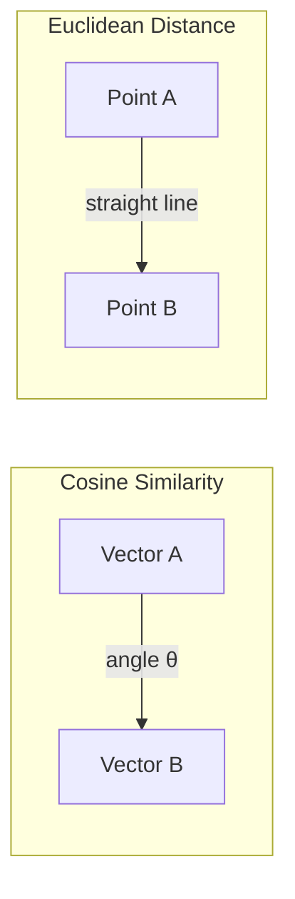
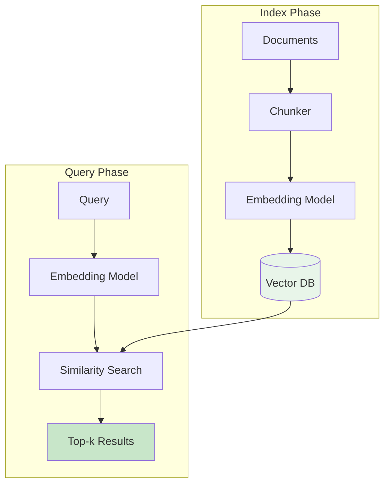
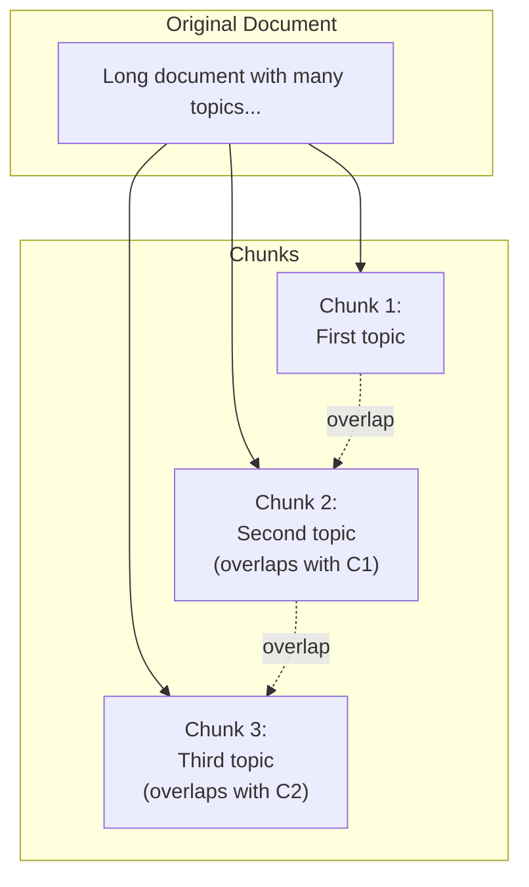
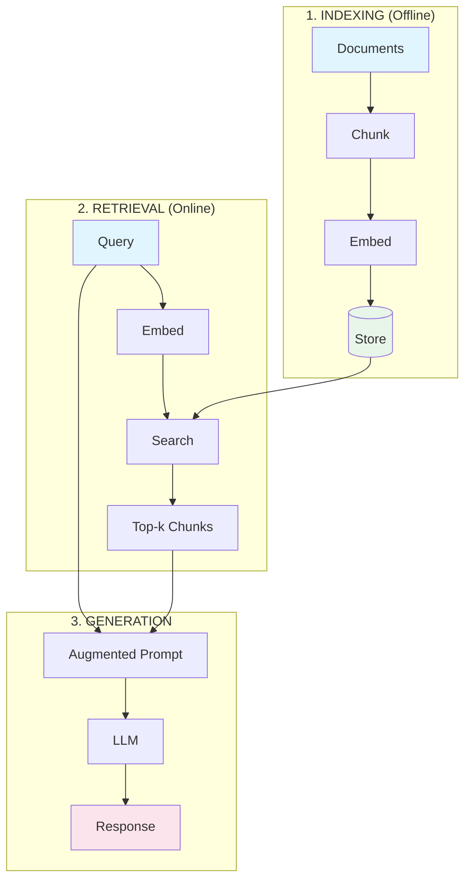
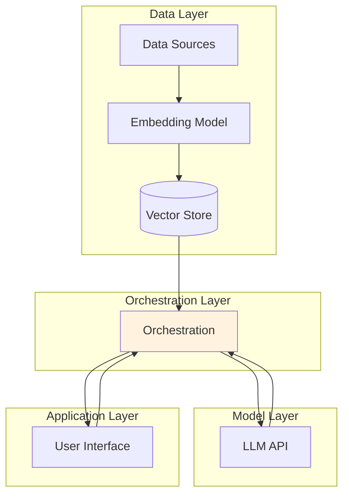

# Session 2: Dense Vector Retrieval
## Slides

---

## Slide 1: Title

# Dense Vector Retrieval
## Building RAG from First Principles

**AIE9 - Session 2**

*Understanding embeddings, similarity search, and retrieval-augmented generation*

---

## Slide 2: Learning Objectives

# What You'll Learn

By the end of this session, you will be able to:

- Explain why **in-context learning** is the foundation of modern LLM applications
- Convert text to **embedding vectors** and interpret their semantic meaning
- Implement **similarity search** using cosine similarity from scratch
- Build a complete **RAG pipeline** without frameworks
- Evaluate retrieval quality through vibe checks

---

## Slide 3: The Core Equation

# RAG Explained in One Equation

```
RAG = Dense Vector Retrieval + In-Context Learning
```

**Dense Vector Retrieval**: Finding relevant documents by semantic similarity

**In-Context Learning**: Providing information in the prompt for the LLM to reason over

> *"In-context learning refers to a model's ability to temporarily learn from prompts."*
> ~ GPT-3 Paper (2020)

**Speaker Notes**: This equation is the key insight. Everything we build today implements this pattern. The retrieval component automates what we would otherwise do manually - finding the right context to include in our prompt.

---

## Slide 4: Why RAG?

# The Problem RAG Solves



**LLMs have limitations**:
- Knowledge frozen at training cutoff
- No access to private/proprietary data
- May hallucinate when uncertain

**RAG provides**: Access to current, domain-specific information at inference time

**Speaker Notes**: Without RAG, we rely entirely on what the model learned during training. With RAG, we can ground responses in specific, current documents. This is why RAG has become the default pattern for knowledge-intensive applications.

---

## Slide 5: Embeddings - Text to Numbers

# Embeddings: The Foundation

> *"You shall know a word by the company it keeps."* ~ John Firth (1957)



**What embeddings do**:
- Convert text into fixed-length vectors (e.g., 1536 dimensions)
- Preserve semantic meaning - similar concepts cluster together
- Enable mathematical operations on language

**The classic example**: `king - man + woman ≈ queen`

**Speaker Notes**: This is the magic that makes semantic search possible. The embedding model has learned to position text in a high-dimensional space where meaning is encoded as coordinates. We can't visualize 1536 dimensions, but the math works the same as in 2D or 3D.

---

## Slide 6: Semantic Similarity

# Finding Meaning, Not Keywords



**Keyword search fails when**:
- Synonyms are used ("precipitation" vs "rain")
- Concepts are explained differently
- The exact words don't appear

**Semantic search succeeds because**: It compares meaning, not strings

**Speaker Notes**: This is the superpower of dense retrieval. The embedding model understands that "precipitation" and "rain" are related concepts, even though they share no characters. This enables much more intelligent information retrieval.

---

## Slide 7: Distance Metrics

# Measuring Similarity in Vector Space



| Metric | What It Measures | Best For |
|--------|------------------|----------|
| **Cosine Similarity** | Angle between vectors | Default choice; direction matters |
| **Euclidean (L2)** | Straight-line distance | When magnitude matters |
| **Dot Product** | Projection of one onto another | Normalized vectors |

**Key insight**: For normalized embeddings, cosine and dot product produce identical rankings

**Speaker Notes**: Most embedding APIs return normalized vectors (unit length), so cosine similarity is essentially free - it's just a dot product. This is computationally efficient and works well in practice. Start with cosine; only switch if you have a specific reason.

---

## Slide 8: The Vector Database

# Storing and Searching Embeddings



**At its simplest**: A dictionary mapping text to vectors

```python
vectors = {
    "The sky is blue": [0.12, -0.34, ...],
    "Water is wet": [0.23, 0.45, ...],
}
```

**Production systems add**: Indexing (HNSW, IVF), metadata filtering, persistence

**Speaker Notes**: For learning, we build with a simple Python dictionary. This is exactly what production vector databases do at their core - they just add optimizations for scale. Understanding the simple version deeply makes the complex ones transparent.

---

## Slide 9: Chunking Strategies

# Breaking Documents into Retrievable Pieces



**Why chunk?**
1. Embeddings work best on focused text
2. Smaller chunks enable precise retrieval
3. Prevents exceeding context limits

**Parameters to tune**:
- `chunk_size`: Typically 500-1000 characters
- `chunk_overlap`: Typically 10-20% of chunk size

**Speaker Notes**: Chunking is where many RAG systems fail. Too small and you lose context; too large and retrieval becomes imprecise. The overlap prevents losing information at chunk boundaries. We'll use fixed-size chunking today, but semantic chunking exists for more sophisticated use cases.

---

## Slide 10: The RAG Pipeline

# End-to-End Architecture



**The flow**:
1. **Index**: Prepare documents once (offline)
2. **Retrieve**: Find relevant context for each query
3. **Generate**: Augment prompt, call LLM

**Speaker Notes**: This three-phase architecture is the pattern you'll see everywhere. The indexing happens once per corpus update. Retrieval and generation happen on every query. Optimizing each phase independently is a key skill.

---

## Slide 11: From Scratch Implementation

# What We're Building Today

```python
# 1. Load and chunk
loader = TextFileLoader("data/document.txt")
chunks = CharacterTextSplitter().split_texts(loader.load_documents())

# 2. Build vector database
vector_db = VectorDatabase(EmbeddingModel())
await vector_db.abuild_from_list(chunks)

# 3. Retrieve
results = vector_db.search_by_text("What is the main topic?", k=3)

# 4. Generate
context = "\n".join([text for text, score in results])
response = llm.run(f"Context: {context}\n\nQuestion: {query}")
```

**No frameworks** - just Python, NumPy, and the OpenAI API

**Speaker Notes**: This is the PydanticAI RAG example approach - building from scratch to understand every component. When you understand what's happening at each step, debugging becomes straightforward and you can make informed decisions about when to add complexity.

---

## Slide 12: The LLM Application Stack

# Where RAG Fits



> *"The LLM application stack is built on the design pattern of in-context learning."*
> ~ a16z, 2023

**Tools change; the pattern persists**

**Speaker Notes**: This architecture diagram from a16z has become the reference for how production LLM applications are structured. RAG is the retrieval component - but notice how it fits into the larger picture. The orchestration layer is where most of the complexity lives.

---

## Slide 13: Scaling Considerations

# From Learning to Production

| Aspect | This Session | Production |
|--------|--------------|------------|
| **Search** | Brute force O(n) | HNSW, IVF O(log n) |
| **Storage** | In-memory dict | Persistent DB |
| **Embedding** | Single model | Model selection |
| **Retrieval** | Dense only | Hybrid (dense + sparse) |
| **Evaluation** | Vibe checks | Metrics pipeline |

**What stays the same**: The fundamental architecture and concepts

**Speaker Notes**: Everything we build today scales. The concepts don't change - we just add optimizations. Understanding the simple version deeply is the foundation for making good decisions about when and how to add complexity.

---

## Slide 14: Evaluation Basics

# How Do We Know It's Working?

**Vibe Checks (Start Here)**:
- Do retrieved chunks seem relevant?
- Does the LLM use the context?
- Is the answer factually grounded?

**Retrieval Metrics (Graduate To)**:
- **Precision@k**: Fraction of top-k that are relevant
- **Recall**: Did we find all relevant documents?
- **MRR**: How high is the first relevant result?

**Generation Metrics**:
- **Faithfulness**: Does the answer match the context?
- **Relevance**: Does it answer the question?

**Speaker Notes**: Start with manual inspection - look at what's being retrieved and whether the answers make sense. Only add metrics once you have a baseline and know what you're optimizing for. Metrics without intuition are dangerous.

---

## Slide 15: Summary

# Key Takeaways

1. **RAG = Retrieval + In-Context Learning** - Automate context selection

2. **Embeddings capture meaning** - Similar concepts cluster in vector space

3. **Cosine similarity is the default** - Measures direction, not magnitude

4. **Chunking matters** - Balance precision vs. context

5. **The architecture is stable** - Tools change, patterns persist

6. **Start simple** - Brute force search is fine for learning

7. **Evaluate retrieval separately** - Poor retrieval can't be fixed by a better LLM

**Speaker Notes**: These are the concepts to internalize. The specific tools and code will evolve, but these principles guide decision-making. When you encounter a new RAG framework, ask: how does it implement each of these steps?

---

## Slide 16: What's Next

# Your Assignment

**Build Phase**:
- Complete the Pythonic RAG notebook
- Build from scratch: loader → chunker → embedder → vector DB → retrieval → generation

**Ship Phase**:
- Enhance the pipeline (PDF support, new metrics, metadata, etc.)
- Create a diagram of your implementation

**Share Phase**:
- Record a Loom walkthrough
- Share 3 lessons learned

**Coming in Session 3**: Advanced retrieval techniques - hybrid search, reranking, and evaluation frameworks

---

## Slide 17: Resources

# Further Reading

**Papers**:
- [RAG Paper (2020)](https://arxiv.org/abs/2005.11401)
- [GPT-3 Paper (2020)](https://arxiv.org/abs/2005.14165)
- [Sentence-BERT (2019)](https://arxiv.org/abs/1908.10084)

**References**:
- [LLM Application Stack (a16z)](https://a16z.com/emerging-architectures-for-llm-applications/)
- [PydanticAI RAG Example](https://ai.pydantic.dev/examples/rag/)

**Tools**:
- [MTEB Leaderboard](https://huggingface.co/spaces/mteb/leaderboard)
- [Illustrated Word2Vec](https://jalammar.github.io/illustrated-word2vec/)

---

## Slide 18: Q&A

# Questions?

```
                    ┌─────────────────────┐
                    │   Dense Vector      │
                    │   Retrieval         │
                    │                     │
                    │   Query → Embed     │
                    │      ↓              │
                    │   Search → Retrieve │
                    │      ↓              │
                    │   Augment → Generate│
                    │                     │
                    └─────────────────────┘
```

**Contact**: greg@aimakerspace.io | Discord: @Dr Greg

---

*AIE9 - Session 2: Dense Vector Retrieval*
