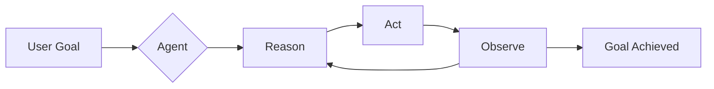
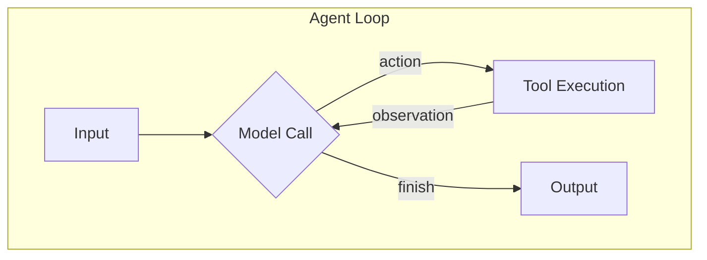
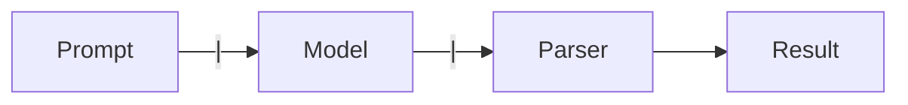
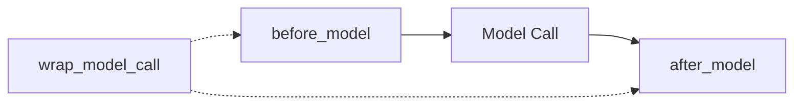
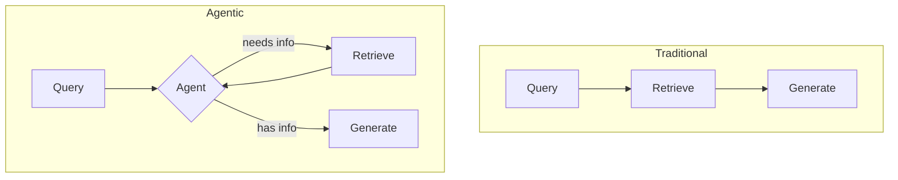
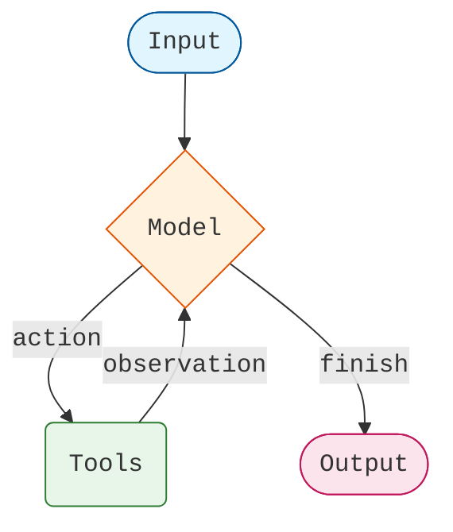
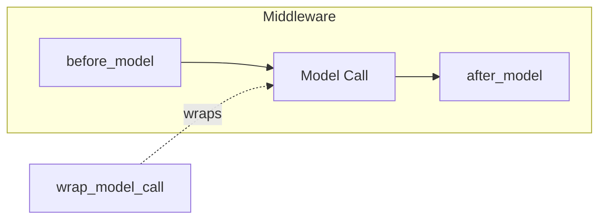
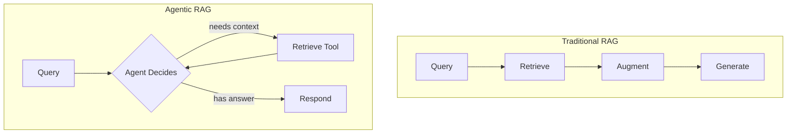
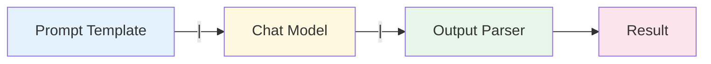

# Session 3: The Agent Loop
## Slide Deck Specification

*AIE9 - AI Engineering Bootcamp*
*January 2026*

---

## Slide 1: Title Slide

### Content
**Session 3: The Agent Loop**

Building Production Agents with LangChain 1.0

*AI Engineering Bootcamp - Cohort 9*

### Visual
- AI Makerspace logo
- Session number badge

### Speaker Notes
Welcome to Session 3. Today we explore one of the most important topics in modern AI engineering: the agent. We'll learn what an agent really is, how the agent loop works, and how to build production-grade agents using LangChain 1.0's `create_agent` API.

---

## Slide 2: Learning Objectives

### Content
By the end of this session, you will:

1. **Understand** what an "agent" is and the foundational agent loop
2. **Learn** the core constructs of LangChain (Runnables, LCEL)
3. **Master** the `create_agent()` function and middleware system
4. **Build** an agentic RAG application using Qdrant

### Visual
- Four objective cards with icons

### Speaker Notes
These four objectives build on each other. First we establish the conceptual foundation, then we learn the building blocks, then we put them together into a complete agent, and finally we connect it to a vector database for retrieval.

---

## Slide 3: What is an Agent?

### Content
> **"An LLM agent runs tools in a loop to achieve a goal."**
> — Simon Willison, September 2025

**Key Characteristics:**
- Reasons about what to do next
- Takes actions by calling tools
- Observes results
- Iterates until complete

### Visual


### Speaker Notes
After years of debate about what "agent" and "agentic" mean, the industry has converged on this definition from Simon Willison. An agent is not just an LLM - it's an LLM that can use tools repeatedly until it achieves a goal. This loop of reasoning, acting, and observing is the core pattern.

**Reference:** https://simonwillison.net/2025/Sep/18/agents/

---

## Slide 4: The Agent Loop

### Content
**Two Main Steps:**
1. **Model Call** - LLM decides: use tool or return answer
2. **Tool Execution** - Run the selected tool
3. **Repeat** - Until task is complete

### Visual


### Speaker Notes
This is the fundamental architecture. The model receives the conversation state and decides whether to call a tool or respond directly. If it calls a tool, the tool runs and the result goes back to the model. This continues until the model decides it has enough information to give a final answer. This is what `create_agent` implements for you.

**Reference:** https://docs.langchain.com/oss/python/langchain/agents

---

## Slide 5: The Runnable Abstraction

### Content
> **"The primary abstraction in LangChain is the Runnable."**

**Universal Interface:**
- Takes an input
- Performs an operation
- Returns an output

**Core Methods:**
```python
runnable.invoke(input)      # Single
runnable.batch([...])       # Multiple
runnable.stream(input)      # Streaming
```

### Visual
- Diagram showing Runnable as a box with input arrow and output arrow
- List of Runnable types: Models, Prompts, Retrievers, Parsers

### Speaker Notes
Every component in LangChain is a Runnable. This consistency is what makes the framework so composable. Whether you're working with a chat model, a prompt template, a retriever, or an output parser, they all share the same interface: invoke, batch, and stream.

**Reference:** https://python.langchain.com/docs/concepts/runnables/

---

## Slide 6: LCEL - The Pipe Operator

### Content
**LangChain Expression Language (LCEL)**

Chain Runnables with `|` (like Unix pipes):

```python
chain = prompt | model | parser
result = chain.invoke({"question": "What is AI?"})
```

**Output flows from left to right**

### Visual


### Speaker Notes
LCEL makes composition intuitive. The pipe operator takes the output of one Runnable and feeds it as input to the next. This is exactly like Unix pipes where you might do `cat file | grep pattern | sort`. The key insight is that because everything is a Runnable, you can chain anything together.

**Reference:** https://docs.langchain.com/oss/python/langchain/philosophy

---

## Slide 7: The ReAct Pattern

### Content
**ReAct = Reasoning + Acting**

From the original 2022 paper:
> "Reasoning traces help the model induce, track and update action plans, while actions allow it to gather additional information from external sources."

**Example:**
```
Thought: I need to search for weather
Action: search_weather("SF")
Observation: 65°F, sunny
Thought: I have the info
Action: respond("It's 65°F and sunny")
```

### Visual
- Side-by-side comparison of Reasoning vs Acting
- Flow diagram showing the interleaving

### Speaker Notes
ReAct was published in October 2022 and combined two existing techniques: chain-of-thought prompting for reasoning and action plan generation for acting. The key innovation was interleaving them - the model reasons, then acts, then observes, then reasons again. This is the pattern that modern agents implement.

**Reference:** https://arxiv.org/abs/2210.03629

---

## Slide 8: Tool Calling with @tool

### Content
**Creating Tools:**
```python
from langchain_core.tools import tool

@tool
def calculate(expression: str) -> str:
    """Evaluate a mathematical expression.

    Args:
        expression: Math expression (e.g., '2 + 2')
    """
    result = eval(expression, {"__builtins__": {}})
    return f"Result: {result}"
```

**The docstring IS the tool description!**

### Visual
- Annotated code showing decorator, type hints, docstring

### Speaker Notes
The `@tool` decorator converts a Python function into something an agent can use. The critical point here is that the docstring becomes the tool description that the LLM sees when deciding which tool to call. Write clear, detailed docstrings that explain when and how to use the tool. This is where many agent problems originate.

**Reference:** https://docs.langchain.com/oss/python/langchain/tools

---

## Slide 9: The create_agent() API

### Content
**LangChain 1.0's Standard Agent Builder:**

```python
from langchain.agents import create_agent

agent = create_agent(
    model="gpt-4o",
    tools=[calculate, search],
    system_prompt="You are helpful.",
    middleware=[limiter, logger]
)

response = agent.invoke({
    "messages": [{"role": "user", "content": "..."}]
})
```

### Visual
- Table of parameters: model, tools, system_prompt, middleware

### Speaker Notes
`create_agent` is the new standard way to build agents in LangChain 1.0. It wraps LangGraph under the hood, giving you a production-ready agent with just a few lines of code. You provide the model, the tools, an optional system prompt, and any middleware you want. The agent handles the loop for you.

**Reference:** https://reference.langchain.com/python/langchain/agents/

---

## Slide 10: Middleware Hooks

### Content
**Hook into the agent loop:**
- `before_model` - Before each LLM call
- `after_model` - After each LLM response
- `wrap_model_call` - Around entire call

**Use Cases:**
- Logging & analytics
- Guardrails & filtering
- Rate limiting
- Human-in-the-loop

### Visual


### Speaker Notes
Middleware gives you control over what happens inside the agent. Before the model is called, after it responds, or wrapping the entire call. This is where you add logging, implement guardrails, enforce rate limits, or pause for human approval. LangChain provides built-in middleware like `ModelCallLimitMiddleware` to prevent runaway agents.

**Reference:** https://docs.langchain.com/oss/python/langchain/middleware/overview

---

## Slide 11: Traditional RAG vs Agentic RAG

### Content
**Traditional RAG:**
```
Query → Always Retrieve → Generate
```

**Agentic RAG:**
```
Query → Agent Decides → Maybe Retrieve → Generate
```

**Agent Benefits:**
- Skips retrieval when not needed
- Can retrieve multiple times
- Can combine with other tools

### Visual


### Speaker Notes
Traditional RAG always retrieves, even when the question doesn't need it. Agentic RAG wraps retrieval as a tool that the agent can choose to use. The agent decides: "Do I need to search? What should I search for? Is this enough, or should I search again?" This makes the system more flexible and often more efficient.

**Reference:** https://docs.langchain.com/oss/python/langchain/retrieval

---

## Slide 12: Qdrant Vector Database

### Content
**Key Concepts:**
| Concept | Description |
|---------|-------------|
| Collection | Namespace (like a table) |
| Points | Vectors + metadata |
| Distance | Similarity metric |

```python
qdrant_client.create_collection(
    collection_name="docs",
    vectors_config=VectorParams(
        size=1536, distance=Distance.COSINE
    )
)
```

### Visual
- Diagram showing documents → embeddings → vector store → retrieval

### Speaker Notes
Qdrant is our vector database of choice. A collection is like a table in SQL - it holds your vectors. Each point is a vector with optional metadata (payload). Distance defines how similarity is measured - cosine is most common for text embeddings. We use 1536 dimensions because that's what OpenAI's text-embedding-3-small produces.

**Reference:** https://qdrant.tech/documentation/

---

## Slide 13: LangSmith Observability

### Content
> "LangSmith turns LLM magic into enterprise-ready applications."

**Key Concepts:**
- **Trace**: Full execution path
- **Run**: Single operation (one LLM call)
- **Project**: Container for traces

**Enable with:**
```python
os.environ["LANGCHAIN_TRACING_V2"] = "true"
os.environ["LANGCHAIN_API_KEY"] = "..."
```

### Visual
- Screenshot mockup of LangSmith trace view

### Speaker Notes
LangSmith gives you visibility into what your agent is actually doing. Every model call, every tool call, all the inputs and outputs, timing information, token counts. This is essential for debugging and for understanding why your agent behaves the way it does. Enable it with two environment variables.

**Reference:** https://docs.langchain.com/langsmith/observability

---

## Slide 14: Context Engineering

### Content
> **"Everything that makes agents good is context engineering."**
> — Dex Horthy

**12-Factor Agents:**
1. Natural Language to Tool Calls
2. Own your prompts
3. Own your context window
4. Tools are structured outputs
5. Small, focused agents
...

### Visual
- Grid of the 12 factors with icons

### Speaker Notes
Context engineering is the practice of providing the right information, in the right format, at the right time. Dex Horthy's 12-Factor Agents manifesto is essential reading. The key insight: agents fail when they don't have the right context. Your job as an AI engineer is to engineer that context carefully.

**Reference:** https://github.com/humanlayer/12-factor-agents

---

## Slide 15: Key Takeaways

### Content
1. **Agent = LLM + Tools + Loop**
2. **Runnables are the building blocks** - everything composes
3. **LCEL pipes (`|`) chain components** - intuitive composition
4. **`create_agent()` is your starting point** - production-ready
5. **Middleware hooks into every step** - logging, guardrails, limits
6. **Agentic RAG > Traditional RAG** - agent decides when to retrieve
7. **LangSmith for observability** - see what's happening
8. **Context engineering is key** - right info, right format

### Visual
- Eight takeaway cards with checkmarks

### Speaker Notes
Let's recap. An agent is an LLM that runs tools in a loop. Everything in LangChain is a Runnable that you compose with LCEL. Use `create_agent` to build agents quickly. Add middleware for control. Make retrieval a tool, not a fixed step. Use LangSmith to see inside your agents. And always remember: context engineering determines success.

---

## Slide 16: Next Steps & Resources

### Content
**Today's Homework:**
- Complete the notebook tasks
- Build your first agent with `create_agent()`
- Implement Agentic RAG with Qdrant
- Record a Loom walkthrough

**Resources:**
- [LangChain Docs](https://docs.langchain.com)
- [LangSmith](https://smith.langchain.com)
- [ReAct Paper](https://arxiv.org/abs/2210.03629)
- [12-Factor Agents](https://github.com/humanlayer/12-factor-agents)

### Visual
- QR codes to resources
- Homework checklist

### Speaker Notes
Your homework is to work through the notebook, answer the questions, and complete the two activities. Create a custom tool and enhance the agentic RAG system. Record a Loom video explaining your work. The links here will take you deeper into the concepts we covered today.

---

## Appendix: Mermaid Diagrams (For Export)

### Agent Loop Diagram


### Middleware Hook Diagram


### RAG Comparison Diagram


### LCEL Chain Diagram


---

## Design Notes

### Color Palette
- **Primary**: #1976D2 (Blue)
- **Secondary**: #FF9800 (Orange)
- **Accent**: #4CAF50 (Green)
- **Background**: #FAFAFA (Light Gray)

### Fonts
- **Headings**: Inter Bold
- **Body**: Inter Regular
- **Code**: JetBrains Mono

### Slide Layout Guidelines
- Title slides: Centered, large text
- Content slides: Left-aligned, with visual on right
- Diagram slides: Diagram centered, minimal text
- Code slides: Syntax highlighted, large font

---

## References (Full List)

1. Simon Willison. "Agent Definition." https://simonwillison.net/2025/Sep/18/agents/
2. LangChain. "Agents Documentation." https://docs.langchain.com/oss/python/langchain/agents
3. LangChain. "Runnables Concepts." https://python.langchain.com/docs/concepts/runnables/
4. LangChain. "Philosophy." https://docs.langchain.com/oss/python/langchain/philosophy
5. Yao et al. "ReAct: Synergizing Reasoning and Acting." https://arxiv.org/abs/2210.03629
6. LangChain. "Tools." https://docs.langchain.com/oss/python/langchain/tools
7. LangChain. "create_agent API." https://reference.langchain.com/python/langchain/agents/
8. LangChain. "Middleware Overview." https://docs.langchain.com/oss/python/langchain/middleware/overview
9. LangChain. "Retrieval." https://docs.langchain.com/oss/python/langchain/retrieval
10. Qdrant. "Documentation." https://qdrant.tech/documentation/
11. LangSmith. "Observability." https://docs.langchain.com/langsmith/observability
12. HumanLayer. "12-Factor Agents." https://github.com/humanlayer/12-factor-agents
13. LangChain. "Context Engineering." https://docs.langchain.com/oss/python/langchain/context-engineering

---

*Slide deck specification for AIE9 Session 3*
*Export to PowerPoint using preferred tool (python-pptx, reveal.js, etc.)*
