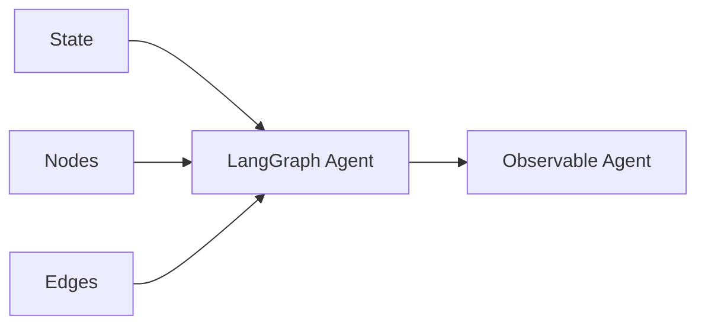

# Session 4: Agentic RAG
## Slide Deck Specification

*AIE9 - AI Engineering Bootcamp*
*January 2026*

---

## Slide 1: Title Slide

### Content
**Session 4: Agentic RAG**

Low-Level Orchestration with LangGraph

*AI Engineering Bootcamp - Cohort 9*

### Visual
- AI Makerspace logo
- Session number badge

### Speaker Notes
Welcome to Session 4. Today we go under the hood of what we built in Session 3. We'll learn how `create_agent` actually works by understanding LangGraph - the low-level orchestration framework that powers LangChain's agents. By the end of this session, you'll be able to build agents with full control over state, routing, and persistence.

---

## Slide 2: Learning Objectives

### Content
By the end of this session, you will:

1. **Understand** the three pillars of LangGraph (State, Nodes, Edges)
2. **Build** graphs with explicit state management and routing
3. **Implement** checkpointing for multi-turn conversations
4. **Monitor** graph execution with LangSmith traces

### Visual


### Speaker Notes
These objectives build from concepts to implementation. First we understand the building blocks, then we assemble them into working graphs, then we add persistence, and finally we learn to see inside our agents with tracing. This is the foundation for everything we'll build in the rest of the bootcamp.

---

## Slide 3: From create_agent to LangGraph

### Content
**Session 3**: High-level abstraction
```python
agent = create_agent(model, tools)
```

**Session 4**: Under the hood
```python
builder = StateGraph(State)
builder.add_node("agent", ...)
builder.add_conditional_edges(...)
graph = builder.compile()
```

> "LangChain's `create_agent` runs on LangGraph."

### Visual


### Speaker Notes
In Session 3, we used `create_agent` to quickly build agents. It worked, but we couldn't see what was happening inside. Today we peel back that abstraction and learn LangGraph directly. The relationship is simple: `create_agent` is a convenience function that creates a LangGraph under the hood. Learning LangGraph gives you control.

**Reference:** https://docs.langchain.com/oss/python/releases/langgraph-v1

---

## Slide 4: What is LangGraph?

### Content
> **"LangGraph is a low-level orchestration framework and runtime for building, managing, and deploying long-running, stateful agents."**

**Key Capabilities:**
- Durable execution
- Streaming
- Human-in-the-loop
- Checkpointing

### Visual


### Speaker Notes
LangGraph is not just about building graphs - it's about building agents that can run for a long time, persist their state, handle interruptions, and be observed. It's "low-level" in the sense that you explicitly define every node and edge, giving you complete control over the agent's behavior.

**Reference:** https://docs.langchain.com/oss/python/langgraph/overview

---

## Slide 5: The Three Pillars

### Content
**State**: Shared data structure
- TypedDict schema
- What flows through the graph

**Nodes**: Processing functions
- Receive state, return updates
- The work gets done here

**Edges**: Control flow
- Fixed or conditional
- What happens next

### Visual


### Speaker Notes
Everything in LangGraph comes down to these three concepts. State defines your data model - what information exists at any point. Nodes are just functions that read state and return updates. Edges define how we move between nodes. Simple as that. "Nodes do the work, edges tell what to do next."

**Reference:** https://docs.langchain.com/oss/python/langgraph/graph-api

---

## Slide 6: Defining State

### Content
**State = TypedDict + Reducers**

```python
from typing import TypedDict, Annotated
from langgraph.graph.message import add_messages

class AgentState(TypedDict):
    messages: Annotated[list, add_messages]
    documents: list
    query: str
```

**Reducers control merging:**
- Without: Replace value
- With `add_messages`: Append to list

### Visual
- Table showing state fields and their purposes

### Speaker Notes
State is defined using Python's TypedDict for type safety. The key insight is reducers. When a node returns `{"messages": [new_msg]}`, the reducer determines whether to replace the existing messages or append. The `add_messages` reducer appends, which is what we want for conversation history. Other fields just get replaced.

**Reference:** https://docs.langchain.com/oss/python/langgraph/state-schema

---

## Slide 7: Building Nodes

### Content
**Nodes = Functions that transform state**

```python
def call_model(state: AgentState) -> dict:
    """Node that calls the LLM."""
    response = model.invoke(state["messages"])
    return {"messages": [response]}
```

**Rules:**
1. Receive full state
2. Return partial updates
3. Updates merge via reducers

### Visual


### Speaker Notes
A node is just a Python function. It receives the complete current state and returns a dictionary with only the fields it wants to update. This partial update gets merged with the existing state using reducers. Keep nodes focused - each should do one thing well.

---

## Slide 8: Connecting with Edges

### Content
**Fixed Edges**: Always go from A to B
```python
builder.add_edge("tools", "agent")
```

**Conditional Edges**: Route based on state
```python
builder.add_conditional_edges(
    "agent",
    should_continue,
    {"tools": "tools", "end": END}
)
```

### Visual


### Speaker Notes
Fixed edges are simple: after node A, always go to node B. Conditional edges are where the agent makes decisions. The routing function looks at the current state and returns a key that maps to the next node. This is how we implement the "loop until done" pattern from Session 3.

**Reference:** https://docs.langchain.com/oss/python/langgraph/conditional-edges

---

## Slide 9: The Routing Function

### Content
```python
def should_continue(state: AgentState) -> str:
    """Route based on tool calls."""
    last_message = state["messages"][-1]

    if last_message.tool_calls:
        return "tools"
    return "end"
```

**Must:**
1. Accept state as input
2. Return string matching edge map keys

### Visual
- Flowchart showing decision logic

### Speaker Notes
The routing function is the brain of conditional edges. It receives the current state, analyzes it, and returns a string that tells LangGraph which node to go to next. The string must match one of the keys in the edge mapping. Here we check if the LLM made tool calls - if yes, go to tools; if no, we're done.

---

## Slide 10: Building the Complete Graph

### Content
```python
from langgraph.graph import StateGraph, START, END

builder = StateGraph(AgentState)

# Add nodes
builder.add_node("agent", agent_node)
builder.add_node("tools", tool_node)

# Add edges
builder.add_edge(START, "agent")
builder.add_conditional_edges(...)
builder.add_edge("tools", "agent")

# Compile
graph = builder.compile()
```

### Visual


### Speaker Notes
Here's the complete pattern. Create a StateGraph with your state schema. Add nodes for each processing step. Add edges to connect them - START for the entry point, conditional edges for decisions, fixed edges for guaranteed transitions. Compile to get an executable graph. This is exactly what `create_agent` does internally.

---

## Slide 11: Checkpointing for Persistence

### Content
**Why Checkpointing?**
- Multi-turn conversations
- Human-in-the-loop
- Fault tolerance
- Time travel

```python
from langgraph.checkpoint.memory import InMemorySaver

checkpointer = InMemorySaver()
graph = builder.compile(checkpointer=checkpointer)
```

### Visual


### Speaker Notes
Checkpointing is LangGraph's persistence layer. After each step, the state is saved to a checkpoint. This means you can stop execution, inspect state, modify it, and resume. It enables multi-turn conversations where the agent remembers previous turns. In production, you'd use PostgresSaver; for development, InMemorySaver works fine.

**Reference:** https://docs.langchain.com/oss/python/langgraph/persistence

---

## Slide 12: Multi-Turn Conversations

### Content
**Thread = Conversation session**

```python
config = {"configurable": {"thread_id": "user-123"}}

# Turn 1
graph.invoke({"messages": ["Hi, I'm Alice"]}, config)

# Turn 2 - State persists!
graph.invoke({"messages": ["What's my name?"]}, config)
# Agent: "Your name is Alice"
```

### Visual
- Sequence diagram showing two turns with same thread_id

### Speaker Notes
The thread_id is the key. Each unique thread_id gets its own conversation history. When you invoke with the same thread_id, LangGraph loads the previous state from the checkpoint. This is how agents remember across multiple interactions. Different thread_ids mean different conversations.

**Reference:** https://docs.langchain.com/oss/python/langgraph/add-memory

---

## Slide 13: LangSmith Tracing

### Content
**Enable with environment variables:**
```python
os.environ["LANGCHAIN_TRACING_V2"] = "true"
os.environ["LANGCHAIN_API_KEY"] = "..."
os.environ["LANGCHAIN_PROJECT"] = "AIE9-Session4"
```

**Traces show:**
- Node execution order
- State at each step
- LLM calls and responses
- Timing and tokens

### Visual
- Mock trace view showing nested execution

### Speaker Notes
LangSmith tracing gives you X-ray vision into your graphs. Every node execution, every LLM call, every tool invocation - all visible in the trace. You can see exactly what state looked like at each step, how long each node took, how many tokens were used. This is essential for debugging and optimization.

**Reference:** https://docs.langchain.com/langsmith/observability

---

## Slide 14: Agentic RAG as a Graph

### Content
**Traditional RAG:**
```
Query → Retrieve → Generate
```

**Agentic RAG (as graph):**
```
Query → Classify → [Retrieve?] → Generate
```

The agent decides whether to retrieve.

### Visual


### Speaker Notes
Here's the payoff. With LangGraph, we can implement agentic RAG as an explicit graph. The classify node decides whether we need retrieval. If yes, we retrieve and then generate. If no, we skip straight to generate. This is more efficient than always retrieving and more transparent than a black-box agent.

---

## Slide 15: Key Takeaways

### Content
1. **LangGraph powers `create_agent`** - understanding it gives control
2. **Three pillars: State, Nodes, Edges** - the building blocks
3. **State schemas with reducers** - control data merging
4. **Conditional edges** - agent makes routing decisions
5. **Checkpointing** - persistence for multi-turn and recovery
6. **LangSmith traces** - visibility into execution
7. **Start high, go low** - use `create_agent`, drop to LangGraph when needed

### Visual
- Summary cards with checkmarks

### Speaker Notes
Let's recap. LangGraph is what makes agents work. You define state, build nodes, connect with edges. Reducers control how state updates merge. Conditional edges let the agent decide what to do next. Checkpointing enables persistence. LangSmith shows you what's happening. Start with `create_agent` for simple cases, use LangGraph when you need control.

---

## Slide 16: Next Steps & Resources

### Content
**Today's Homework:**
- Complete the notebook tasks
- Build a LangGraph agent from scratch
- Implement conditional routing
- Enable checkpointing and test multi-turn

**Resources:**
- [LangGraph Docs](https://docs.langchain.com/oss/python/langgraph/overview)
- [Thinking in LangGraph](https://docs.langchain.com/oss/python/langgraph/thinking-in-langgraph)
- [LangSmith](https://smith.langchain.com)

### Visual
- QR codes to resources
- Homework checklist

### Speaker Notes
Your homework is to build a complete LangGraph agent. Define a state schema, create nodes for processing, add conditional edges for routing, and enable checkpointing. View your traces in LangSmith. Record a Loom video explaining your implementation. The links here will help you go deeper.

---

## Appendix: Mermaid Diagrams (For Export)

### Three Pillars Diagram
```mermaid
%%{
  init: {
    "fontFamily": "monospace",
    "flowchart": {"curve": "basis"}
  }
}%%
graph TD
    subgraph "LangGraph"
        S[State<br>TypedDict + Reducers]
        N[Nodes<br>Processing Functions]
        E[Edges<br>Control Flow]
    end

    S --> G[Compiled Graph]
    N --> G
    E --> G

    classDef state fill:#e3f2fd,stroke:#1565c0;
    classDef node fill:#fff8e1,stroke:#f9a825;
    classDef edge fill:#e8f5e9,stroke:#2e7d32;
    classDef graph fill:#fce4ec,stroke:#c2185b;

    class S state;
    class N node;
    class E edge;
    class G graph;
```

### Agent Loop Graph
```mermaid
graph TD
    START([START]) --> agent
    agent{Agent Node}
    agent -->|"tool_calls"| tools[Tool Node]
    agent -->|"no tools"| END([END])
    tools --> agent

    classDef start fill:#e1f5fe,stroke:#01579b;
    classDef decision fill:#fff3e0,stroke:#e65100;
    classDef action fill:#e8f5e9,stroke:#2e7d32;
    classDef end fill:#fce4ec,stroke:#c2185b;

    class START start;
    class agent decision;
    class tools action;
    class END end;
```

### Agentic RAG Graph


### Checkpointing Timeline


### State Update Flow


### Conditional Edge Decision


### LangSmith Trace Structure


---

## Design Notes

### Color Palette
- **Primary**: #1976D2 (Blue)
- **Secondary**: #FF9800 (Orange)
- **Accent**: #4CAF50 (Green)
- **Background**: #FAFAFA (Light Gray)
- **State**: #E3F2FD (Light Blue)
- **Nodes**: #FFF8E1 (Light Amber)
- **Edges**: #E8F5E9 (Light Green)

### Fonts
- **Headings**: Inter Bold
- **Body**: Inter Regular
- **Code**: JetBrains Mono

### Slide Layout Guidelines
- Title slides: Centered, large text
- Content slides: Left-aligned, with visual on right
- Diagram slides: Diagram centered, minimal text
- Code slides: Syntax highlighted, large font

---

## References (Full List)

1. LangChain. "LangGraph Overview." https://docs.langchain.com/oss/python/langgraph/overview
2. LangChain. "What's new in LangGraph v1." https://docs.langchain.com/oss/python/releases/langgraph-v1
3. LangChain. "Graph API overview." https://docs.langchain.com/oss/python/langgraph/graph-api
4. LangChain. "State Schema." https://docs.langchain.com/oss/python/langgraph/state-schema
5. LangChain. "Conditional Edges." https://docs.langchain.com/oss/python/langgraph/conditional-edges
6. LangChain. "Command API." https://docs.langchain.com/oss/python/langgraph/use-graph-api
7. LangChain. "Persistence." https://docs.langchain.com/oss/python/langgraph/persistence
8. LangChain. "Add Short-Term Memory." https://docs.langchain.com/oss/python/langgraph/add-memory
9. LangSmith. "Observability." https://docs.langchain.com/langsmith/observability
10. LangChain. "Thinking in LangGraph." https://docs.langchain.com/oss/python/langgraph/thinking-in-langgraph
11. LangChain Blog. "LangChain & LangGraph 1.0." October 2025. https://blog.langchain.com/langchain-langgraph-1dot0/

---

*Slide deck specification for AIE9 Session 4*
*Export to PowerPoint using preferred tool (python-pptx, reveal.js, etc.)*
