# Session 5: Multi-Agent Systems
## Coordinated Agent Architectures with LangGraph

---

# Slide 1: Title

## Multi-Agent Systems
### Building Coordinated Agent Architectures

**Session 5 | Complex Agents Module | Week 3**

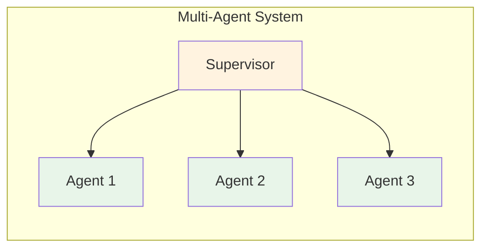

**Speaker Notes:**
Welcome to Session 5 on Multi-Agent Systems. Today we'll explore how to coordinate multiple specialized agents to tackle complex workflows. We'll cover supervisor, router, and swarm patterns—the three major architectures in the LangChain/LangGraph ecosystem.

---

# Slide 2: Learning Objectives

## By the end of this session, you will be able to:

1. **Explain** when multi-agent systems are appropriate vs. single agents
2. **Implement** the supervisor pattern with worker agents
3. **Design** router architectures for domain specialists
4. **Create** handoff tools for swarm systems
5. **Manage** shared state across multi-agent workflows

**Speaker Notes:**
These five objectives form a progression: first understanding when to use multi-agent, then learning the three main patterns (supervisor, router, swarm), and finally mastering state management which underlies all multi-agent systems.

---

# Slide 3: When to Use Multi-Agent Systems

## The Decision Framework

> **"Multi-agent systems coordinate specialized components to tackle complex workflows. However, not every complex task requires this approach."**
> — LangChain Team

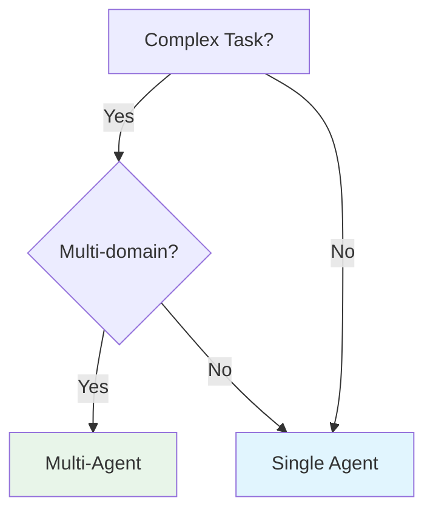

| Single Agent | Multi-Agent |
|--------------|-------------|
| One knowledge domain | Multiple domains |
| Tools share context | Different prompts per domain |
| < 10 related tools | Domain-specific toolsets |

**Speaker Notes:**
The key question: "Could one agent with dynamic tools solve this?" A single agent can often handle 10+ tools in one domain. Choose multi-agent when tools require fundamentally different prompts or expertise—like calendar scheduling vs. email composition.

---

# Slide 4: Supervisor Pattern

## Central Coordinator + Specialized Workers

> **"The supervisor pattern is a multi-agent architecture where a central supervisor agent coordinates specialized worker agents."**
> — LangChain Team

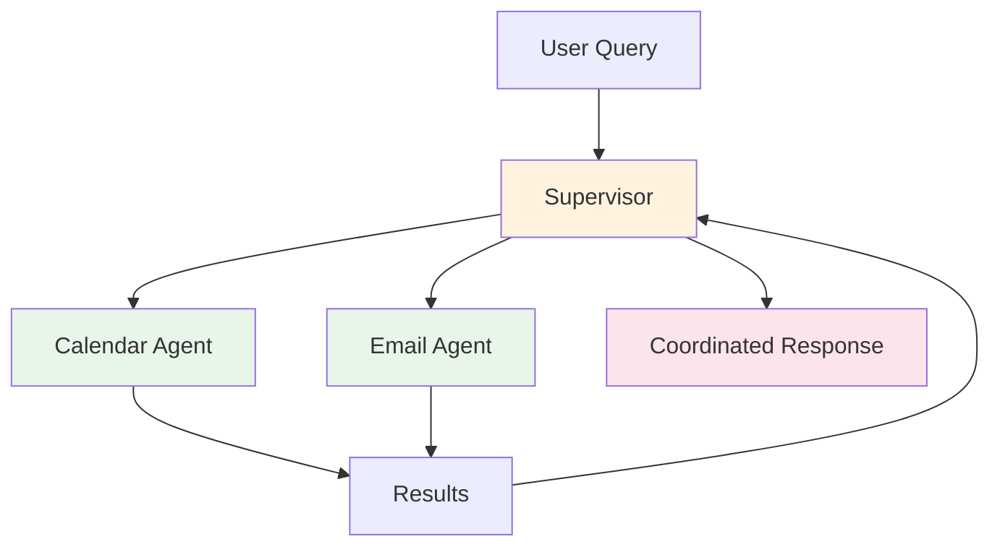

**Use when:**
- Tasks require different types of expertise
- Central coordination is needed
- Workers have separate tool domains

**Speaker Notes:**
The supervisor pattern is ideal for personal assistants. The supervisor understands the overall workflow and delegates to specialists. Example: "Schedule a meeting with John and send him a confirmation email"—supervisor routes to calendar agent, then email agent, then synthesizes the response.

---

# Slide 5: Router Pattern

## Classify → Route → Synthesize

> **"The router pattern excels when your organization's knowledge lives across distinct verticals."**
> — LangChain Team

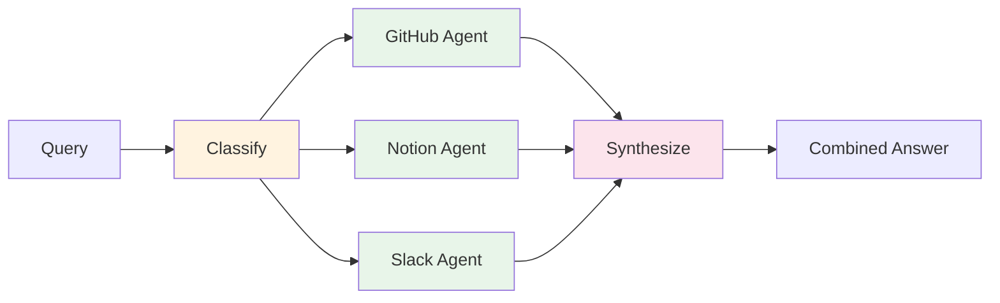

**Use when:**
- Knowledge across distinct verticals
- Parallel specialist queries needed
- Results must be synthesized

**Speaker Notes:**
The router pattern is perfect for enterprise knowledge bases. When a user asks "How do I authenticate API requests?", the router decomposes the query, routes to GitHub (code), Notion (docs), and Slack (discussions) in parallel, then synthesizes a coherent answer.

---

# Slide 6: Swarm Pattern

## Dynamic Agent Handoffs

> **"A library for creating swarm-style multi-agent systems where specialized agents dynamically hand off control."**
> — LangChain Team

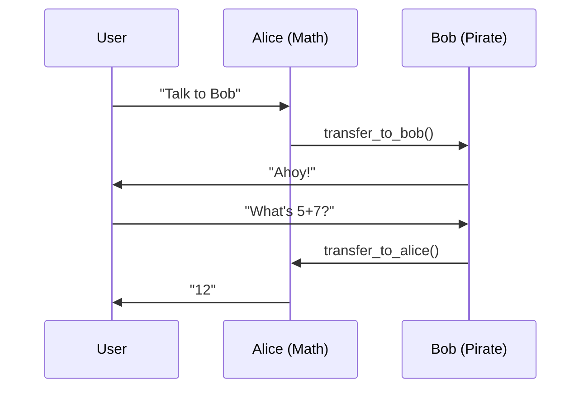

**Key characteristics:**
- No central coordinator
- Agents hand off directly
- Context preserved across transfers

**Speaker Notes:**
The swarm pattern enables fluid conversation flows. Unlike supervisor/router, there's no central coordinator—agents pass control directly. This is powerful for customer support scenarios where different specialists handle different parts of a conversation.

---

# Slide 7: Shared State Management

## TypedDict Schemas for Inter-Agent Communication

> **"State is a shared data structure representing the current snapshot of your application."**
> — LangGraph Documentation

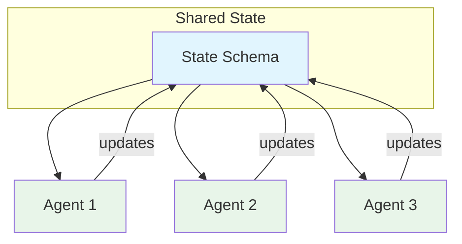

```python
class State(TypedDict):
    messages: Annotated[list[AnyMessage], operator.add]
    active_agent: str
    results: list[str] | None
```

**Speaker Notes:**
All agents read and write to the same state object. Key principle: store raw data, not formatted text—this allows each agent to format data for its specific prompts. Use `Annotated` with `operator.add` for lists that should append rather than replace.

---

# Slide 8: Handoff Tools

## Transferring Control Between Agents

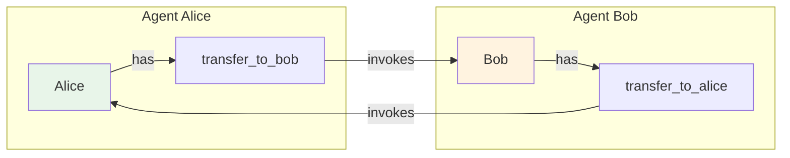

```python
transfer_to_expert = create_handoff_tool(
    agent_name="Expert",
    description="Transfer to expert for complex questions"
)
```

**Best practices:**
- Descriptive tool names
- Clear descriptions for when to hand off
- Two-way handoffs when needed

**Speaker Notes:**
Handoff tools are just like regular tools—the agent calls them when appropriate. The key is providing clear descriptions so the agent knows when to transfer. Example: "Transfer to Bob, who speaks like a pirate and handles creative writing."

---

# Slide 9: Memory in Multi-Agent Systems

## Short-Term vs Long-Term Memory

> **"Short-term memory is crucial for maintaining conversation state between turns."**
> — LangGraph Swarm Documentation

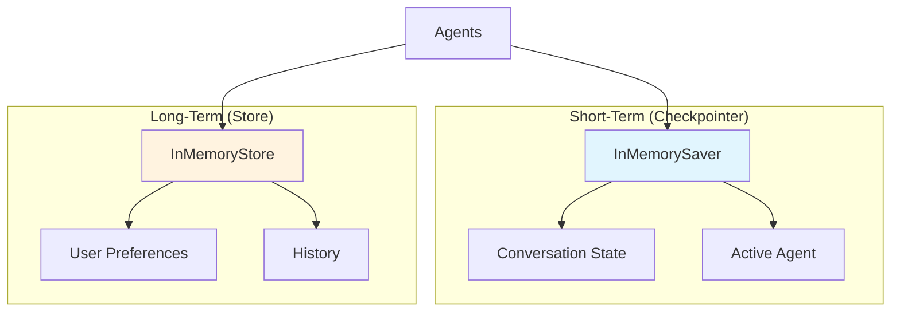

```python
app = workflow.compile(
    checkpointer=InMemorySaver(),  # Required
    store=InMemoryStore()           # Optional
)
```

**Speaker Notes:**
Checkpointer is REQUIRED for multi-turn swarm conversations—it tracks which agent is active between invocations. Store is optional but valuable for persisting user preferences or conversation history across sessions.

---

# Slide 10: Human-in-the-Loop

## Interrupt and Resume for Sensitive Actions

> **"We will incorporate human-in-the-loop review to allow users to approve, edit, and reject actions."**
> — LangChain Supervisor Tutorial

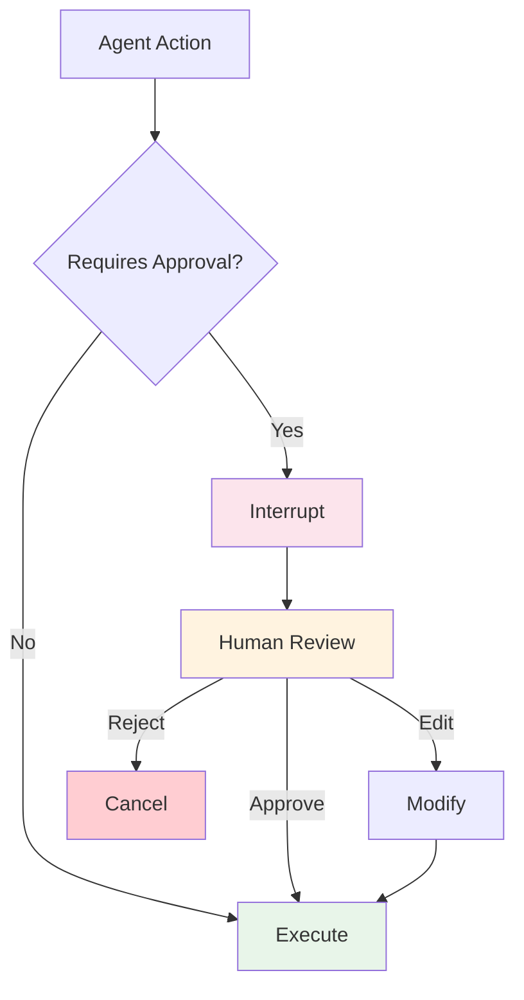

```python
human_response = Command(
    resume={"approved": True, "edited_response": "..."}
)
result = app.invoke(human_response, config)
```

**Speaker Notes:**
Critical for production systems—pause before sending emails, making purchases, or any sensitive action. The graph interrupts, waits for human input via `Command(resume=...)`, then continues execution based on the decision.

---

# Slide 11: Debugging Multi-Agent Systems

## Observability with LangSmith

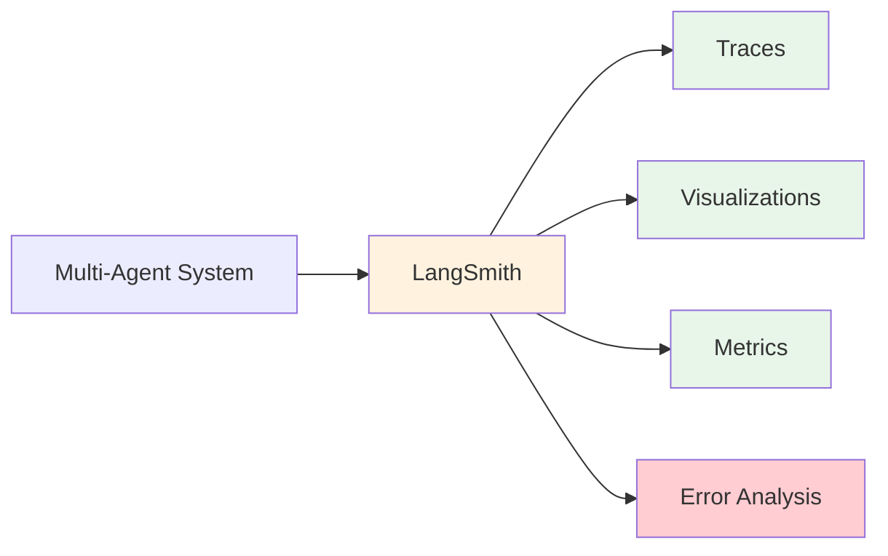

```python
os.environ["LANGCHAIN_TRACING_V2"] = "true"
os.environ["LANGCHAIN_API_KEY"] = "your-key"
```

| Issue | Cause | Solution |
|-------|-------|----------|
| Lost context | Missing checkpointer | Add `InMemorySaver()` |
| Wrong agent | Bad handoff description | Improve tool description |
| State mismatch | Type error | Check TypedDict schema |

**Speaker Notes:**
LangSmith is essential for debugging multi-agent systems. You can trace each agent's actions, visualize the graph execution, and catch errors early. Common issues: forgetting the checkpointer (loses agent tracking) or vague handoff descriptions (agent picks wrong target).

---

# Slide 12: Customer Support Example

## Flight + Hotel Booking Swarm

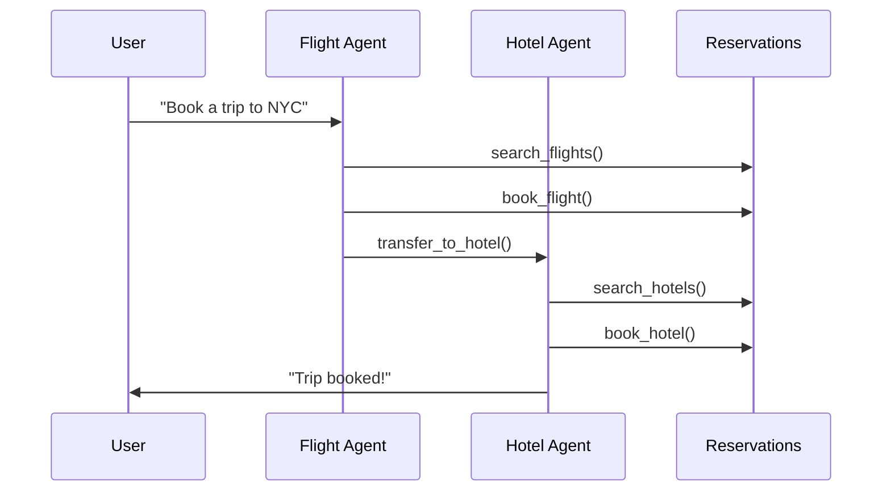

**Key features:**
- Shared reservation state
- Dynamic handoffs based on task
- Memory persistence across conversation

**Speaker Notes:**
This example from LangGraph Swarm shows a realistic customer support scenario. The flight agent handles flight booking, then hands off to hotel agent. Both read and write to shared RESERVATIONS state. The checkpointer ensures context is maintained between turns.

---

# Slide 13: Pattern Comparison

## Choosing the Right Architecture

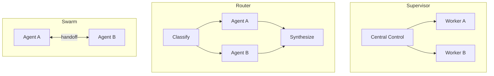

| Pattern | Coordination | Best For |
|---------|--------------|----------|
| Supervisor | Central | Sequential expertise |
| Router | Parallel | Knowledge verticals |
| Swarm | Dynamic | Fluid conversations |

**Speaker Notes:**
Choose supervisor when you need central coordination and sequential task handling. Choose router when queries span multiple knowledge domains that can be searched in parallel. Choose swarm when conversation flow is unpredictable and agents need to hand off dynamically.

---

# Slide 14: Implementation Checklist

## Building Your First Multi-Agent System

1. **Decide architecture**
   - [ ] Supervisor, Router, or Swarm?

2. **Define state schema**
   - [ ] `class State(TypedDict)` with shared fields

3. **Create specialized agents**
   - [ ] Each with focused tools and prompts

4. **Add coordination mechanism**
   - [ ] Supervisor logic OR handoff tools

5. **Configure memory**
   - [ ] `InMemorySaver()` for checkpointer
   - [ ] Optional `InMemoryStore()` for long-term

6. **Enable observability**
   - [ ] LangSmith tracing enabled

**Speaker Notes:**
Walk through this checklist when building any multi-agent system. The order matters: architecture choice informs state design, which informs agent specialization. Memory and observability are often forgotten but essential for production.

---

# Slide 15: Summary

## Key Takeaways

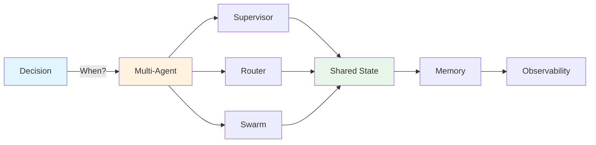

1. **Not everything needs multi-agent** — single agent often works
2. **Three patterns**: Supervisor, Router, Swarm
3. **Shared state** via TypedDict enables coordination
4. **Checkpointer required** for multi-turn conversations
5. **Human-in-the-loop** for sensitive actions
6. **LangSmith** for debugging complex interactions

**Speaker Notes:**
These six takeaways capture the essence of multi-agent systems. The most common mistake is reaching for multi-agent too early—always ask if a single agent with dynamic tools could work. When you do need multi-agent, state management is the foundation everything else builds on.

---

# Slide 16: Resources & Q&A

## Essential Reading

| Resource | Link |
|----------|------|
| Multi-agent Overview | [LangChain Docs](https://docs.langchain.com/oss/python/langchain/multi-agent/index) |
| LangGraph Swarm | [GitHub](https://github.com/langchain-ai/langgraph-swarm-py) |
| Supervisor Tutorial | [LangChain Docs](https://docs.langchain.com/oss/python/langchain/multi-agent/subagents-personal-assistant) |
| Router Tutorial | [LangChain Docs](https://docs.langchain.com/oss/python/langchain/multi-agent/router-knowledge-base) |
| LangChain Academy | [GitHub](https://github.com/langchain-ai/langchain-academy) |
| "Don't Build Multi-Agents" | [Cognition](https://cognition.ai/blog/dont-build-multi-agents) |

## Assignment
Build a multi-agent system with:
- Supervisor coordinating 2+ workers
- Shared state schema
- Human-in-the-loop for final approval

**Questions?**

**Speaker Notes:**
Point students to LangChain Academy for hands-on code examples. The "Don't Build Multi-Agents" article is a healthy counterpoint—it argues for simpler architectures when possible. The assignment ties together supervisor pattern, state management, and human-in-the-loop.

---

*Session 5 | Multi-Agent Systems | Complex Agents Module | Week 3*
