# Session 6: Agent Memory
## Slide Deck Specification

*AIE9 - AI Engineering Bootcamp*
*January 2026*

---

## Slide 1: Title Slide

### Content
**Session 6: Agent Memory**

Building Memory-Enabled Agents with LangGraph

*AI Engineering Bootcamp - Cohort 9*

### Visual
- AI Makerspace logo
- Session number badge
- Memory icon (brain with circuit patterns)

### Speaker Notes
Welcome to Session 6. Today we dive into one of the most critical aspects of building production agents: memory. Without memory, agents are stateless - they forget everything between interactions. We'll learn how to give agents both short-term memory for conversation context and long-term memory for persistent knowledge across sessions.

---

## Slide 2: Learning Objectives

### Content
By the end of this session, you will:

1. **Understand** the difference between short-term and long-term memory
2. **Implement** checkpointers for conversation persistence
3. **Configure** stores with namespaces for cross-thread data
4. **Build** semantic memory search using embeddings

### Visual
- Four objective cards with icons:
  - Brain icon (understand)
  - Database icon (implement)
  - Folder tree icon (configure)
  - Search icon (build)

### Speaker Notes
These four objectives build a complete picture of agent memory. First we understand the conceptual distinction between memory types. Then we implement the persistence layer with checkpointers. Next we organize long-term data with stores and namespaces. Finally, we make memories searchable with semantic retrieval.

---

## Slide 3: What is Agent Memory?

### Content
> **"Memory is a system that remembers information about previous interactions."**
> -- LangGraph Documentation

**Why Memory Matters:**
- Maintains conversation continuity
- Enables personalization over time
- Stores learned facts and preferences
- Supports multi-turn reasoning

### Visual
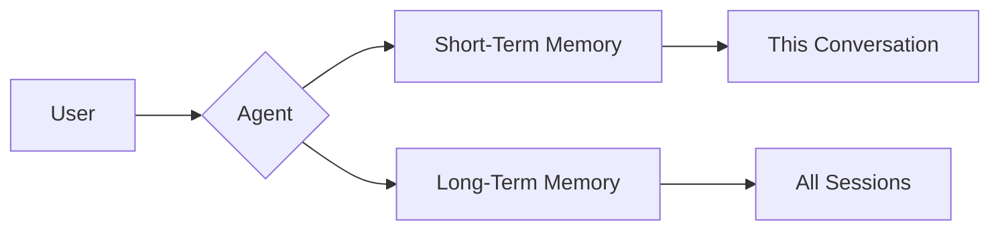

### Speaker Notes
At its core, memory is about persistence. Without memory, every agent interaction starts from zero. The agent doesn't know who you are, what you discussed before, or what you prefer. Memory solves this by storing information that survives beyond a single request. This quote from LangGraph captures the essence - memory is simply a system for remembering previous interactions.

**Reference:** https://docs.langchain.com/oss/python/concepts/memory

---

## Slide 4: Short-Term Memory

### Content
> **"Short-term memory lets your application remember previous interactions within a single thread or conversation."**
> -- LangGraph Documentation

**Characteristics:**
- Thread-scoped (isolated per conversation)
- Automatic (updates at each step)
- Sequential (ordered message history)
- Managed by **Checkpointer**

### Visual
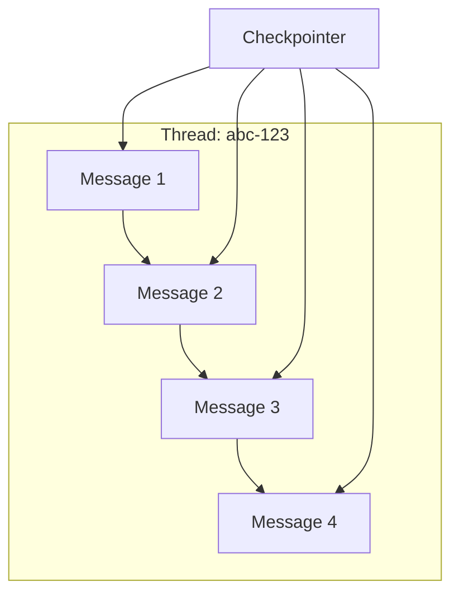

### Speaker Notes
Short-term memory is conversation memory. Think of it like working memory in humans - it holds the current context. Each thread ID gets its own isolated history. When you start a new conversation, you get a fresh slate. The checkpointer automatically saves state after each step, so if you restart your application, the conversation picks up where it left off.

**Reference:** https://docs.langchain.com/oss/python/langchain/short-term-memory

---

## Slide 5: Long-Term Memory

### Content
> **"Long-term memory stores user-specific or application-level data across sessions and is shared across conversational threads."**
> -- LangGraph Documentation

**Characteristics:**
- Cross-thread (shared across conversations)
- Namespace-organized (hierarchical structure)
- JSON documents (flexible format)
- Managed by **Store**

### Visual
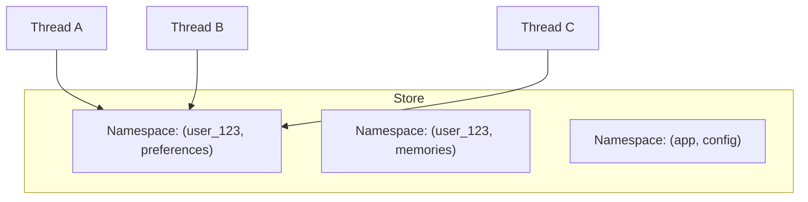

### Speaker Notes
Long-term memory transcends individual conversations. It's where you store things like user preferences, learned facts, and persistent knowledge. Unlike checkpointer memory, store memory is accessible from any thread. If a user tells you their favorite color in one conversation, you can recall it in a completely different conversation weeks later. This is what makes agents truly personalized.

**Reference:** https://docs.langchain.com/oss/python/langchain/long-term-memory

---

## Slide 6: Checkpointers

### Content
**Three Checkpointer Types:**

| Checkpointer | Package | Use Case |
|--------------|---------|----------|
| `InMemorySaver` | `langgraph-checkpoint` | Development/testing |
| `SqliteSaver` | `langgraph-checkpoint-sqlite` | Local persistence |
| `PostgresSaver` | `langgraph-checkpoint-postgres` | Production |

```python
from langgraph.checkpoint.memory import InMemorySaver
checkpointer = InMemorySaver()
graph = builder.compile(checkpointer=checkpointer)
```

### Visual
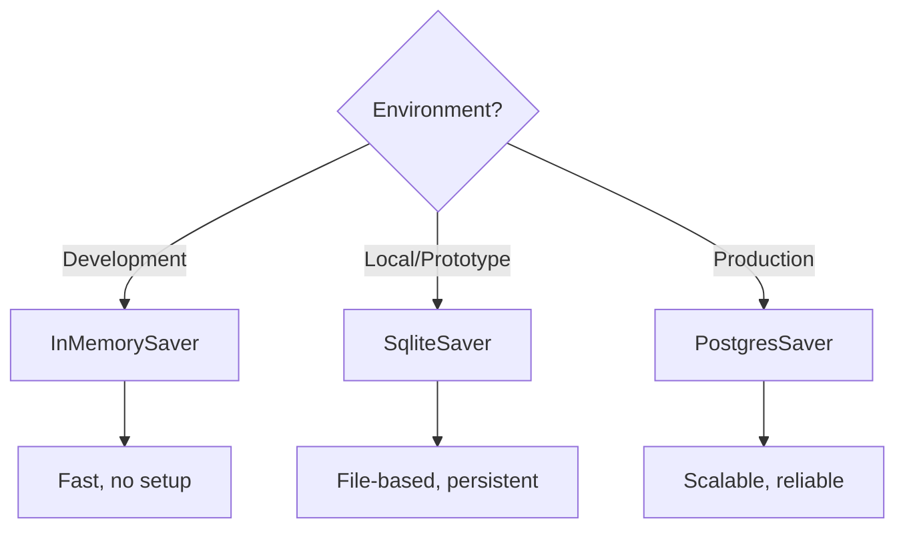

### Speaker Notes
LangGraph provides three checkpointer implementations for different scenarios. InMemorySaver is fastest but data is lost when the process ends - perfect for development. SqliteSaver writes to a local file, giving you persistence without infrastructure. PostgresSaver is for production - it scales, handles concurrent access, and integrates with your existing database infrastructure. Choose based on your deployment context.

**Reference:** https://docs.langchain.com/oss/python/langgraph/persistence

---

## Slide 7: Stores and Namespaces

### Content
**Store = Long-term memory container**

**Namespace = Hierarchical organization**

```python
store.put(
    namespace = ("user_123", "preferences"),  # Tuple path
    key = "theme",                             # Document key
    value = {"mode": "dark", "font": "large"} # JSON data
)
```

**Namespace Examples:**
- `("user_123", "preferences")` - User settings
- `("user_123", "memories")` - Learned facts
- `("app", "config")` - App-wide settings

### Visual
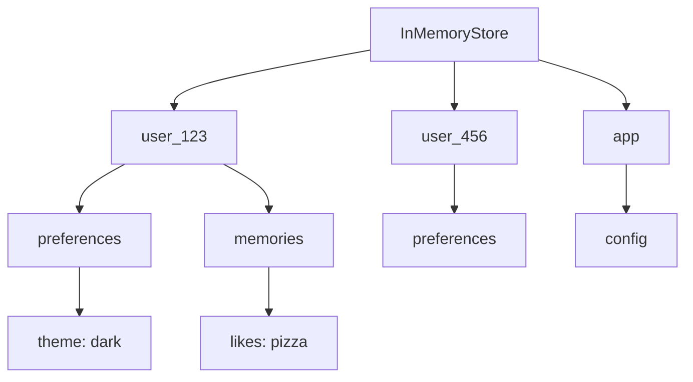

### Speaker Notes
Stores organize data using namespaces - tuples that create a hierarchical path. Think of it like a file system: the namespace is the directory path, the key is the filename, and the value is the file contents. This structure lets you organize data by user, by context type, or any hierarchy that makes sense for your application. The tuple format is intentional - it makes it easy to construct paths dynamically from config values.

**Reference:** https://docs.langchain.com/oss/python/langgraph/persistence

---

## Slide 8: Thread Management

### Content
**Thread = Unique Conversation Identifier**

```python
config = {
    "configurable": {
        "thread_id": "conv-abc-123",  # Conversation identity
        "user_id": "user_456"          # For store namespace
    }
}

response = graph.invoke({"messages": [...]}, config)
```

**Thread Isolation:**
- Each thread has separate message history
- Same user can have multiple threads
- Thread ID typically includes session or conversation ID

### Visual
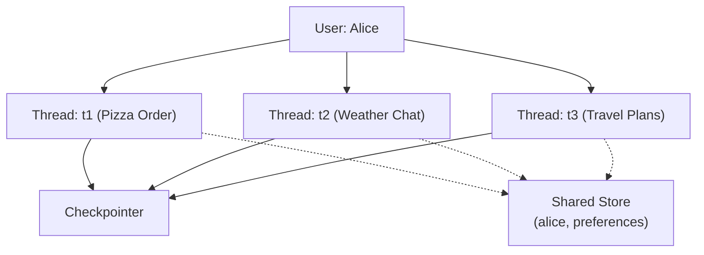

### Speaker Notes
Thread management is how you identify unique conversations. The thread_id in config tells the checkpointer which conversation state to load and save. Notice in the diagram how three different threads are isolated - each has its own message history - but they all share access to the same long-term store. This is the key architectural insight: threads isolate short-term memory while the store shares long-term memory.

**Reference:** https://docs.langchain.com/oss/python/langgraph/add-memory

---

## Slide 9: Hot Path Memory

### Content
**Hot Path = Synchronous state updates during execution**

```python
from langgraph.graph import Command

def my_node(state):
    return Command(
        update={"counter": state["counter"] + 1},
        goto="next_node"
    )
```

**Characteristics:**
- Happens during graph execution
- Blocking (waits for completion)
- Persisted via checkpointer
- Used for: message history, tool results, state tracking

### Visual
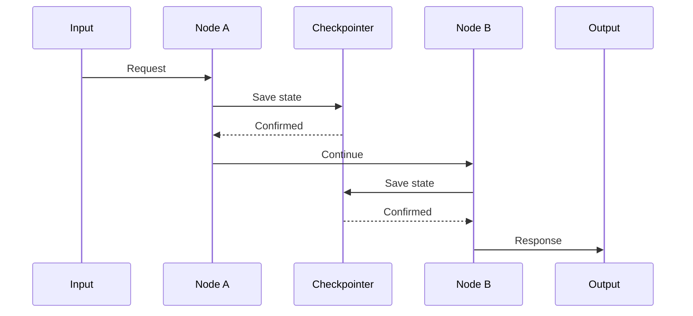

### Speaker Notes
Hot path memory updates happen as part of the main execution flow. When a node returns a Command with an update, that state change is persisted before moving to the next node. This is blocking - the graph waits for the checkpointer to confirm the save. Hot path is perfect for critical state like conversation messages or tool call results that must be persisted reliably. The trade-off is latency - each save adds time to the request.

**Reference:** https://docs.langchain.com/oss/python/langgraph/use-graph-api

---

## Slide 10: Background Memory

### Content
**Background = Asynchronous persistence outside main flow**

```python
def update_memory(state, config, *, store):
    user_id = config["configurable"]["user_id"]
    namespace = (user_id, "memories")

    # Non-blocking write to store
    store.put(namespace, "fact_001", {
        "text": "User mentioned they love jazz"
    })

    return state  # Continue immediately
```

**Use Cases:**
- User preference learning
- Fact extraction from conversations
- Analytics and logging
- Cross-session insights

### Visual
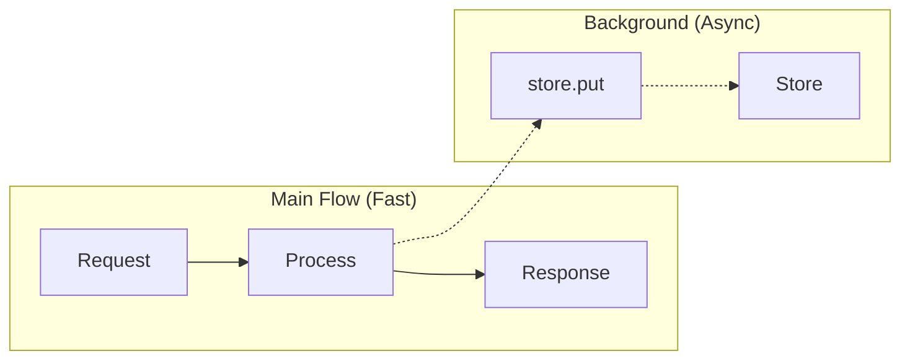

### Speaker Notes
Background memory is for non-critical persistence that shouldn't slow down the user's response. Instead of blocking, you fire off a store write and continue. The user gets their response quickly while the memory persists asynchronously. This is ideal for "nice to have" persistence like learning user preferences or extracting facts for later use. The trade-off is that if the process crashes before the write completes, that data might be lost.

**Reference:** https://docs.langchain.com/oss/python/langgraph/persistence

---

## Slide 11: Dual Memory Architecture

### Content
**Complete Pattern: Checkpointer + Store**

```python
from langgraph.checkpoint.memory import InMemorySaver
from langgraph.store.memory import InMemoryStore

checkpointer = InMemorySaver()  # Short-term
store = InMemoryStore()          # Long-term

graph = builder.compile(
    checkpointer=checkpointer,
    store=store
)
```

**When to Use Each:**
| Data Type | Use | Why |
|-----------|-----|-----|
| Messages | Checkpointer | Thread-scoped |
| Preferences | Store | Cross-thread |
| Tool results | Checkpointer | Conversation context |
| Learned facts | Store | Persistent knowledge |

### Visual
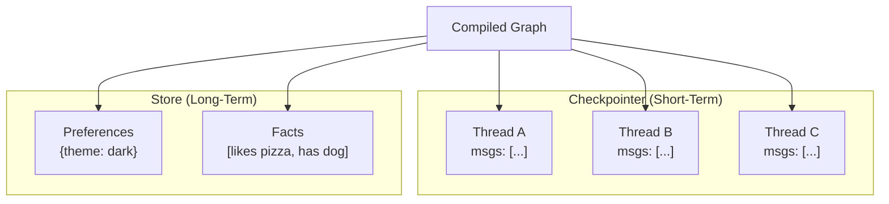

### Speaker Notes
The dual memory architecture combines both persistence mechanisms. The checkpointer handles conversation state - messages flow in, get processed, and accumulate in thread-specific history. The store handles everything else - user preferences, learned facts, application configuration. Together they give you complete memory coverage. Notice how you pass both to compile() - LangGraph then makes both available to your nodes.

**Reference:** https://docs.langchain.com/oss/python/langgraph/persistence

---

## Slide 12: Memory Search

### Content
**Semantic Search = Find memories by meaning, not exact match**

```python
from langchain.embeddings import init_embeddings

store = InMemoryStore(
    index={
        "embed": init_embeddings("openai:text-embedding-3-small"),
        "dims": 1536
    }
)

# Store and search
store.put(ns, "1", {"text": "I love pizza"})
items = store.search(ns, query="I'm hungry", limit=3)
```

**How It Works:**
1. Query gets embedded into vector
2. Vectors compared for similarity
3. Most similar memories returned

### Visual
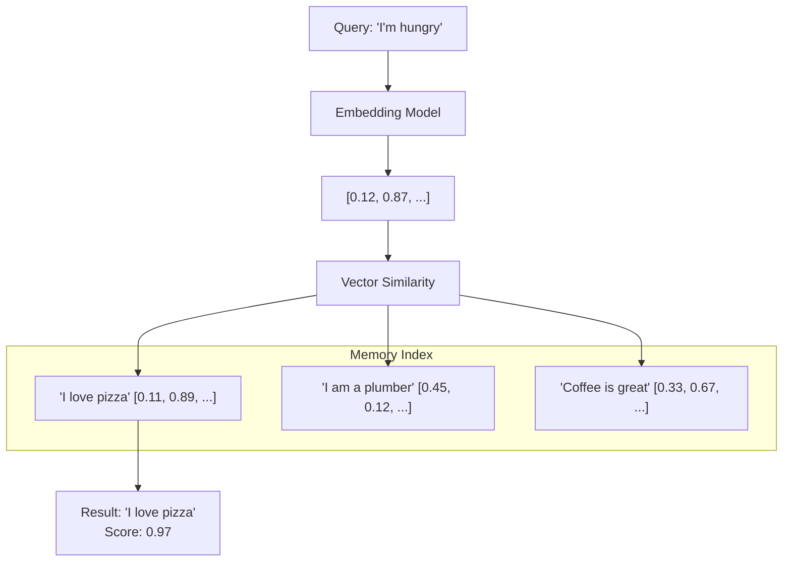

### Speaker Notes
Semantic search transforms memory retrieval. Instead of exact key lookups, you search by meaning. When configured with an embedding model, the store automatically embeds stored text and queries, then finds the most similar matches. This is powerful - "I'm hungry" matches "I love pizza" because they're semantically related, even though they share no words. Configure this by passing an index configuration when creating your store.

**Reference:** https://docs.langchain.com/oss/python/langgraph/add-memory

---

## Slide 13: Memory Lifecycle

### Content
**CRUD Operations for Memory:**

| Operation | Method | Description |
|-----------|--------|-------------|
| Create | `store.put(ns, key, value)` | Add new memory |
| Read | `store.get(ns, key)` | Exact key lookup |
| Search | `store.search(ns, query=...)` | Semantic search |
| Update | `store.put(ns, key, new_value)` | Overwrite existing |
| Delete | `store.delete(ns, key)` | Remove memory |

```python
def memory_node(state, config, *, store):
    user_id = config["configurable"]["user_id"]
    ns = (user_id, "memories")

    # Read
    item = store.get(ns, "settings")

    # Write
    store.put(ns, "settings", {"theme": "dark"})
```

### Visual
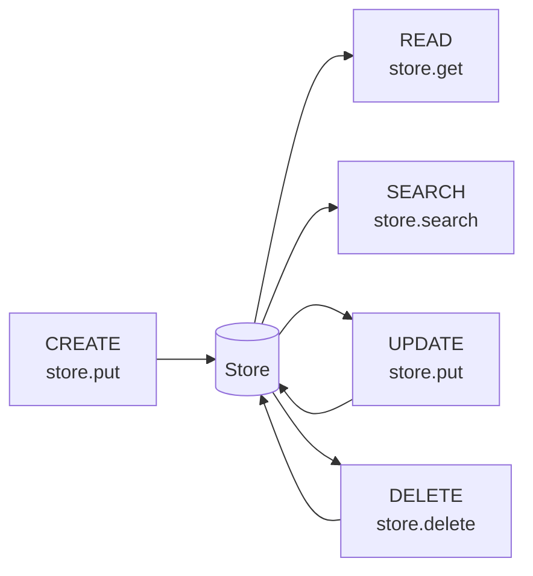

### Speaker Notes
Memory has a lifecycle - create, read, update, delete. The store API is straightforward: put() for create and update (it overwrites), get() for exact key lookup, search() for semantic retrieval, and delete() for removal. Notice the node signature includes `store` as a keyword argument - LangGraph injects the store automatically when you compile with one. The namespace and key together uniquely identify each memory item.

**Reference:** https://docs.langchain.com/oss/python/langgraph/persistence

---

## Slide 14: Common Misconceptions

### Content
**Misconception vs Reality:**

| Misconception | Reality |
|---------------|---------|
| "Checkpointer stores long-term memory" | Checkpointer is thread-scoped; use Store for cross-thread |
| "InMemorySaver persists to disk" | InMemory = RAM only; use SqliteSaver for disk |
| "All threads share messages" | Each thread_id has isolated message history |
| "Store and checkpointer are the same" | Different purposes: Store for data, Checkpointer for state |
| "Memory persists automatically" | Need explicit checkpointer for persistence |

### Visual
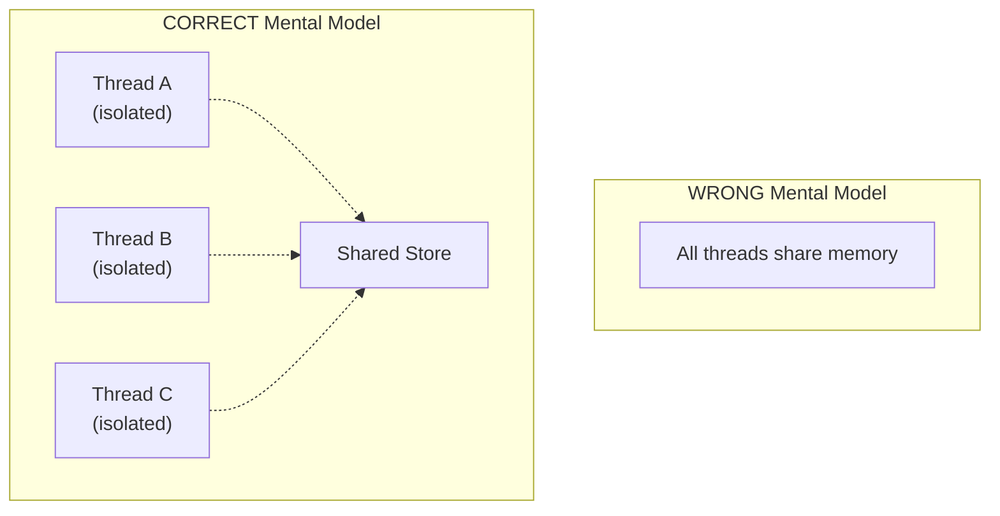

### Speaker Notes
These misconceptions trip up many developers. The biggest confusion is between checkpointer and store scope. Checkpointers are thread-scoped - perfect for conversation history but not for cross-conversation data. InMemorySaver sounds persistent but it's RAM-only - restart your app and everything's gone. And remember: without explicitly adding a checkpointer, your graph has no memory at all - state is completely ephemeral.

---

## Slide 15: Key Takeaways

### Content
1. **Two memory types**: Short-term (conversation) vs Long-term (persistent)
2. **Checkpointer = thread-scoped**: Manages conversation state automatically
3. **Store = cross-thread**: Organizes persistent data by namespace
4. **Thread isolation**: Each thread_id gets separate history
5. **Hot path vs background**: Choose blocking vs async based on criticality
6. **Dual architecture**: Use checkpointer AND store together
7. **Semantic search**: Retrieve memories by meaning, not just key
8. **Choose the right checkpointer**: InMemory for dev, Postgres for prod

### Visual
- Eight takeaway cards with checkmarks
- Visual summary showing Checkpointer + Store architecture

### Speaker Notes
Let's recap the key points. Agent memory comes in two flavors - short-term for conversations and long-term for persistent knowledge. Checkpointers manage short-term memory automatically, saving after each step. Stores organize long-term data with namespaces. Threads isolate conversations. You can update memory synchronously on the hot path or asynchronously in the background. Production systems need both checkpointer and store. Semantic search makes memories findable by meaning. And always match your checkpointer to your environment.

---

## Slide 16: Next Steps & Resources

### Content
**Today's Homework:**
- Implement short-term memory with InMemorySaver
- Add long-term memory store with namespaces
- Configure thread management with unique IDs
- Implement semantic search for memory retrieval
- Record a Loom walkthrough

**Resources:**
- [Memory Overview](https://docs.langchain.com/oss/python/concepts/memory)
- [Short-Term Memory](https://docs.langchain.com/oss/python/langchain/short-term-memory)
- [Long-Term Memory](https://docs.langchain.com/oss/python/langchain/long-term-memory)
- [Persistence Guide](https://docs.langchain.com/oss/python/langgraph/persistence)

**LangChain Academy:**
- [Introduction to LangGraph](https://github.com/langchain-ai/langchain-academy) - Module 4: Memory & Persistence
- [Ambient Agents Project](https://github.com/langchain-ai/agents-from-scratch) - Memory capabilities
- [DeepLearning.AI Course](https://www.deeplearning.ai/short-courses/long-term-agentic-memory-with-langgraph/) - Free long-term memory course

### Visual
- QR codes to resources
- Homework checklist

### Speaker Notes
Your homework is to build a complete memory-enabled agent. Start with short-term memory using a checkpointer, then add long-term memory with a store. Make sure you test thread isolation - start two conversations and verify they don't see each other's messages. Then implement semantic search so your agent can recall relevant memories. Record a Loom explaining your implementation and what you learned.

---

## Appendix: Mermaid Diagrams (For Export)

### Diagram 1: Memory Types Comparison
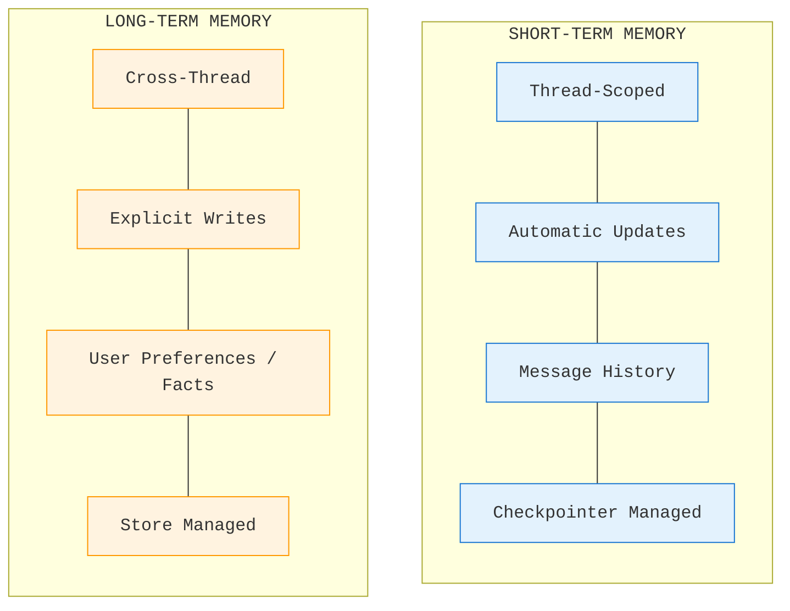

### Diagram 2: Checkpointer Architecture (Sequence)
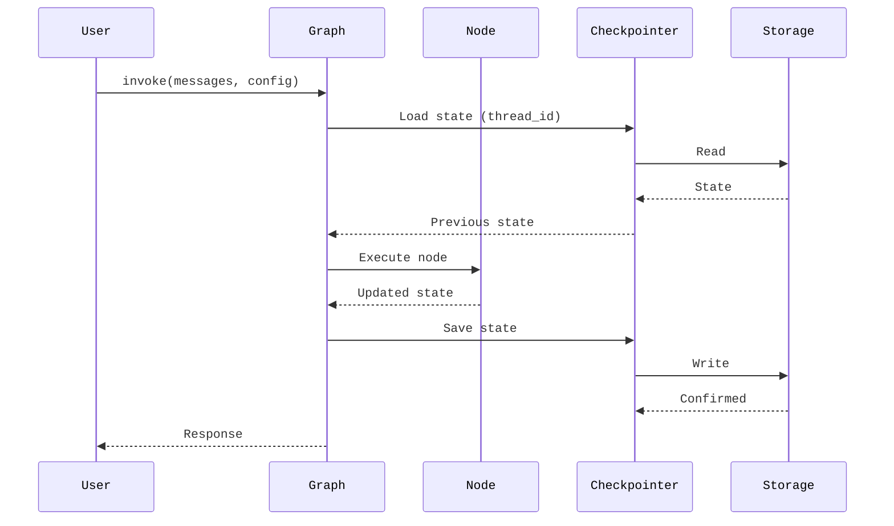

### Diagram 3: Store Namespace Hierarchy (Tree)
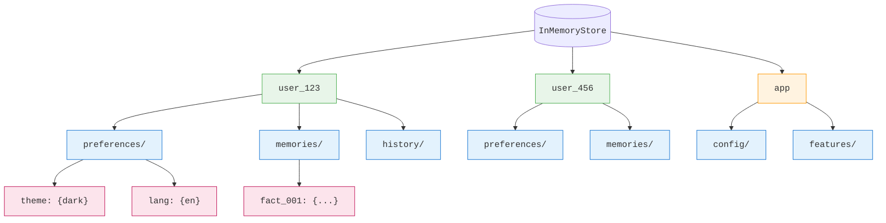

### Diagram 4: Hot Path vs Background Write Flow
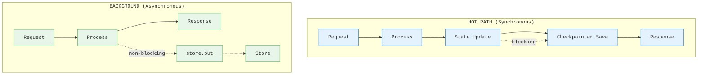

### Diagram 5: Thread-based Conversation State
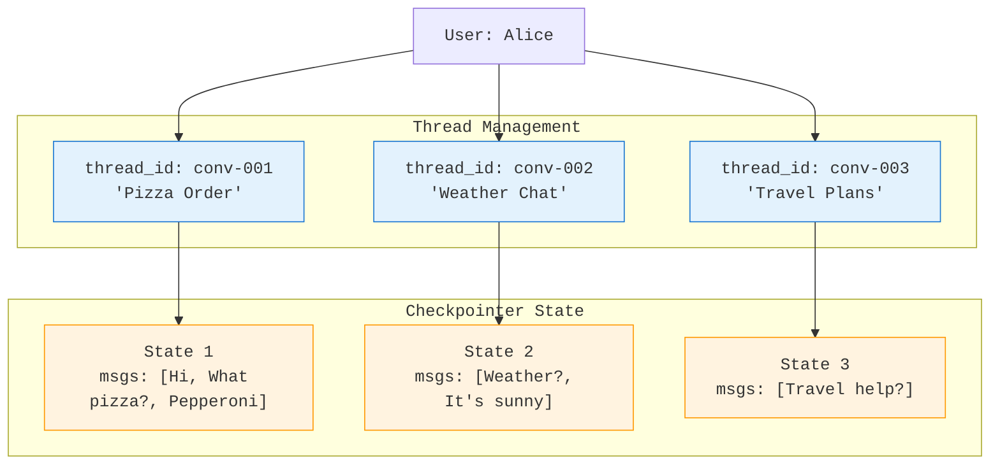

### Diagram 6: Memory Lifecycle (Circular)
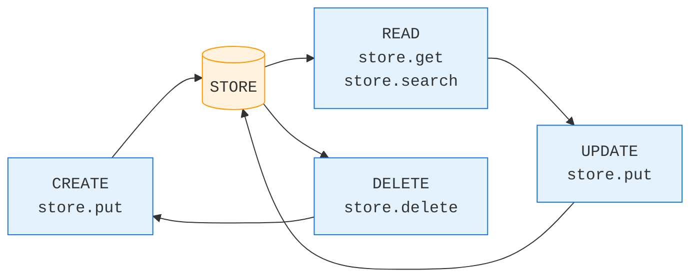

### Diagram 7: Dual Memory Architecture
```mermaid
%%{
  init: {
    "fontFamily": "monospace"
  }
}%%
graph TB
    G[Compiled Graph]

    subgraph "CHECKPOINTER (Short-Term)"
        CP[InMemorySaver / SqliteSaver / PostgresSaver]
        T1["Thread A: [msg1, msg2, ...]"]
        T2["Thread B: [msg1, ...]"]
        T3["Thread C: [msg1, msg2, msg3, ...]"]
        CP --> T1
        CP --> T2
        CP --> T3
    end

    subgraph "STORE (Long-Term)"
        ST[InMemoryStore]
        NS1["(user, prefs): {theme: dark}"]
        NS2["(user, facts): [likes pizza, ...]"]
        NS3["(app, config): {features: [...]}"]
        ST --> NS1
        ST --> NS2
        ST --> NS3
    end

    G --> CP
    G --> ST

    classDef graph fill:#e8f5e9,stroke:#4CAF50;
    classDef checkpointer fill:#e3f2fd,stroke:#1976D2;
    classDef store fill:#fff3e0,stroke:#FF9800;

    class G graph;
    class CP,T1,T2,T3 checkpointer;
    class ST,NS1,NS2,NS3 store;
```

### Diagram 8: Memory Search Pattern
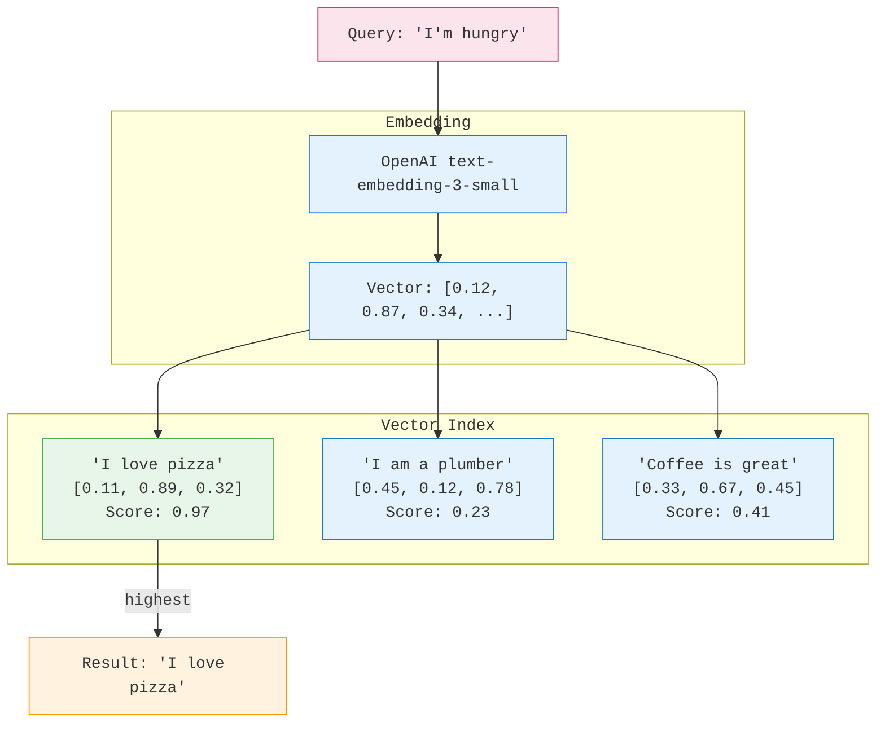

---

## Design Notes

### Color Palette
- **Primary**: #1976D2 (Blue) - Checkpointer, Short-term
- **Secondary**: #FF9800 (Orange) - Store, Long-term
- **Accent**: #4CAF50 (Green) - Success, Completed
- **Highlight**: #c2185b (Pink) - Important, Query
- **Background**: #FAFAFA (Light Gray)

### Fonts
- **Headings**: Inter Bold
- **Body**: Inter Regular
- **Code**: JetBrains Mono

### Slide Layout Guidelines
- Title slides: Centered, large text
- Content slides: Left-aligned, with visual on right
- Diagram slides: Diagram centered, minimal text
- Code slides: Syntax highlighted, large font
- Quote slides: Quote prominent, attribution below

### Icon Suggestions
- Short-term memory: Clock or chat bubble
- Long-term memory: Database or brain
- Checkpointer: Save disk icon
- Store: Folder tree or filing cabinet
- Thread: Conversation thread icon
- Search: Magnifying glass

---

## References (Full List)

1. LangGraph Documentation. "Memory Overview." https://docs.langchain.com/oss/python/concepts/memory
2. LangChain Documentation. "Short-Term Memory." https://docs.langchain.com/oss/python/langchain/short-term-memory
3. LangChain Documentation. "Long-Term Memory." https://docs.langchain.com/oss/python/langchain/long-term-memory
4. LangGraph Documentation. "Persistence Guide." https://docs.langchain.com/oss/python/langgraph/persistence
5. LangGraph Documentation. "Add Memory Guide." https://docs.langchain.com/oss/python/langgraph/add-memory
6. LangGraph Documentation. "Command API." https://docs.langchain.com/oss/python/langgraph/use-graph-api
7. LangGraph Documentation. "Dynamic Runtime Context." https://docs.langchain.com/oss/python/concepts/context
8. LangChain Documentation. "Embedding Models." https://docs.langchain.com/oss/python/integrations/text_embedding/index
9. LangSmith Documentation. "Observability." https://docs.langchain.com/langsmith/observability

---

*Slide deck specification for AIE9 Session 6: Agent Memory*
*Export to PowerPoint using preferred tool (python-pptx, reveal.js, etc.)*
