# Session 8: Deep Research - Slides

> Build research agents that can scope, research, and write comprehensive reports

---

## Slide 1: Title

### Content
# Session 8: Deep Research
## Build Research Agents That Scope, Research, and Write

**AIE9 - AI Engineering Bootcamp**

### Visual
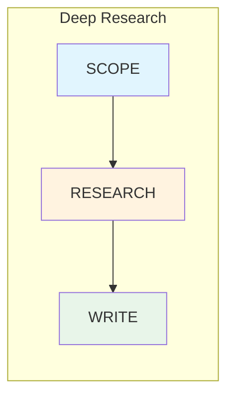

### Speaker Notes
Welcome to Session 8 on Deep Research. Today we'll learn how to build research agents that can handle complex research tasks through a structured three-step process. This builds directly on Session 7's Deep Agents framework, applying it to the specialized domain of research and report generation.

---

## Slide 2: Learning Objectives

### Content
## By the end of this session, you will be able to:

1. **Explain** the three-step deep research process
2. **Distinguish** deep research from general deep agents
3. **Implement** query decomposition for multi-hop reasoning
4. **Build** iterative research cycles with source evaluation
5. **Configure** report synthesis with citation attribution
6. **Apply** the Bitter Lesson philosophy
7. **Evaluate** research quality using RACE and FACT frameworks

### Visual
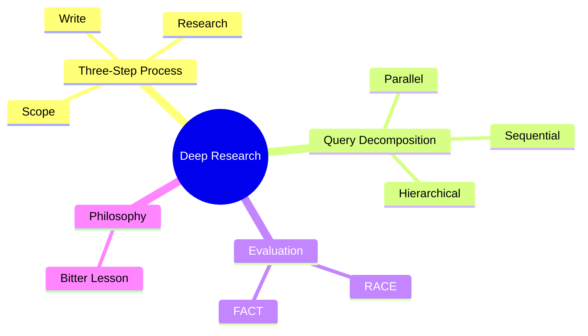

### Speaker Notes
These seven outcomes map to the key skills you'll need to build production-quality research agents. Notice how we progress from understanding the process to implementing it, then to evaluating the results. By the end, you'll have built your own deep research clone.

---

## Slide 3: Deep Research vs Deep Agents

### Content
## When to Use What

| Aspect | Deep Agents (Session 7) | Deep Research (Session 8) |
|--------|------------------------|---------------------------|
| **Purpose** | General complex tasks | Research & reports |
| **Workflow** | Four elements | Three-step process |
| **Output** | Task completion | Reports with citations |
| **Evaluation** | Task success | RACE + FACT metrics |

> **"Deep agents come with planning capabilities, file systems for context management, and the ability to spawn subagents."**
> — LangChain Documentation

### Visual
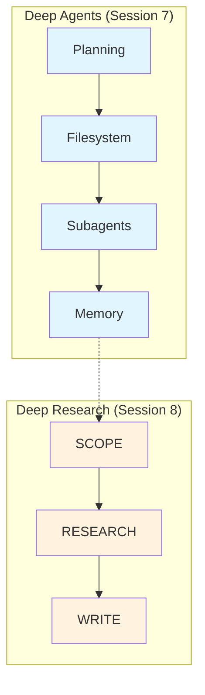

### Speaker Notes
Deep Research is a specialized application of Deep Agents. Session 7 gave you the general framework - planning, filesystem, subagents, memory. Session 8 applies that framework specifically to research workflows. The key difference is the structured three-step process optimized for generating high-quality reports with citations.

---

## Slide 4: The Three-Step Process

### Content
## SCOPE → RESEARCH → WRITE

**SCOPE**: Define objectives, decompose queries, set boundaries
- What is the research question?
- What sub-questions need answers?
- What are the scope boundaries?

**RESEARCH**: Execute searches, evaluate sources, iterate
- Search for information
- Evaluate source quality
- Iterate until sufficient coverage

**WRITE**: Structure report, add citations, verify facts
- Outline the report structure
- Draft sections with evidence
- Add citations and verify

### Visual
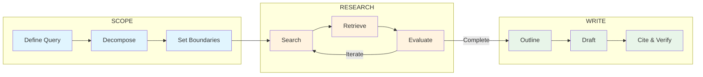

### Speaker Notes
This three-step process is the heart of deep research. Notice the feedback loop in the RESEARCH phase - you iterate until you have sufficient coverage. Also note that the phases aren't strictly linear; you may return to SCOPE if you discover the research question needs refinement.

---

## Slide 5: Query Decomposition

### Content
## Breaking Complex Queries into Sub-Queries

> **"Existing LLMs augmented with retrieval often struggle with multi-hop question answering due to inaccurate query decomposition."**
> — Multi-Hop Reasoning Research

**Three Decomposition Patterns:**

| Pattern | Use Case | Tradeoff |
|---------|----------|----------|
| **Parallel** | Independent sub-queries | Fast, may miss connections |
| **Sequential** | Each answer informs next | Thorough, slower |
| **Hierarchical** | Complex dependencies | Most thorough, complex |

### Visual
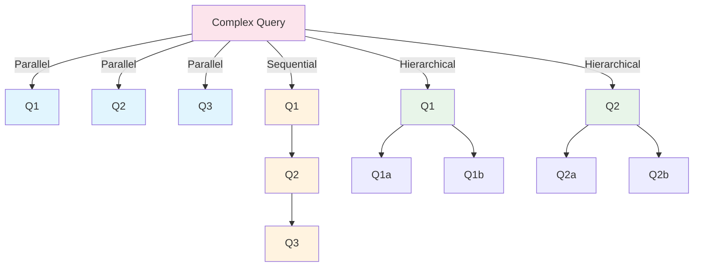

### Speaker Notes
Query decomposition is critical for handling complex research questions. A question like "How do AI agents compare to traditional automation?" might decompose into: definition of AI agents, definition of traditional automation, capability comparison, cost comparison, use case analysis. Choosing the right decomposition pattern affects both quality and latency.

---

## Slide 6: Multi-Hop Reasoning

### Content
## Iterative Retrieval Where Each Step Informs the Next

**The Research Cycle:**
1. **Plan** - Decide what to search for
2. **Search** - Execute the search
3. **Evaluate** - Assess source quality
4. **Refine** - Update plan based on findings

**Stop Conditions:**
- Sufficient coverage achieved
- Maximum iterations reached
- No new information found

> **"Building AI agents is hard because it combines unpredictability from the model with determinism from the system."**
> — AI Engineering Best Practices

### Visual
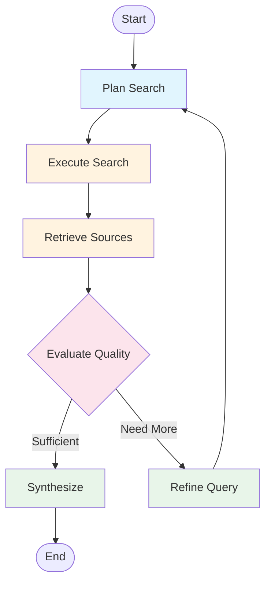

### Speaker Notes
Multi-hop reasoning is like peeling an onion. Your first search might reveal that you need to understand concept X before you can answer the original question. So you search for X, which reveals you need Y, and so on. The key is knowing when to stop - set clear criteria for sufficient coverage.

---

## Slide 7: Source Evaluation and Citation

### Content
## Assessing Quality and Attributing Information

**Citation Quality Factors:**
- **Authority** - Source credibility (institutional vs. community)
- **Accuracy** - Quote matches source content
- **Format** - Consistent citation style
- **Grounding** - Claims tied to specific sources

> **"FACT evaluates an agent's information retrieval and collection capabilities by assessing its effective citation count and overall citation accuracy."**
> — DeepResearch Bench

### Visual
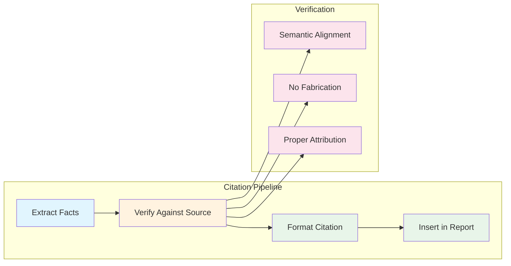

### Speaker Notes
Citation quality is where many research agents fail. It's not enough to include links - you must verify that the cited content actually supports your claims. The FACT framework from DeepResearch Bench gives us concrete metrics: citation count, accuracy, diversity, and trustworthiness.

---

## Slide 8: Report Synthesis

### Content
## Combining Findings into Coherent Reports

**Report Structure:**
1. Executive Summary
2. Introduction (research question, scope)
3. Findings (per sub-query, with citations)
4. Synthesis (cross-cutting themes)
5. Conclusions (answers, confidence levels)
6. References

**Synthesis Patterns:**
| Pattern | Description | Use Case |
|---------|-------------|----------|
| Generator-Critic | Draft then review | High-stakes |
| Incremental | Section by section | Long reports |
| Parallel Sections | Independent generation | Speed-optimized |

### Visual
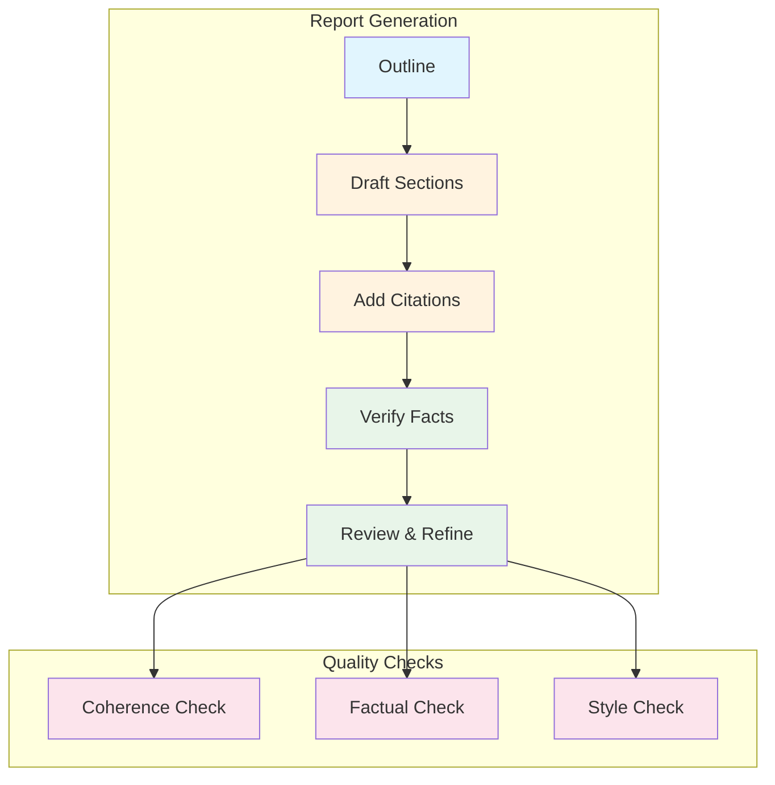

### Speaker Notes
Report synthesis is the WRITE phase in action. Notice we're not just dumping findings - we're structuring them for the reader. The Generator-Critic pattern is particularly powerful: have one agent draft, another review for accuracy. This catches hallucinations before they reach the final output.

---

## Slide 9: The Bitter Lesson

### Content
## General Methods Leveraging Computation Win

> **"By 2026, the most valuable engineers were no longer those who wrote the best prompts, but those who understood how to build systems around models - systems that think, retrieve, evaluate, and act."**
> — AI Engineering Industry Analysis

**Applied to Research:**

| Avoid (Specialized) | Prefer (General) |
|---------------------|------------------|
| Hard-coded routing | Flexible planning |
| Domain-specific agents | Broad tool access |
| Fixed query patterns | Adaptive decomposition |
| Manual source ranking | Learned evaluation |

### Visual
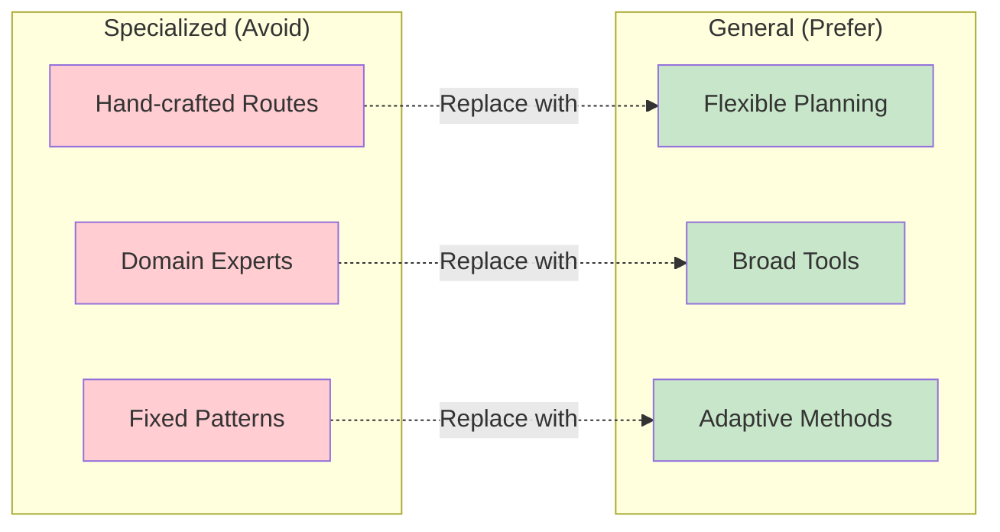

### Speaker Notes
The Bitter Lesson, originally from Rich Sutton, teaches us that methods leveraging computation at scale consistently beat hand-crafted approaches. Lance Martin's blog applies this to research agents: instead of building elaborate routing logic, give agents good tools and let them plan. This is counterintuitive but works.

---

## Slide 10: Evaluation Frameworks

### Content
## RACE for Reports, FACT for Citations

**RACE** (Report Quality):
| Dimension | Weight |
|-----------|--------|
| Relevance | 25% |
| Coherence | 25% |
| Depth | 25% |
| Clarity | 25% |

**FACT** (Citation Quality):
| Dimension | Metric |
|-----------|--------|
| Abundance | Citation count |
| Accuracy | % correct |
| Diversity | Source variety |
| Trustworthiness | No fabrications |

> **"Quality is the production killer, with 32% citing it as a top barrier."**
> — LangChain State of Agent Engineering

### Visual
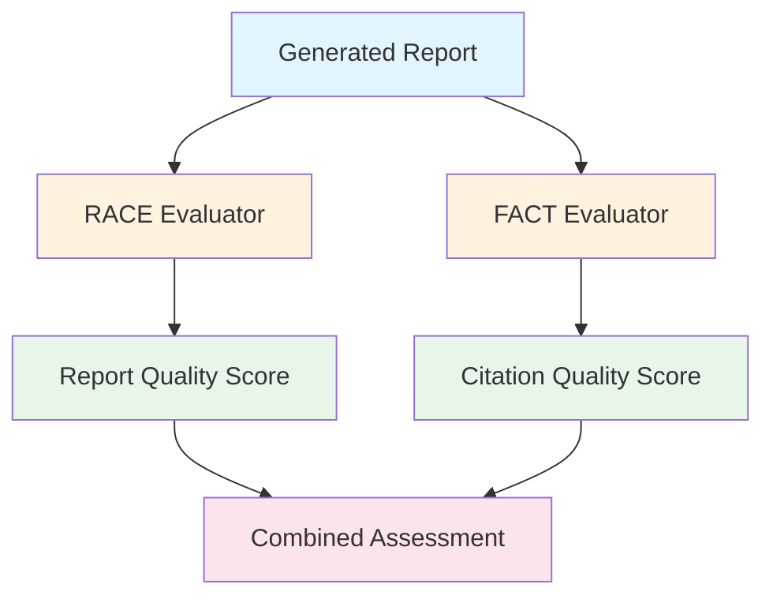

### Speaker Notes
DeepResearch Bench gives us two evaluation frameworks. RACE measures report quality - is it relevant, coherent, deep, and clear? FACT measures citation quality - are there enough citations, are they accurate, diverse, and trustworthy? Together, these give you a comprehensive quality assessment.

---

## Slide 11: Architecture Overview

### Content
## Complete Deep Research System

**Components:**
1. **Query Analyzer** - Understands research intent
2. **Decomposer** - Breaks query into sub-queries
3. **Researcher** - Iterative search and retrieval
4. **Memory** - Stores findings across iterations
5. **Synthesizer** - Generates coherent report
6. **Verifier** - Checks citations and facts

**Integration with Deep Agents:**
- Planning → Research plan, sub-query tracking
- Filesystem → Store findings, notes
- Subagents → Parallel research streams
- Memory → Persist across iterations

### Visual
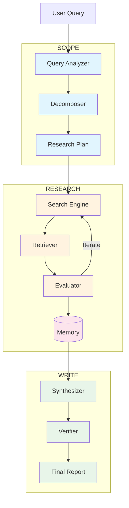

### Speaker Notes
Here's the complete architecture. Notice how it maps to the three-step process: SCOPE components at top, RESEARCH in the middle with its iteration loop, WRITE at bottom. The Memory component spans RESEARCH and WRITE, preserving findings for synthesis. This is where Session 7's filesystem and memory patterns become critical.

---

## Slide 12: Tutorial Notebooks

### Content
## Learning Path: deep_research_from_scratch

| Notebook | Focus | Key Concepts |
|----------|-------|--------------|
| **1** | Setup & Foundations | Environment, APIs, baseline |
| **2** | Query Planning | Decomposition strategies |
| **3** | Iterative Retrieval | Multi-hop reasoning |
| **4** | Report Generation | Synthesis, citations |
| **5** | Full Pipeline | Complete system, evaluation |

**Repository**: [github.com/langchain-ai/deep_research_from_scratch](https://github.com/langchain-ai/deep_research_from_scratch)

**Production Reference**: [github.com/langchain-ai/open_deep_research](https://github.com/langchain-ai/open_deep_research)

### Visual
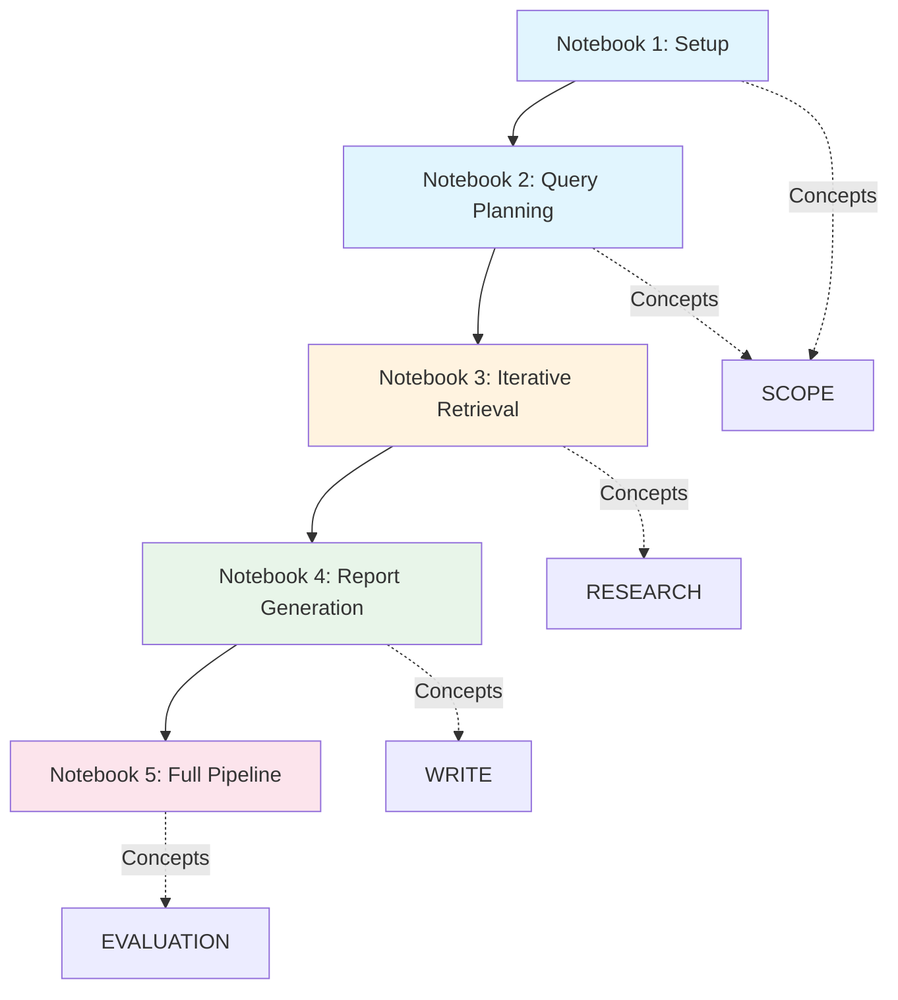

### Speaker Notes
The tutorial notebooks progressively build toward a complete research agent. Start with Notebook 1 for setup, then work through query planning, iterative retrieval, and report generation. Notebook 5 brings it all together with evaluation. For production reference, check out the open_deep_research repository.

---

## Slide 13: Breakout Activities

### Content
## Hands-On Practice

**Breakout Room 1** (Notebooks 1-3):
- Set up environment with API keys
- Implement query decomposition
- Build iterative retrieval
- **Activity**: Compare decomposition strategies

**Breakout Room 2** (Notebooks 4-5):
- Implement report synthesis
- Configure citation attribution
- Apply RACE/FACT evaluation
- **Activity**: Build your own research agent

**Discussion Questions:**
- How does parallel vs. sequential decomposition affect quality?
- How do you balance thoroughness with efficiency?
- When should you stop iterating?

### Visual
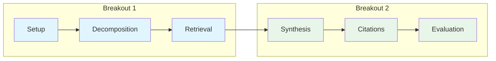

### Speaker Notes
The breakout rooms split the three-step process. Room 1 focuses on SCOPE and RESEARCH - the query planning and iterative retrieval. Room 2 focuses on WRITE and evaluation - synthesis and quality assessment. The key discussion questions help you think critically about design tradeoffs.

---

## Slide 14: Assignment Preview

### Content
## Build an Unrolled Deep Research Clone

**Requirements:**
1. Implement three-step process (scope, research, write)
2. Use query decomposition
3. Build iterative retrieval with source evaluation
4. Generate reports with citations
5. Include evaluation metric (RACE or FACT)

**Deliverables:**
- [ ] Working research agent
- [ ] Documentation of decomposition strategy
- [ ] Sample output with citations
- [ ] Evidence of iterative refinement
- [ ] Basic quality evaluation

**Hint**: Study `open_deep_research` for production patterns

### Visual
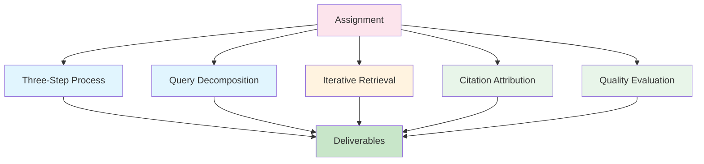

### Speaker Notes
The assignment asks you to build your own deep research clone. Focus on getting the three-step process working end-to-end first, then add sophistication. Don't overcomplicate the decomposition - even a simple parallel decomposition can be effective. The key is having evaluation to measure your system's quality.

---

## Slide 15: Key Takeaways

### Content
## What You Learned Today

1. **Three-Step Process**: SCOPE → RESEARCH → WRITE structures research workflows

2. **Query Decomposition**: Breaking complex queries enables multi-hop reasoning

3. **Iterative Retrieval**: Search, evaluate, refine cycle until sufficient coverage

4. **Citation Quality**: FACT framework ensures accurate attribution

5. **Report Quality**: RACE framework measures coherence and depth

6. **Bitter Lesson**: General methods with broad tools beat specialized architectures

7. **Integration**: Deep Research builds on Deep Agents patterns from Session 7

### Visual
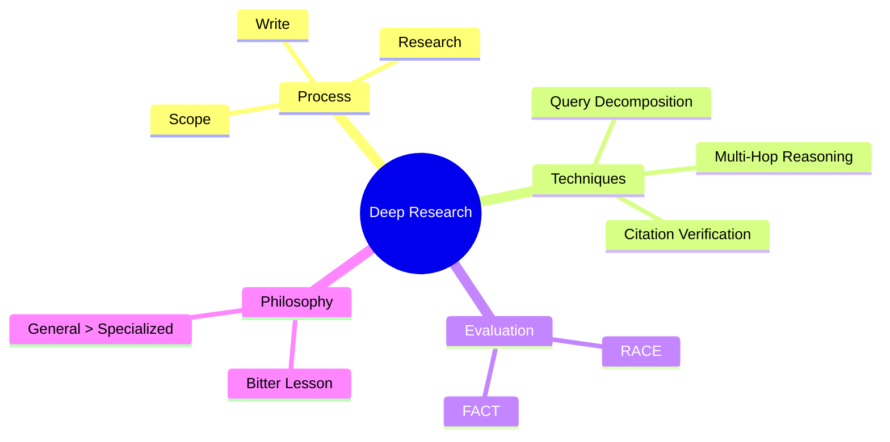

### Speaker Notes
Let's recap the key takeaways. Deep Research gives you a structured approach to building research agents through the three-step process. Query decomposition and multi-hop reasoning handle complex questions. RACE and FACT give you concrete evaluation metrics. And the Bitter Lesson reminds us to trust general methods over hand-crafted specialization.

---

## Slide 16: Q&A and Resources

### Content
## Questions?

**Key Resources:**
- [Learning the Bitter Lesson](https://rlancemartin.github.io/2025/07/30/bitter_lesson/) - Philosophy
- [DeepResearch Bench](https://deepresearch-bench.github.io/) - Evaluation
- [Open Deep Research](https://github.com/langchain-ai/open_deep_research) - Production
- [Deep Research from Scratch](https://github.com/langchain-ai/deep_research_from_scratch) - Tutorial

**Documentation:**
- [Deep Agents Overview](https://docs.langchain.com/oss/python/deepagents/overview)
- [Multi-Agent Patterns](https://docs.langchain.com/oss/python/langchain/multi-agent/index)

**Next Session**: Session 9 - Synthetic Data for Evals

### Visual
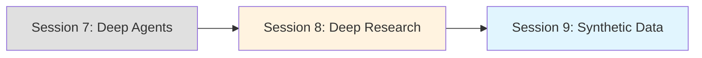

### Speaker Notes
Any questions before we move to breakout rooms? Remember, the tutorial notebooks guide you step-by-step. If you get stuck, the open_deep_research repository shows production patterns. Next session we'll learn about synthetic data generation for evaluations - which connects directly to the RACE and FACT frameworks we discussed today.

---

*Slides created for AIE9 Session 8: Deep Research*
*Last updated: January 2026*
