# Session 9: Synthetic Data Generation for Evals

## Slide Deck for AIE9 Bootcamp

---

## Slide 1: Title

# Synthetic Data Generation for Evals

### Session 9 | AI Engineering Bootcamp

**Learning Focus:**
- Generate synthetic test data with RAGAS
- Understand knowledge graph approach
- Apply evaluation metrics for RAG
- Implement metrics-driven development

---

**Speaker Notes:**
Welcome to Session 9. Today we're tackling one of the most practical challenges in RAG development: how do you evaluate your system when you don't have labeled test data? We'll learn to generate synthetic evaluation datasets and use them for systematic improvement.

---

## Slide 2: The Evaluation Challenge

### Why is evaluation data so hard to get?

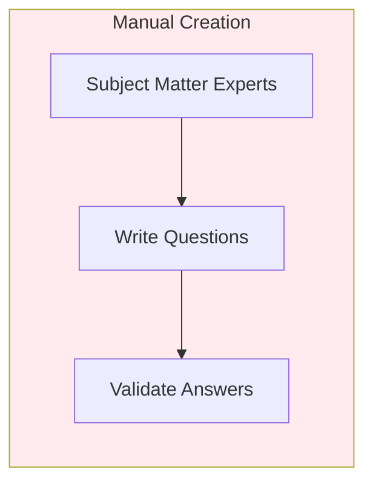

**Problems with manual approach:**
- Expensive (requires domain experts)
- Time-consuming (weeks to months)
- Doesn't scale with document updates
- Human bias in question types

---

**Speaker Notes:**
Ask the class: "Who has tried to create evaluation datasets manually? What was your experience?" The manual approach has fundamental scaling problems. Every time your documents change, your test data becomes stale.

---

## Slide 3: Synthetic Data Solution

### Let LLMs generate your test data

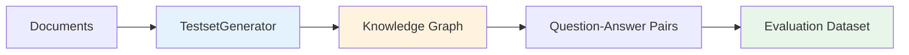

> "By using synthetic data generation, developer time in data aggregation can be reduced by 90%."
> — RAGAS Blog

---

**Speaker Notes:**
Synthetic data generation flips the script. Instead of humans writing questions, we use LLMs to analyze documents and generate diverse question-answer pairs automatically. RAGAS is the industry standard tool for this in RAG applications.

---

## Slide 4: Knowledge Graph Approach

### Why not just generate from random chunks?

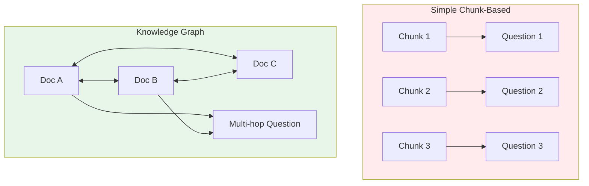

**Knowledge graph enables:**
- Multi-hop reasoning questions
- Cross-document relationships
- Diverse question complexity

---

**Speaker Notes:**
This is a key insight. Simple approaches generate one question per chunk, but real users ask complex questions that span multiple documents. The knowledge graph approach discovers relationships between documents, enabling questions like "How does X in document A relate to Y in document B?"

---

## Slide 5: RAGAS TestsetGenerator

### The core API for synthetic data

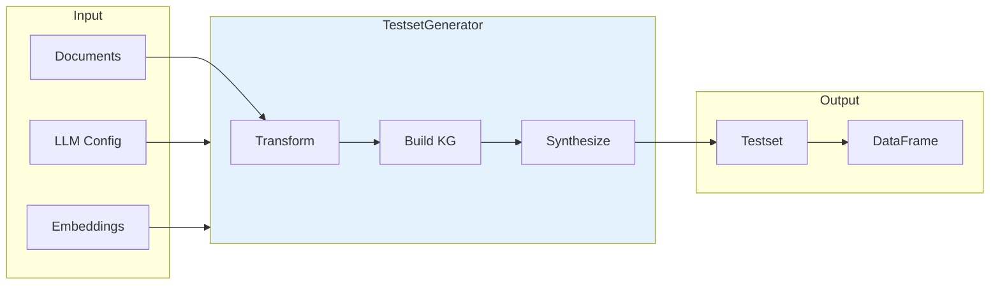

**Core pattern:**
```python
generator = TestsetGenerator(llm=llm, embedding_model=embeddings)
testset = generator.generate(testset_size=10, query_distribution=dist)
```

---

**Speaker Notes:**
The TestsetGenerator is your main interface. You provide documents, an LLM for generation, and embeddings for similarity. It handles the complexity of building the knowledge graph and synthesizing diverse questions. The output is a pandas DataFrame you can use directly.

---

## Slide 6: Query Evolution Types

### Three levels of question complexity

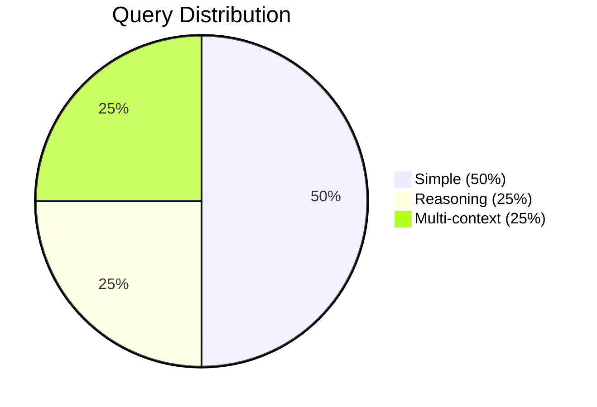

| Type | Tests | Example |
|------|-------|---------|
| **Simple** | Basic retrieval | "What is X?" |
| **Reasoning** | Inference | "Why does X cause Y?" |
| **Multi-context** | Cross-document | "Compare X in doc A with Y in doc B" |

---

**Speaker Notes:**
The default distribution is 50/25/25. Ask students: "For a legal document QA system, would you change this distribution? Why?" Legal systems might want more multi-context questions since legal reasoning often requires synthesizing multiple statutes or cases.

---

## Slide 7: RAGAS Metrics Overview

### Four metrics for RAG evaluation

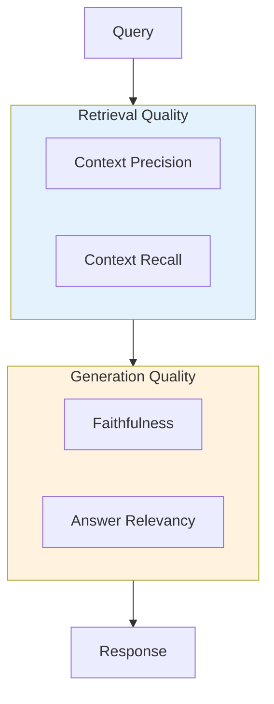

**All metrics return 0-1 scores (higher is better)**

---

**Speaker Notes:**
RAGAS gives you four complementary metrics. Two measure retrieval quality: are we getting the right chunks? Two measure generation quality: is the LLM producing good answers from those chunks? Together they tell you exactly where your RAG pipeline needs work.

---

## Slide 8: Faithfulness Deep Dive

### Is the response grounded in context?

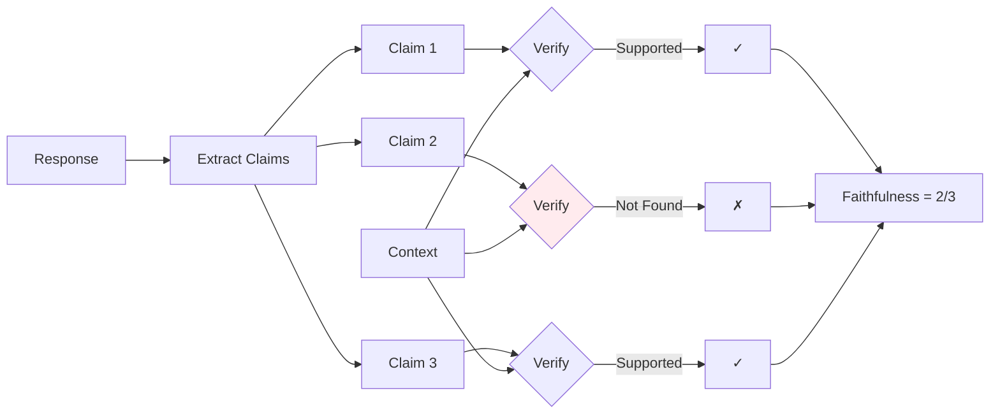

> "Faithfulness quantifies the proportion of truthful facts that were not contradicted in the generated output."
> — RAGAS Documentation

---

**Speaker Notes:**
Faithfulness is your hallucination detector. The LLM extracts claims from the response and checks each one against the retrieved context. A score of 0.67 means one-third of the response contains claims not supported by context—a red flag for hallucination.

---

## Slide 9: Context Precision

### Are relevant chunks ranked at the top?

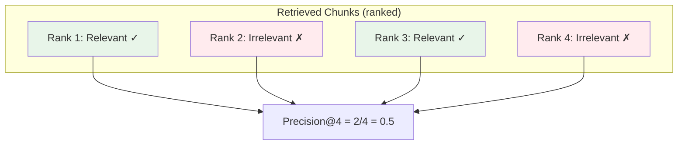

**Why ranking matters:**
- LLM context windows are limited
- Top chunks have most influence
- Poor ranking wastes context budget

---

**Speaker Notes:**
Context precision tells you if your retriever is doing its job. Even if you retrieve relevant chunks, having irrelevant ones at the top wastes precious context space. Low precision often means you need a reranker like Cohere Rerank.

---

## Slide 10: Context Recall

### Are all relevant facts retrieved?

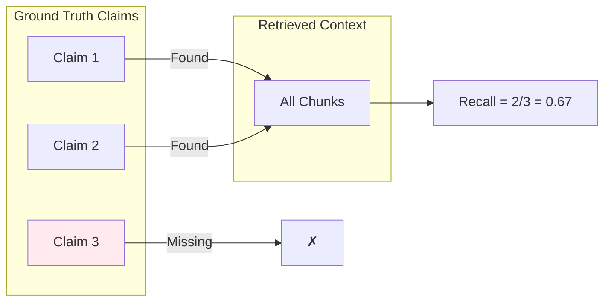

**Precision vs. Recall:**
- High precision, low recall → Missing important info
- Low precision, high recall → Too much noise
- Both high → Optimal retrieval

---

**Speaker Notes:**
Recall measures completeness. You could have perfect precision but miss critical information. For comprehensive answers, you need high recall. Low recall often means increasing k (number of retrieved chunks) or improving your chunking strategy.

---

## Slide 11: LangSmith Integration

### From RAGAS to production workflows

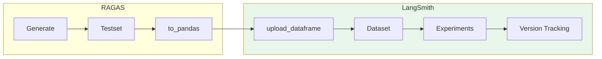

**LangSmith adds:**
- Dataset versioning
- Experiment comparison
- Team collaboration
- Production monitoring

---

**Speaker Notes:**
RAGAS generates the data; LangSmith manages it. Once your testset is in LangSmith, you can track experiments over time, compare different versions of your RAG pipeline, and share results with your team. This is essential for metrics-driven development.

---

## Slide 12: Metrics-Driven Development

### The improvement loop

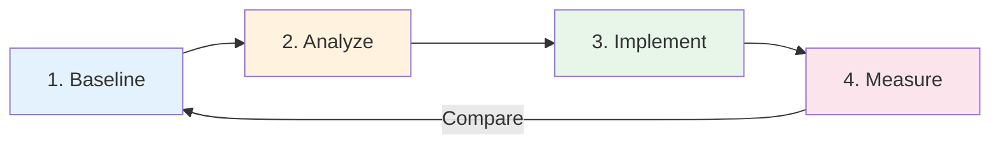

**Example cycle:**
1. **Baseline:** Faithfulness = 0.72
2. **Analyze:** Claims about dates not grounded
3. **Implement:** Add "cite your sources" to prompt
4. **Measure:** Faithfulness = 0.89 (+17%)

---

**Speaker Notes:**
This is the heart of systematic improvement. Without metrics, you're guessing. With metrics, you know exactly what's wrong and can measure the impact of your fixes. The key is making ONE change at a time so you understand cause and effect.

---

## Slide 13: Improvement Strategies

### What to fix for each low metric

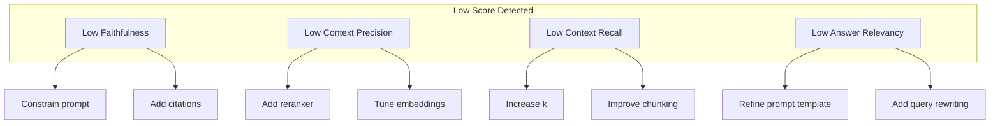

---

**Speaker Notes:**
This is your troubleshooting guide. Each metric points to specific components. Faithfulness issues? Look at your prompt. Precision issues? Look at your reranker. Recall issues? Look at your retriever settings. Relevancy issues? Look at how you're framing the task.

---

## Slide 14: Human-in-the-Loop

### Synthetic data needs validation

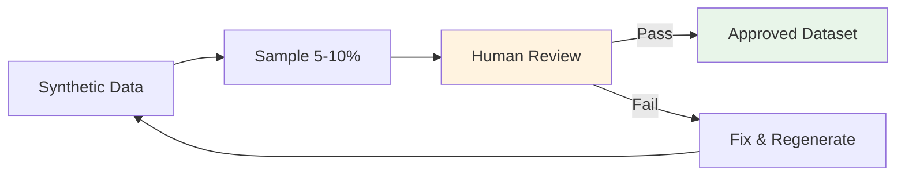

**Quality checks:**
- Are questions answerable from context?
- Are answers factually correct?
- Is question diversity sufficient?
- Any demographic or topic bias?

---

**Speaker Notes:**
Synthetic data isn't magic. LLMs can hallucinate questions or generate biased distributions. Always sample and validate before trusting your synthetic testset for production decisions. This is especially critical in regulated industries.

---

## Slide 15: Framework Landscape

### RAGAS isn't the only option

| Framework | Best For | Metrics | Open Source |
|-----------|----------|---------|-------------|
| **RAGAS** | RAG pipelines | 4 core | Yes |
| **DeepEval** | RAG + Fine-tuning | 14+ | Yes |
| **MLflow** | Pipeline integration | Modular | Yes |
| **Promptfoo** | Prompt testing | Simple | Yes |
| **LangSmith** | Production evals | Extensible | Partial |

**Choose based on your use case and team needs**

---

**Speaker Notes:**
RAGAS is excellent for RAG-focused evaluation, but know your options. DeepEval provides more metrics and self-explaining scores. MLflow integrates with ML pipelines. Promptfoo is great for quick prompt experiments. LangSmith offers production-grade tooling.

---

## Slide 16: Summary & Assignment

### Key Takeaways

1. **Synthetic data** solves the evaluation bootstrap problem
2. **Knowledge graphs** enable diverse, multi-hop questions
3. **Four RAGAS metrics** cover retrieval and generation quality
4. **Metrics-driven development** turns scores into improvements
5. **Human validation** ensures production-ready datasets

### Assignment

Generate synthetic testset → Upload to LangSmith → Run evaluation → Document findings

**Advanced:** Implement generation with LangGraph agent instead of knowledge graph

---

**Speaker Notes:**
Before next session, everyone should have their synthetic testset in LangSmith with at least two metric scores documented. Come prepared to discuss: which metric was lowest and what might you do about it? Session 10 will go deeper into agentic RAG evaluation.

---

## Slide 17: Resources

### Documentation
- [RAGAS Testset Generation](https://docs.ragas.io/en/stable/getstarted/rag_testset_generation/)
- [RAGAS Metrics](https://docs.ragas.io/en/stable/concepts/metrics/available_metrics/)
- [LangSmith Evaluation](https://docs.langchain.com/langsmith/evaluation)

### Papers & Blogs
- [RAGAS Paper (arXiv:2309.15217)](https://arxiv.org/abs/2309.15217)
- [All About Synthetic Data](https://blog.ragas.io/all-about-synthetic-data-generation)
- [Hard-Earned Lessons](https://blog.ragas.io/hard-earned-lessons-from-2-years-of-improving-ai-applications)

### Reference Project
- [GDELT Knowledge Base](https://github.com/donbr/gdelt-knowledge-base) - Certification challenge example

---

## Slide 18: Q&A

# Questions?

### Discussion Prompts

- What domain are you building RAG for? What question types matter most?
- Have you encountered hallucination issues? How would faithfulness help?
- What's your current evaluation approach? How would synthetic data change it?

---

**Speaker Notes:**
Open the floor for questions. Good discussion starters: Ask about their domains and what evaluation challenges they've faced. Connect their experiences to today's concepts. Remind them about office hours if they need help with the assignment.

---

*Session 9 | AI Engineering Bootcamp | Cohort 9*
