```mermaid
flowchart LR
    subgraph Development
        VC[Vibe Check<br/>💭 Informal]
        UT[Unit Tests<br/>⚡ Fast]
    end
    subgraph PreProd["Pre-Production"]
        OE[Offline Evals<br/>📊 Datasets]
    end
    subgraph Production
        OM[Online Monitor<br/>🔍 Real Traffic]
    end

    VC --> UT --> OE --> OM

    style VC fill:#fff3e0
    style UT fill:#e1f5fe
    style OE fill:#e8f5e9
    style OM fill:#fce4ec
```

```mermaid
flowchart LR
    subgraph Input
        Q[Query]
        D[(Documents)]
    end

    subgraph Retrieval
        R[Retriever]
    end

    subgraph Metrics
        CP[Context<br/>Precision<br/>📊 Ranking]
        CR[Context<br/>Recall<br/>📋 Coverage]
    end

    Q --> R
    D --> R
    R --> CP
    R --> CR

    style CP fill:#e1f5fe,stroke:#1976d2
    style CR fill:#e1f5fe,stroke:#1976d2
```

```mermaid
flowchart LR
    subgraph Input
        C[Context]
        Q[Query]
    end

    subgraph Generation
        G[Generator<br/>LLM]
    end

    subgraph Metrics
        F[Faithfulness<br/>🎯 Grounded?]
        AR[Answer<br/>Relevancy<br/>❓ On-topic?]
    end

    C --> G
    Q --> G
    G --> F
    G --> AR

    style F fill:#fff3e0,stroke:#f57c00
    style AR fill:#fff3e0,stroke:#f57c00
```

```mermaid
flowchart TB
    subgraph AgentEval["Agentic Evaluation Dimensions"]
        TS[Tool Selection<br/>🔧 Right tool?]
        AC[Argument Correctness<br/>📝 Valid params?]
        TC[Task Completion<br/>✅ Goal met?]
        TQ[Trajectory Quality<br/>📈 Efficient?]
    end

    A[Agent<br/>Execution] --> TS
    A --> AC
    A --> TC
    A --> TQ

    style TS fill:#e8f5e9,stroke:#4caf50
    style AC fill:#e8f5e9,stroke:#4caf50
    style TC fill:#e8f5e9,stroke:#4caf50
    style TQ fill:#e8f5e9,stroke:#4caf50
```

```mermaid
flowchart TB
    subgraph Actual["Agent Trajectory"]
        A1[tool_a] --> A2[tool_b] --> A3[tool_c]
    end

    subgraph Match["Trajectory Match"]
        R1[Reference:<br/>a → b → c]
        R1 --> M{Exact<br/>Match?}
        M --> |Yes| P1[✓ Pass]
        M --> |No| F1[✗ Fail]
    end

    subgraph Judge["LLM Judge"]
        RB[Rubric]
        RB --> J[Judge LLM]
        J --> S[Score +<br/>Reasoning]
    end

    Actual --> Match
    Actual --> Judge

    style P1 fill:#e8f5e9
    style F1 fill:#ffebee
    style S fill:#e8f5e9
```

# Session 10: Agentic RAG Evaluation

## Slide Deck Specification

**Session**: 10 - Agentic RAG Evaluation
**Subtitle**: From Vibe Checks to Systematic Measurement
**Duration**: ~90 minutes
**Format**: 16 slides with Mermaid diagrams

---

## Slide 1: Title Slide

### Content
# Agentic RAG Evaluation
## From Vibe Checks to Systematic Measurement

**Session 10 | AIE9 Cohort**

### Visual


### Speaker Notes
- Welcome to Session 10 where we transform informal evaluation into systematic measurement
- Building on Session 1 (vibe checks) and Session 9 (synthetic testsets)
- Today: metrics, datasets, LLM judges, trajectory evaluation
- Goal: You leave with evaluation pipelines ready for production

---

## Slide 2: Learning Objectives

### Content
## By the end of this session, you will:

1. **Explain** the evaluation hierarchy from vibe checks to production monitoring
2. **Design** component-level evaluations (retrieval vs generation)
3. **Apply** RAG evaluation metrics (faithfulness, precision, recall, relevancy)
4. **Evaluate** agent trajectories for tool selection and task completion
5. **Implement** LLM-as-judge evaluators for subjective quality
6. **Build** evaluation-driven development workflows

### Visual


### Speaker Notes
- These skills form the complete evaluation toolkit for production RAG systems
- We progress from understanding metrics to implementing full evaluation pipelines
- Focus on practical skills you'll use immediately

---

## Slide 3: The Evaluation Hierarchy

### Content
## From Informal to Systematic

| Stage | Purpose | When |
|-------|---------|------|
| **Vibe Check** | Quick sanity test | Early development |
| **Unit Tests** | Deterministic logic | Continuous |
| **Offline Evals** | Quality benchmarks | Pre-release |
| **Online Monitoring** | Production quality | Continuous |

> "Evaluations are a quantitative way to measure the performance of LLM applications."
> — LangSmith Documentation

### Visual


### Speaker Notes
- Session 1 introduced vibe checks - necessary but not sufficient
- Unit tests catch deterministic regressions
- Offline evals use curated datasets for quality gates
- Online monitoring catches issues with real traffic
- Each level adds rigor AND cost - use appropriately

---

## Slide 4: Why Component-Level Evaluation?

### Content
## Isolate Problems Faster

**The debugging question:**
When output quality drops, is it because:
- We retrieved the wrong documents? → **Retrieval problem**
- We generated hallucinations from good context? → **Generation problem**

Component-level evaluation answers this directly.

> "Rather than treating RAG as a black box, evaluating retrieval and generation separately enables faster debugging."
> — Evidently AI

### Visual


### Speaker Notes
- Treating RAG as black box makes debugging slow
- If context is bad, no amount of prompt engineering fixes generation
- If context is good but response wrong, focus on generation
- Component metrics tell you exactly where to invest effort

---

## Slide 5: Retrieval Metrics Deep Dive

### Content
## Did We Find the Right Documents?

| Metric | Question | Failure Signal |
|--------|----------|----------------|
| **Context Precision** | Are relevant docs ranked high? | Poor ranking |
| **Context Recall** | Did we get all relevant info? | Missing coverage |
| **Hit Rate** | Any relevant doc in top-k? | Total miss |
| **MRR** | How early is first relevant? | Buried results |

**Fix strategies:**
- Low precision → Add reranker, tune embeddings
- Low recall → Increase k, improve chunking

### Visual


### Speaker Notes
- Context Precision: Of documents retrieved, how many are relevant? Measures ranking quality
- Context Recall: Of all relevant documents, how many did we retrieve? Measures coverage
- Both are 0-1 scores where higher is better
- Low precision means noise; low recall means missing information
- These directly inform your retrieval improvements

---

## Slide 6: Generation Metrics Deep Dive

### Content
## Did We Answer Faithfully and Relevantly?

| Metric | Question | Failure Signal |
|--------|----------|----------------|
| **Faithfulness** | Is response grounded in context? | Hallucination |
| **Answer Relevancy** | Does response address query? | Off-topic |
| **Hallucination Rate** | Unsupported claims? | Fabrication |

**Fix strategies:**
- Low faithfulness → Constrain prompt, require citations
- Low relevancy → Include query in system message

### Visual


### Speaker Notes
- Faithfulness: Can every claim be traced to retrieved context? Catches hallucination
- Answer Relevancy: Does the response actually answer what was asked?
- A response can be faithful but irrelevant (correct info, wrong question)
- A response can seem relevant but be unfaithful (good answer, made-up facts)
- Both matter for production quality

---

## Slide 7: The RAG Metrics Framework

### Content
## Four Pillars of RAG Quality

```
                    RETRIEVAL          GENERATION
                    ---------          ----------
PRECISION     Context Precision    Answer Relevancy
(What we got)   (ranking quality)    (query alignment)

RECALL          Context Recall       Faithfulness
(Coverage)     (completeness)       (grounding)
```

**Key insight:** Each quadrant has distinct improvement strategies.

### Visual


### Speaker Notes
- This framework helps organize your evaluation strategy
- Context Precision + Recall evaluate your retriever
- Faithfulness + Answer Relevancy evaluate your generator
- Improvements to one component shouldn't hurt the other
- Track all four to catch regressions

---

## Slide 8: Agentic RAG Adds Complexity

### Content
## Beyond Traditional RAG Metrics

**New dimensions for agents:**
- **Tool Selection:** Did the agent call the right tools?
- **Argument Correctness:** Were the parameters valid?
- **Task Completion:** Did the agent achieve the goal?
- **Trajectory Quality:** Was the path efficient?

> "Many agent behaviors only emerge when using a real LLM, such as which tool the agent decides to call."
> — LangChain AgentEvals

### Visual


### Speaker Notes
- Agents make decisions traditional RAG doesn't - tool selection, sequencing
- Wrong tool call can derail entire task even with good retrieval
- Argument errors cause silent failures
- Task completion is the ultimate measure but hard to automate
- Trajectory evaluation captures the full execution path

---

## Slide 9: Trajectory Evaluation Approaches

### Content
## Two Ways to Evaluate Agent Paths

| Approach | How It Works | Best For |
|----------|--------------|----------|
| **Trajectory Match** | Compare step-by-step to reference | Deterministic workflows |
| **LLM Judge** | LLM scores against rubric | Flexible, multi-path tasks |

**Trade-offs:**
- Match: Fast, deterministic, but brittle for complex tasks
- Judge: Flexible, handles variation, but costs LLM calls

### Visual


### Speaker Notes
- Trajectory match: Fast, no LLM cost, deterministic - but requires known-good reference
- LLM judge: Handles multiple valid paths, gives reasoning - but slower, costs tokens
- Use match for regression tests where you know the expected path
- Use judge for exploring new capabilities or complex tasks
- Can combine both: match for critical paths, judge for edge cases

---

## Slide 10: LLM-as-Judge Pattern

### Content
## Automated Human-Like Evaluation

**How it works:**
1. Provide context: query, response, retrieved docs
2. Provide rubric: scoring criteria
3. LLM evaluates and scores

> "LLM-as-a-judge agrees with human grading on over 80% of judgments."
> — Databricks

**Best practices:**
- Use low-precision scales (0-3 or binary)
- Always include reasoning
- Calibrate against human labels

### Visual


### Speaker Notes
- LLM-as-judge enables automated evaluation of subjective qualities
- 80%+ agreement with humans when well-calibrated
- Use simple scales - 0-3 is often better than 0-10
- Always require reasoning - helps debug disagreements
- Consider specialized judge models for specific tasks (hallucination detection)

---

## Slide 11: Golden Dataset Design

### Content
## The Foundation of Evaluation

**Good datasets are:**
- **Representative:** Mirror real user queries
- **Diverse:** Easy, hard, and edge cases
- **Stable:** Versioned, frozen during experiments
- **Evolving:** Updated through governance

> "Golden datasets remain the foundation. These should cover the full scope of the system."
> — Label Your Data

**Sources:**
- Production logs (gold standard)
- Synthetic generation (Session 9)
- Expert curation (edge cases)

### Visual


### Speaker Notes
- Production logs are gold - they're real user needs
- Synthetic data (Session 9) scales coverage
- Expert curation catches critical edge cases
- Balance difficulty: 40% easy (ensure basics work), 40% medium, 20% hard
- Version your datasets - comparisons need stable baselines
- Establish governance for updates

---

## Slide 12: Online vs Offline Evaluation

### Content
## Two Modes for Different Needs

| | Offline | Online |
|---|---------|--------|
| **When** | Before deployment | During production |
| **Data** | Curated datasets | Real traffic |
| **Purpose** | Benchmark, compare | Monitor, detect |
| **Cost** | Predictable | Scales with traffic |

> "LangSmith supports Offline Evaluation to test before you ship, and Online Evaluation to monitor in production."
> — LangSmith Documentation

### Visual


### Speaker Notes
- Offline: Run before release as quality gate
- Online: Continuous monitoring of production
- Offline catches regressions before users see them
- Online catches real-world edge cases and drift
- Both are essential for production systems
- Start with offline, add online as you scale

---

## Slide 13: Evaluation-Driven Development

### Content
## The Improvement Cycle

1. **Measure:** Establish baseline metrics
2. **Analyze:** Identify weakest metric
3. **Improve:** Make targeted changes
4. **Validate:** Re-measure and compare

**Improvement playbook:**
| Low Metric | Try This |
|------------|----------|
| Faithfulness | Add citation requirement |
| Precision | Add reranker |
| Recall | Increase k, improve chunking |
| Relevancy | Refine prompt template |

### Visual


### Speaker Notes
- This is the core practice of evaluation-driven development
- Always start with a baseline - you need something to compare against
- Focus on the weakest metric - biggest opportunity for improvement
- Make ONE change at a time - know what caused improvement
- Validate quantitatively - intuition can mislead
- This cycle is continuous - never "done"

---

## Slide 14: Hands-On: Your Evaluation Pipeline

### Content
## Breakout Room Activities

**Room 1: Core RAG Evaluation**
- Create 10-15 example golden dataset
- Run RAGAS evaluation (faithfulness + precision)
- Identify weakest metric
- Implement one improvement

**Room 2: Agentic Evaluation**
- Set up trajectory evaluation
- Compare match vs LLM judge
- Build custom evaluator for your domain
- Run improvement cycle

### Visual


### Speaker Notes
- Room 1 focuses on core RAG metrics with RAGAS
- Room 2 builds on that with agent-specific evaluation
- Both rooms should complete a full improvement cycle
- Goal: Leave with working evaluation pipeline
- Share findings when we reconvene

---

## Slide 15: Key Takeaways

### Content
## What You've Learned

1. **Evaluation hierarchy** progresses from vibe checks to production monitoring
2. **Component-level evaluation** isolates retrieval vs generation issues
3. **Four core metrics** cover precision and recall for both components
4. **Agents need trajectory evaluation** for tool selection and task completion
5. **LLM-as-judge** achieves 80%+ human agreement when calibrated
6. **Golden datasets** are versioned, representative, and evolving
7. **Evaluation-driven development** uses metrics to guide improvements

**The mantra:** Measure → Analyze → Improve → Validate → Repeat

### Visual


### Speaker Notes
- You now have a complete evaluation toolkit
- Start simple: vibe check → add metrics → add trajectory
- Component evaluation is the key debugging tool
- Golden datasets are investments that pay off
- Evaluation is continuous, not a one-time activity

---

## Slide 16: Resources & Next Steps

### Content
## Continue Your Learning

**Documentation:**
- [LangSmith Evaluation](https://docs.langchain.com/langsmith/evaluation)
- [RAGAS Metrics](https://docs.ragas.io/)
- [AgentEvals](https://docs.langchain.com/langsmith/trajectory-evals)

**Deep Dives:**
- [Evidently AI RAG Guide](https://www.evidentlyai.com/llm-guide/rag-evaluation)
- [Databricks LLM Eval Best Practices](https://www.databricks.com/blog/LLM-auto-eval-best-practices-RAG)

**Next Session:** Advanced Retrievers

### Visual


### Speaker Notes
- These resources go deeper on each topic
- Session 11 will give you more retrieval strategies to evaluate
- Certification project requires full evaluation pipeline
- Questions? Come to office hours
- Assignment due next week

---

## Appendix: Diagram Color Scheme

| Element | Color | Hex |
|---------|-------|-----|
| Input nodes | Light blue | `#e1f5fe` |
| Model/LLM nodes | Light orange | `#fff3e0` |
| Tool/Action nodes | Light green | `#e8f5e9` |
| Output nodes | Light pink | `#fce4ec` |
| Success states | Green | `#4caf50` |
| Warning states | Orange | `#f57c00` |
| Error states | Red | `#e91e63` |

---

*Slides created for AIE9 Session 10: Agentic RAG Evaluation*
*Last updated: January 2026*
