# Session 11: Advanced Retrievers - Slides

---

## Slide 1: Title

### Advanced Retrievers
**Session 11 | AIE9 Bootcamp**

*Beyond Dense Vector Search: Hybrid, Reranking, and Production Patterns*

---

**Visual**: Mermaid diagram showing retriever ecosystem

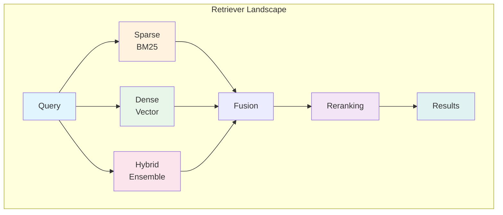

---

**Speaker Notes**:
- Welcome to Session 11 on Advanced Retrievers
- We've built RAG systems with basic dense retrieval—now we level up
- Today: hybrid search, reranking, and production patterns
- By the end, you'll know how to improve retrieval accuracy by 20-35%

---

## Slide 2: Learning Objectives

### What You'll Be Able to Do

1. **Compare** sparse (BM25) and dense (embedding) retrieval trade-offs
2. **Implement** hybrid search with Reciprocal Rank Fusion
3. **Build** two-stage retrieval with cross-encoder reranking
4. **Apply** query transformation for complex questions
5. **Evaluate** retrievers using NDCG, MRR, Recall@K

---

**Visual**: Learning path diagram

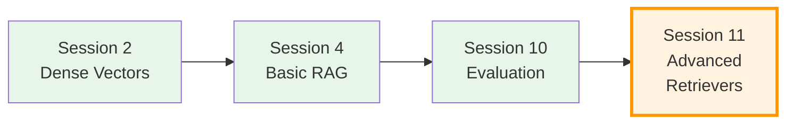

---

**Speaker Notes**:
- These 5 objectives map to real-world RAG optimization
- We build on Session 2 (embeddings), Session 4 (RAG basics), Session 10 (evaluation)
- Today we close the loop: use evaluation to select retriever strategies
- Ask: "Who has experienced poor retrieval results in their RAG systems?"

---

## Slide 3: The Retriever Abstraction

### What is a Retriever?

```
Query (string) ──→ [Retriever] ──→ List[Document]
```

All retrievers share the same interface:
- `.invoke(query)` - synchronous
- `.ainvoke(query)` - asynchronous
- `.batch([queries])` - multiple queries

---

**Visual**: Retriever interface diagram

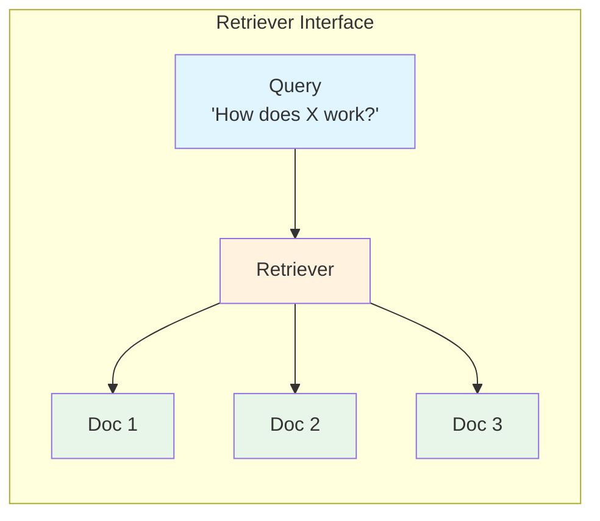

---

**Speaker Notes**:
- The retriever is an abstraction—it hides HOW documents are found
- This lets us swap strategies without changing downstream code
- Vector stores become retrievers via `.as_retriever()`
- Question: "If all retrievers have the same interface, what differs between them?"

---

## Slide 4: Sparse vs Dense Retrieval

### Two Fundamental Approaches

| | **BM25 (Sparse)** | **Embeddings (Dense)** |
|---|---|---|
| **Matches** | Keywords | Meaning |
| **Strength** | Exact terms, acronyms | Synonyms, concepts |
| **Speed** | Very fast | Embedding cost |
| **Scaling** | Inverted index | Vector index |

---

**Visual**: Comparison diagram

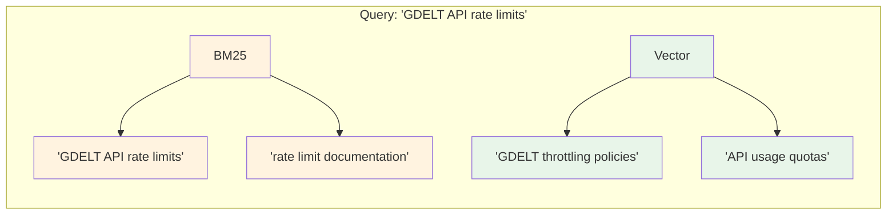

---

**Speaker Notes**:
- BM25 uses term frequency and inverse document frequency
- Dense uses learned representations of meaning
- Neither is universally better—they excel at different things
- Question: "For a query about 'ML model performance', which would find docs about 'neural network accuracy'?"

---

## Slide 5: Hybrid Search with RRF

### Best of Both Worlds

```
Query ─┬─→ [BM25] ──→ Ranked List A ─┐
       │                              ├─→ [RRF] ──→ Merged List
       └─→ [Vector] ─→ Ranked List B ─┘
```

**Reciprocal Rank Fusion**:
```
RRF_score(doc) = Σ 1/(k + rank_i(doc))
```

---

**Visual**: RRF fusion process

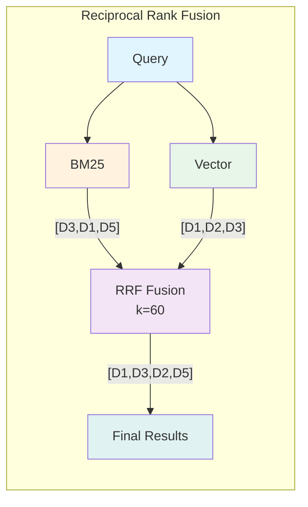

---

**Speaker Notes**:
- RRF is the standard fusion method—simple but effective
- k=60 is typical, dampens the impact of very high ranks
- D1 appears high in both lists → highest RRF score
- "Why not just concatenate the lists?" → Duplicates, no ranking

---

## Slide 6: Two-Stage Retrieval

### Recall First, Precision Second

| Stage 1: Recall | Stage 2: Precision |
|-----------------|-------------------|
| Bi-encoder | Cross-encoder |
| Fast (~1ms/doc) | Slow (~100ms/doc) |
| Retrieve 50-100 | Keep top 5-10 |
| Maximize coverage | Maximize relevance |

---

**Visual**: Two-stage pipeline

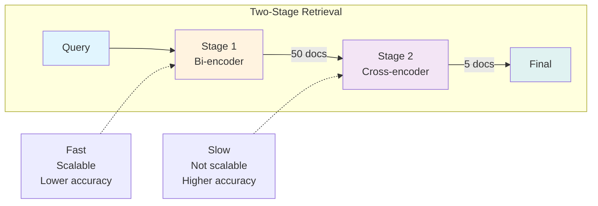

---

**Speaker Notes**:
- Why not just use cross-encoders? Too slow for full corpus
- Bi-encoders embed Q and D separately → can pre-compute D
- Cross-encoders process (Q,D) pair → must run at query time
- Think of it as: cast a wide net, then filter carefully

---

## Slide 7: Cross-Encoder Reranking

### Why Rerankers Are More Accurate

> "Rerankers are much more accurate than embedding models. Bi-encoders must compress all possible meanings into a single vector—meaning we lose information."
> — **Pinecone**

---

**Visual**: Bi-encoder vs Cross-encoder

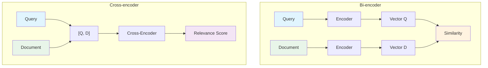

---

**Speaker Notes**:
- Cross-encoders see Q and D together → richer interaction
- They can attend to specific query terms in the document
- Typical improvement: 20-35% better precision
- Trade-off: 200-500ms added latency

---

## Slide 8: Query Transformation

### Improve Retrieval Through Better Queries

| Technique | What It Does | When to Use |
|-----------|--------------|-------------|
| **Multi-Query** | Generate variations | Ambiguous queries |
| **HyDE** | Generate hypothetical answer | Abstract questions |
| **Decomposition** | Break into sub-queries | Multi-hop reasoning |

---

**Visual**: Query transformation patterns

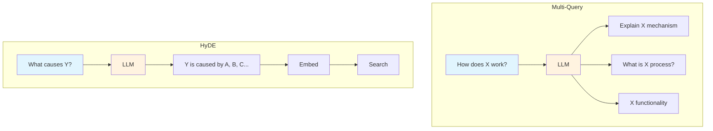

---

**Speaker Notes**:
- Multi-Query: LLM generates 3-5 query variations, retrieve for each, merge
- HyDE: "What would a good answer look like?" → embed that → search
- Decomposition: "Compare A and B" → "What is A?" + "What is B?"
- Question: "Which technique would help 'best practices for X'?"

---

## Slide 9: Parent Document Retriever

### Small Chunks to Search, Large Docs to Return

> "A more narrow piece of text will yield a more meaningful vector representation since there is less noise from multiple topics."
> — **Towards Data Science**

---

**Visual**: Parent-child relationship

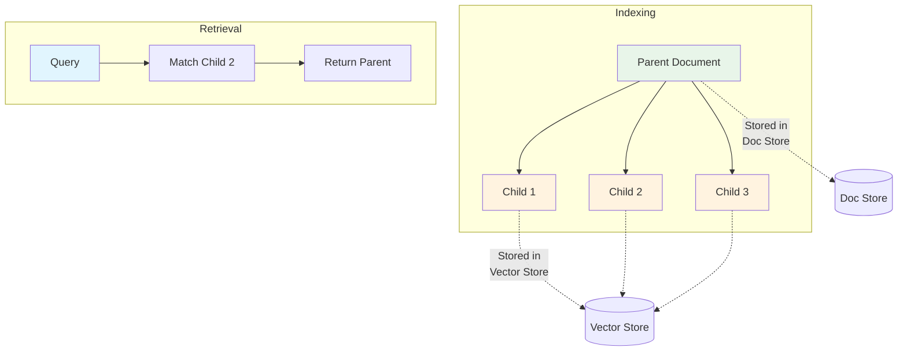

---

**Speaker Notes**:
- Problem: Large chunks = noisy embeddings. Small chunks = missing context.
- Solution: Index small, return large
- Child chunks (100-200 tokens) for precise matching
- Parent docs (1000+ tokens) for full context to LLM
- Question: "What happens if you set child chunk size too large?"

---

## Slide 10: Retriever Evaluation Metrics

### Measuring What Matters

| Metric | Best For | Intuition |
|--------|----------|-----------|
| **Recall@K** | "Don't miss anything" | % relevant in top K |
| **MRR** | "First result counts" | 1/rank of first relevant |
| **NDCG@K** | "Order matters" | Weighted by position |

---

**Visual**: Metric decision tree

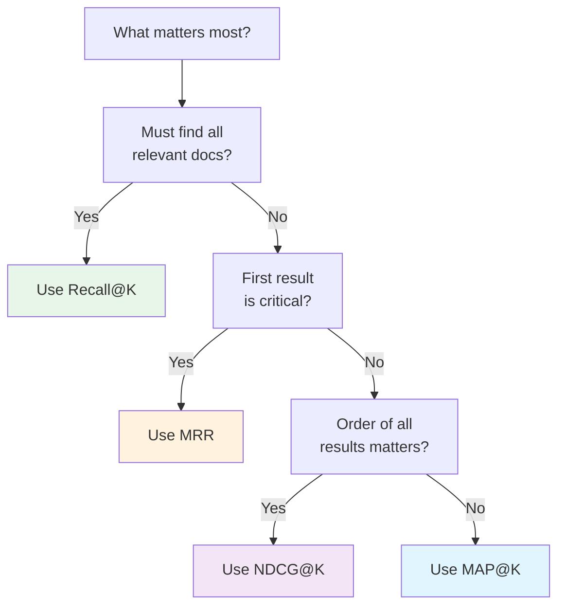

---

**Speaker Notes**:
- NDCG is industry standard (MTEB leaderboard uses it)
- MRR is great for "I'm feeling lucky" scenarios
- Recall@K when missing info is costly (medical, legal)
- Use RAGAS metrics (Context Precision, Recall) for RAG-specific evaluation

---

## Slide 11: Production Patterns

### From Prototype to Production

> "Retrieval, not generation, is the core constraint. Chunking, metadata, and versioning matter as much as embeddings and prompts."
> — **Towards Data Science**

---

**Visual**: Production architecture

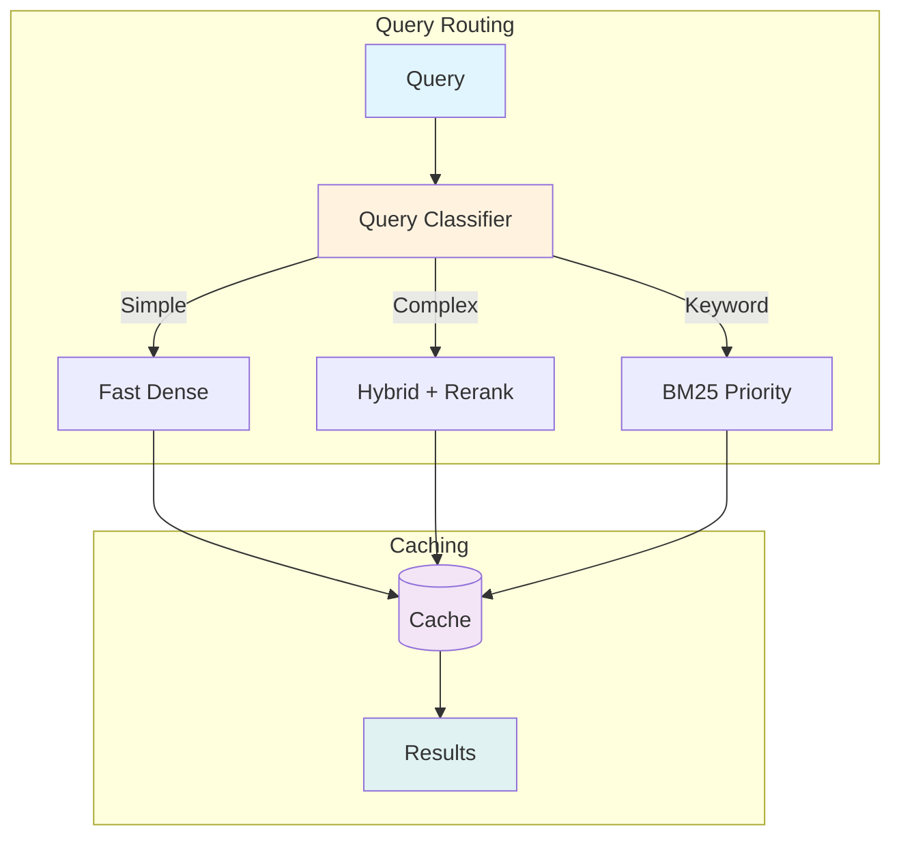

---

**Speaker Notes**:
- Factory pattern: create retrievers lazily, avoid expensive init
- Query routing: classify queries, route to appropriate strategy
- Caching: embed common queries, cache retrieval results
- Cost optimization: simple queries don't need full pipeline

---

## Slide 12: GDELT Reference Implementation

### Real-World Comparison (4 Strategies)

| Retriever | RAGAS Avg | Context Precision |
|-----------|-----------|-------------------|
| Naive (Dense) | 93.9% | 91.4% |
| BM25 | 93.4% | 90.2% |
| Ensemble | 93.6% | 91.0% |
| **Cohere Rerank** | **95.1%** | **93.1%** |

[github.com/donbr/gdelt-knowledge-base](https://github.com/donbr/gdelt-knowledge-base)

---

**Visual**: Performance comparison

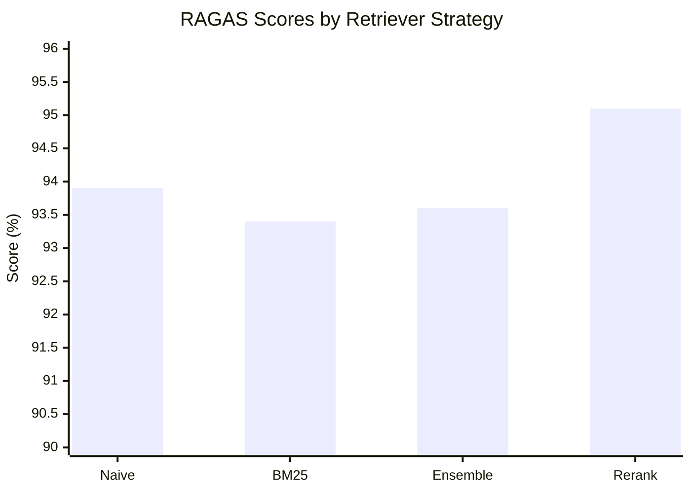

---

**Speaker Notes**:
- Real implementation with 38 GDELT docs, 12 test questions
- Cohere Rerank wins on precision (93.1%)
- Ensemble provides coverage but not huge gains here
- Key insight: reranking is high ROI for precision-critical apps
- The repo shows factory pattern, evaluation pipeline, reproducibility

---

## Slide 13: Implementation Patterns

### Key Code Patterns

**Ensemble Retriever**:
```python
EnsembleRetriever(
    retrievers=[bm25, vector],
    weights=[0.5, 0.5]
)
```

**Reranking Retriever**:
```python
ContextualCompressionRetriever(
    base_compressor=CohereRerank(top_n=5),
    base_retriever=vector.as_retriever(k=20)
)
```

---

**Visual**: Pattern composition

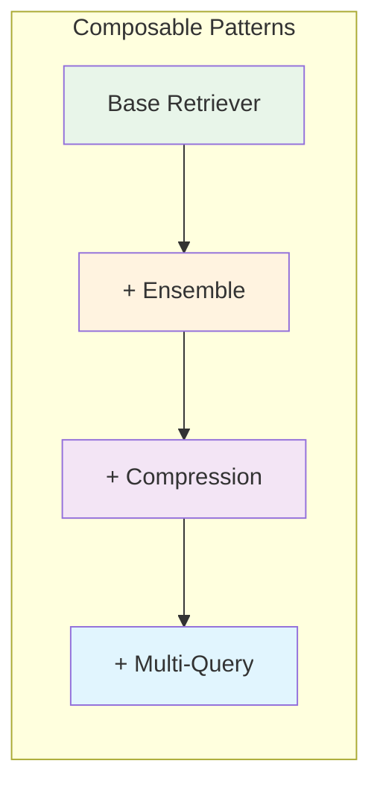

---

**Speaker Notes**:
- Patterns are composable: start simple, add layers
- Factory pattern creates all strategies from same docs/vector store
- ContextualCompression wraps any base retriever
- Always retrieve MORE than you need, then filter down

---

## Slide 14: Summary

### Key Takeaways

1. **Retrieval is the bottleneck** — optimize here first
2. **Hybrid > Single** — combine BM25 + Vector
3. **Reranking is high ROI** — 20-35% improvement
4. **Two-stage = recall then precision**
5. **Measure with proper metrics** — NDCG, Recall@K, RAGAS

---

**Visual**: Summary diagram

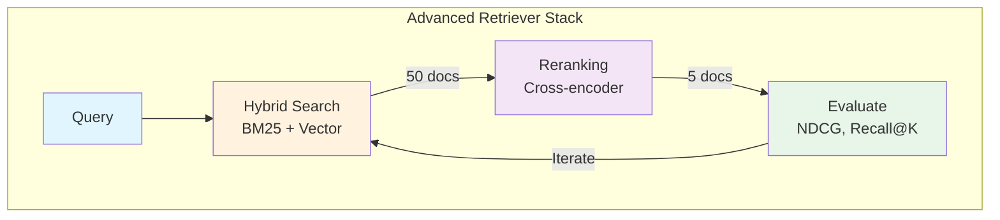

---

**Speaker Notes**:
- Start with dense, add hybrid, then reranking
- Measure impact at each step with proper metrics
- The GDELT reference shows this works: 95.1% with reranking
- Next session applies these techniques to your own projects

---

## Slide 15: Assignment

### Build Your Own Retriever Comparison

**Part 1**: Implement 4 retriever strategies
- Dense (baseline)
- BM25 (sparse)
- Ensemble (hybrid)
- Reranking (two-stage)

**Part 2**: Evaluate with RAGAS
- Context Precision
- Context Recall
- Latency per query

**Part 3**: Analyze results
- Which strategy won? Why?
- What's the latency vs accuracy trade-off?

---

**Visual**: Assignment workflow

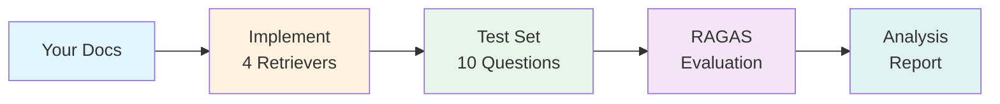

---

**Speaker Notes**:
- Use your own domain corpus or GDELT docs
- Create 10 diverse questions (factual, conceptual, keyword-heavy)
- Measure all 4 strategies on same test set
- Submit analysis: which worked best and why?

---

## Slide 16: Resources & Q&A

### Documentation
- [LangChain Retrievers](https://docs.langchain.com/oss/python/integrations/retrievers/)
- [Cohere Reranker](https://docs.langchain.com/oss/python/integrations/retrievers/cohere-reranker)

### Tutorials
- [Rerankers (Pinecone)](https://www.pinecone.io/learn/series/rag/rerankers/)
- [Evaluation Metrics (Weaviate)](https://weaviate.io/blog/retrieval-evaluation-metrics)

### Reference
- [GDELT Knowledge Base](https://github.com/donbr/gdelt-knowledge-base)

---

**Visual**: Q&A prompt


---

**Speaker Notes**:
- Questions on any of the 9 concepts?
- Common questions: "When should I NOT use reranking?" (latency-critical apps)
- "How do I choose ensemble weights?" (start 50/50, tune with metrics)
- Remind students: cheatsheet has all code patterns and debugging tips

---

## Appendix: Mermaid Diagram Reference

### Color Palette
- Input nodes: `#e1f5fe` (light blue)
- Model/Process nodes: `#fff3e0` (light orange)
- Tool nodes: `#e8f5e9` (light green)
- Reranking nodes: `#f3e5f5` (light purple)
- Output nodes: `#e0f2f1` (light teal)
- Highlight: `#fce4ec` (light pink)

### Diagram Types Used
1. `graph TB/LR` - Flow diagrams
2. `xychart-beta` - Bar charts
3. `subgraph` - Grouped components

---

*Session 11 Slides | AIE9 Bootcamp | January 2026*
