# Session 14: MCP Connectors
## Connecting AI Applications to External Systems

---

# Slide 1: Title

## MCP Connectors
### Building Universal AI-to-Data Connections

**Session 14 | Certification Challenge Module | Week 7**

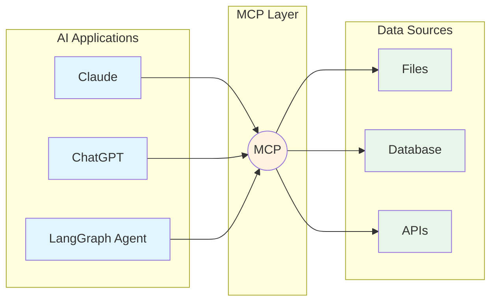

**Speaker Notes:**
Welcome to Session 14 on MCP Connectors. The Model Context Protocol is transforming how we connect AI applications to data sources. Think of MCP as the USB-C of AI—a universal connector that works across different applications and data sources. Today we'll explore the architecture, build clients, and understand when to use MCP vs custom integrations.

---

# Slide 2: Learning Objectives

## By the end of this session, you will be able to:

1. **Explain** the MCP architecture and the M×N problem it solves
2. **Distinguish** between tools, resources, and prompts (the three primitives)
3. **Build** MCP clients using LangChain adapters
4. **Implement** Fuzzy-to-Fact validation patterns
5. **Evaluate** when to use client-side vs server-side MCP

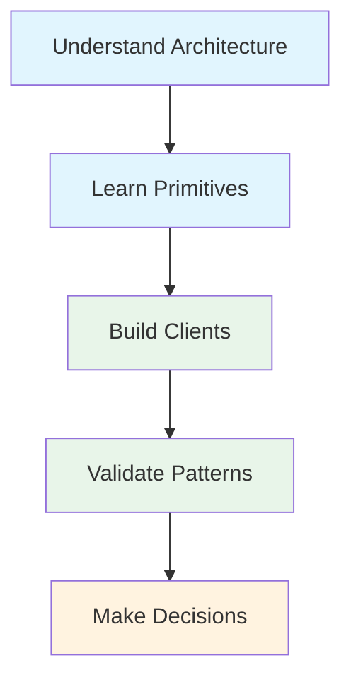

**Speaker Notes:**
These five objectives form a progression from understanding to implementation to decision-making. We start with architecture (the "why"), move to primitives (the "what"), then build clients (the "how"), add validation patterns (the "how well"), and finish with strategic decisions (the "when").

---

# Slide 3: The M×N Problem

## Before MCP: Custom Integrations Everywhere

> **"MCP (Model Context Protocol) is an open-source standard for connecting AI applications to external systems. Think of MCP like a USB-C port for AI applications."**
> — MCP Introduction

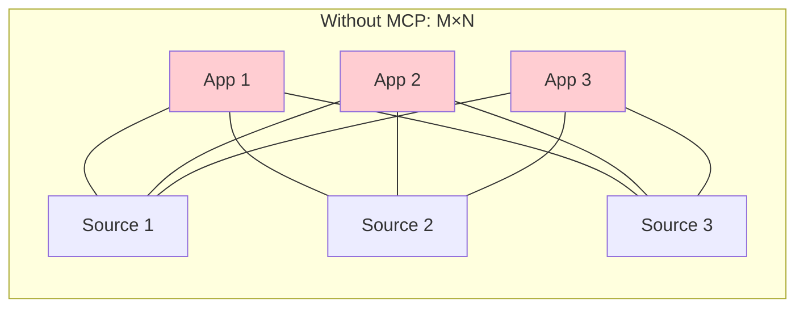

| Approach | Integrations | Maintenance | Reusability |
|----------|--------------|-------------|-------------|
| Custom | M × N | High | None |
| MCP | M + N | Low | Full |

**Speaker Notes:**
Consider the maintenance burden: 3 apps × 3 sources = 9 custom integrations. Each requires separate code, testing, and updates. MCP reduces this to 6 implementations (3 clients + 3 servers) that all interoperate. This is why adoption exploded—97 million SDK downloads and 10,000+ servers in just over a year.

---

# Slide 4: MCP Architecture

## Client-Host-Server Model

> **"The Model Context Protocol (MCP) follows a client-host-server architecture where each host can run multiple client instances."**
> — MCP Architecture Specification

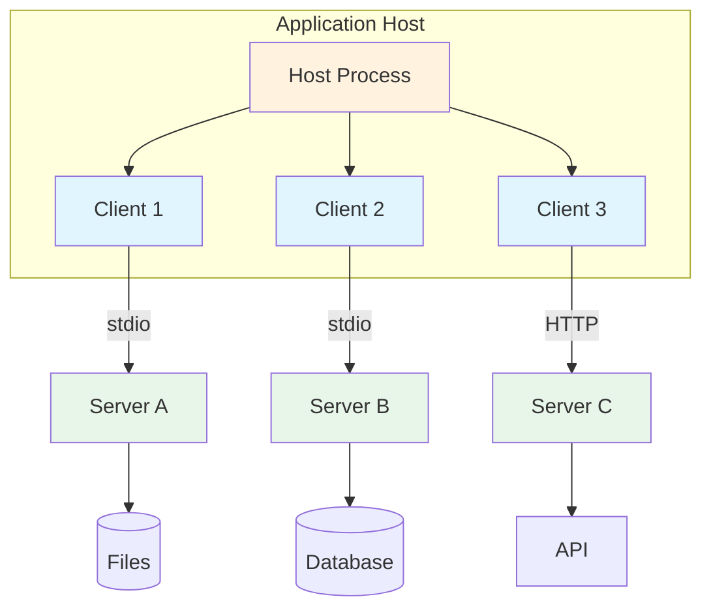

**Key concepts:**
- **Host**: Application process (Claude Desktop, your agent)
- **Client**: Manages one server connection
- **Server**: Exposes capabilities from data source
- **Transport**: stdio (local) or HTTP (remote)

**Speaker Notes:**
The architecture has clear separation of concerns. The host manages multiple clients, each client talks to one server, and each server exposes one data source. This enables security boundaries—hosts control which clients can access which servers. Claude Desktop uses this to let users configure which MCP servers they trust.

---

# Slide 5: The Three Primitives

## Tools, Resources, and Prompts

> **"Tools in MCP are designed to be model-controlled, meaning that the language model can discover and invoke tools automatically."**
> — MCP Tools Specification

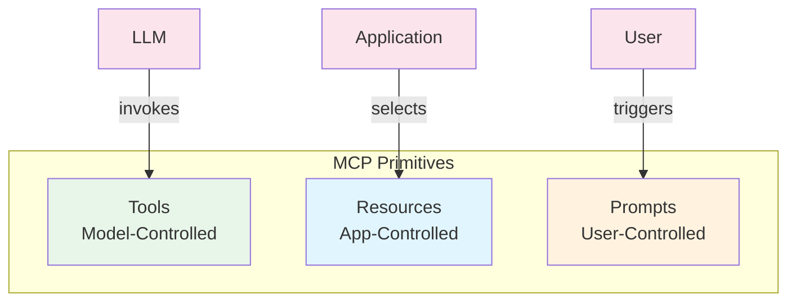

| Primitive | Control | Example |
|-----------|---------|---------|
| **Tools** | Model decides | `search_database(query)` |
| **Resources** | App includes | `file://docs/api.md` |
| **Prompts** | User invokes | `/summarize topic` |

**Speaker Notes:**
The control model is the key insight. Tools are like function calling—the LLM decides when to use them. Resources are like RAG context—the application chooses what to include. Prompts are like slash commands—the user explicitly triggers them. This distinction shapes how you design MCP servers.

---

# Slide 6: Transport Mechanisms

## stdio vs Streamable HTTP

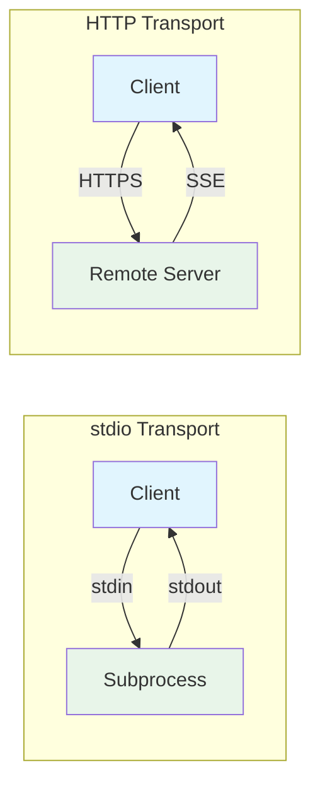

| Transport | Use Case | Auth | Example |
|-----------|----------|------|---------|
| **stdio** | Local servers | Environment vars | Claude Desktop |
| **HTTP** | Remote servers | OAuth 2.1 | Cloud deployments |

```python
# stdio configuration
{"command": "npx", "args": ["@modelcontextprotocol/server-filesystem", "/data"]}

# HTTP configuration
{"transport": "streamable_http", "url": "https://mcp.example.com/mcp"}
```

**Speaker Notes:**
stdio is simpler—launch a subprocess, communicate via pipes. HTTP is more complex but enables remote servers with proper authentication. The 2025-11-25 spec replaced SSE with "Streamable HTTP" for better compatibility. Most development uses stdio; production often uses HTTP.

---

# Slide 7: Building MCP Clients

## LangChain MCP Adapters

> **"LangChain agents can use tools defined on MCP servers using the langchain-mcp-adapters library."**
> — LangChain MCP Documentation

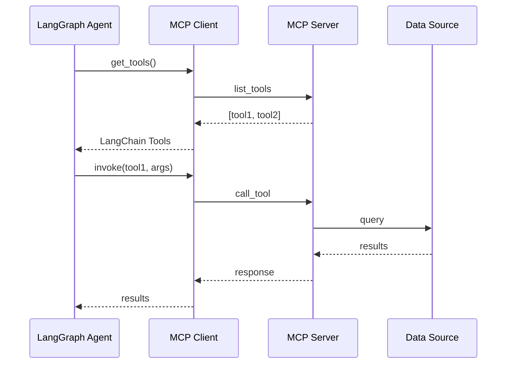

```python
from langchain_mcp_adapters.client import MultiServerMCPClient

async with MultiServerMCPClient(config) as client:
    tools = await client.get_tools()
```

**Speaker Notes:**
The adapter translates MCP tools into LangChain tools seamlessly. You configure which servers to connect to, get all their tools, and use them with any LangChain/LangGraph agent. The sequence diagram shows the flow: tools are discovered at initialization, then invoked during agent execution.

---

# Slide 8: FastMCP Server Pattern

## Building Servers with Decorators

> **"FastMCP is the standard framework for building MCP applications. It makes MCP production-ready with clean, Pythonic code."**
> — FastMCP Welcome

```mermaid
graph LR
    subgraph "FastMCP Server"
        D1[@mcp.tool] --> T[Tools]
        D2[@mcp.resource] --> R[Resources]
        D3[@mcp.prompt] --> P[Prompts]
    end
    C[Client] --> T
    C --> R
    C --> P
    style D1 fill:#e8f5e9
    style D2 fill:#e1f5fe
    style D3 fill:#fff3e0
```

```python
from fastmcp import FastMCP

mcp = FastMCP("My Server")

@mcp.tool
def search(query: str) -> list:
    """Search the knowledge base."""
    return db.search(query)

@mcp.resource("config://settings")
def get_config() -> str:
    return json.dumps(config)
```

**Speaker Notes:**
FastMCP uses decorators to expose capabilities—very similar to Flask or FastAPI patterns. The decorator determines the primitive type (tool, resource, prompt). FastMCP handles all the MCP protocol details, connection management, and error handling. You just write Python functions.

---

# Slide 9: Agentic RAG with MCP

## Conditional Retrieval via MCP Tools

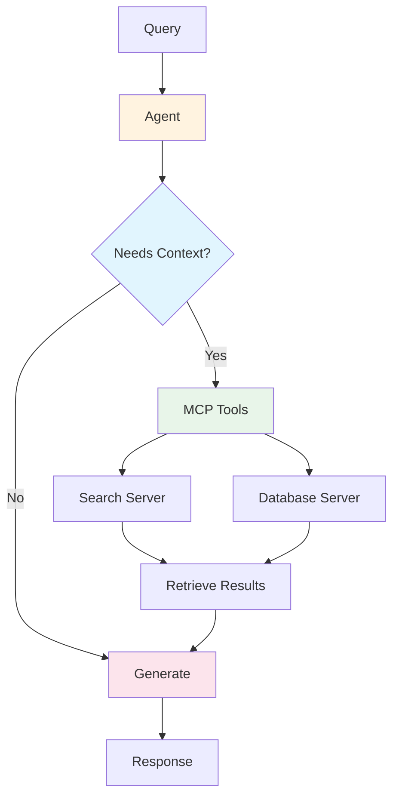

**Pattern:**
```python
def route_decision(state: RAGState) -> str:
    """Agent decides whether to retrieve via MCP."""
    if needs_external_context(state["query"]):
        return "mcp_retrieve"
    return "generate"
```

**Key insight:**
MCP makes retrieval modular—swap data sources without changing agent logic.

**Speaker Notes:**
This is agentic RAG with MCP as the retrieval layer. The agent decides when to call MCP tools, just like with any other tools. The power is modularity: change your data source from filesystem to database by updating MCP config, not agent code. This is the M+N benefit in action.

---

# Slide 10: Fuzzy-to-Fact Pattern

## Preventing Hallucinated Identifiers

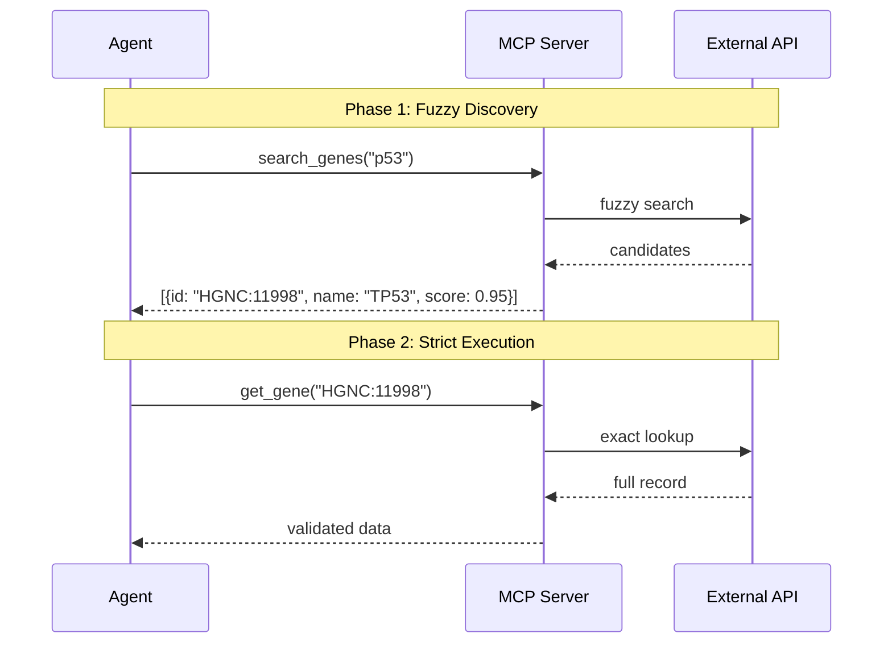

| Phase | Function | Input | Output |
|-------|----------|-------|--------|
| Fuzzy | `search_genes` | "p53" | Ranked candidates |
| Strict | `get_gene` | "HGNC:11998" | Full record |

**Speaker Notes:**
This pattern from the lifesciences-research repo prevents a common agent failure mode: hallucinating identifiers. Agents often guess "BRCA1" when they should use "HGNC:672". The Fuzzy-to-Fact protocol forces agents to search first, then use validated IDs. The strict tool rejects raw strings with a helpful error message.

---

# Slide 11: Error Envelopes

## Self-Healing Error Protocol

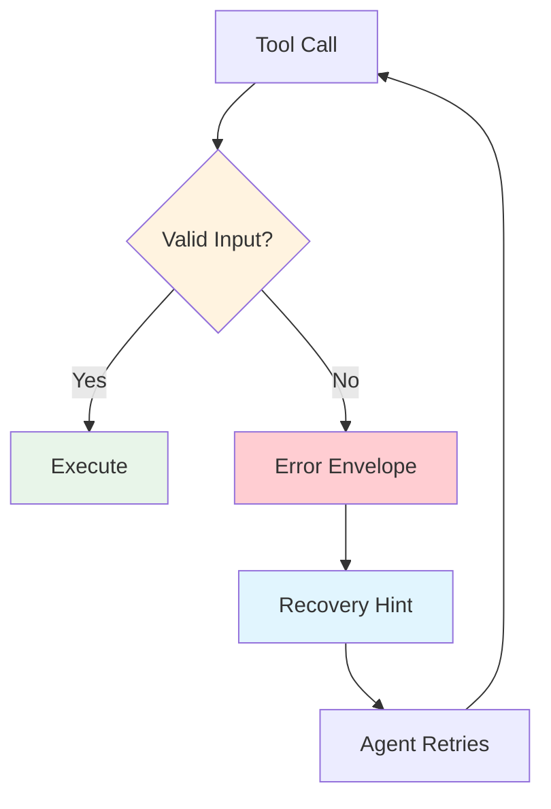

```python
class ErrorEnvelope(BaseModel):
    success: bool = False
    error: ErrorDetail

class ErrorDetail(BaseModel):
    code: str           # "UNRESOLVED_ENTITY"
    message: str        # "Invalid identifier"
    recovery_hint: str  # "Call search_genes first"
```

**Agent receives:**
```json
{"error": {"code": "UNRESOLVED_ENTITY",
           "recovery_hint": "Call search_genes first"}}
```

**Speaker Notes:**
The error envelope pattern enables agent self-correction. Instead of generic errors, the server returns structured hints that tell the agent exactly how to fix the problem. This creates a teaching loop: agent makes mistake, server explains the right approach, agent corrects itself. Essential for robust agentic workflows.

---

# Slide 12: Token Budgeting

## Slim Mode for Efficiency

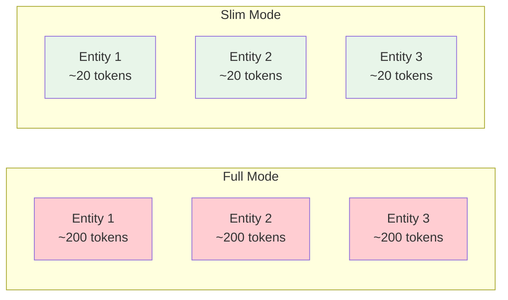

| Mode | Tokens/Entity | 10 Entities | Use Case |
|------|---------------|-------------|----------|
| Full | ~200 | 2,000 | Final display |
| Slim | ~20 | 200 | Multi-hop scanning |

```python
@mcp.tool
def search(query: str, slim: bool = False) -> list:
    results = api.search(query)
    return [r.slim() if slim else r.full() for r in results]
```

**Speaker Notes:**
Token budgeting is critical for multi-hop reasoning. If each hop returns 10 full records at 200 tokens each, four hops consume 8,000 tokens just for intermediate results. Slim mode returns only IDs, names, and scores—enough for the agent to decide, but 10× more efficient. Use full mode only when displaying final results.

---

# Slide 13: Security Considerations

## Protecting Against MCP-Specific Risks

> **"Clients must carefully evaluate whether an action should proceed, even if an MCP server requests it."**
> — MCP Security Best Practices

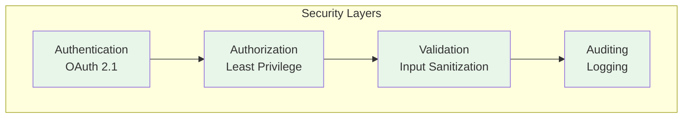

| Risk | Example | Mitigation |
|------|---------|------------|
| Confused Deputy | Proxy runs unintended action | Validate all requests |
| Prompt Injection | Malicious data triggers action | Input sanitization |
| Credential Leak | Secrets in error logs | Environment-only storage |

**Speaker Notes:**
MCP introduces new attack surfaces. Confused deputy attacks occur when a proxy server is tricked into executing unauthorized actions. Prompt injection can come through data returned by MCP servers. Always validate inputs, use environment variables for secrets, and implement human-in-the-loop for sensitive operations.

---

# Slide 14: Client-Side vs Server-Side

## Making the Right Choice

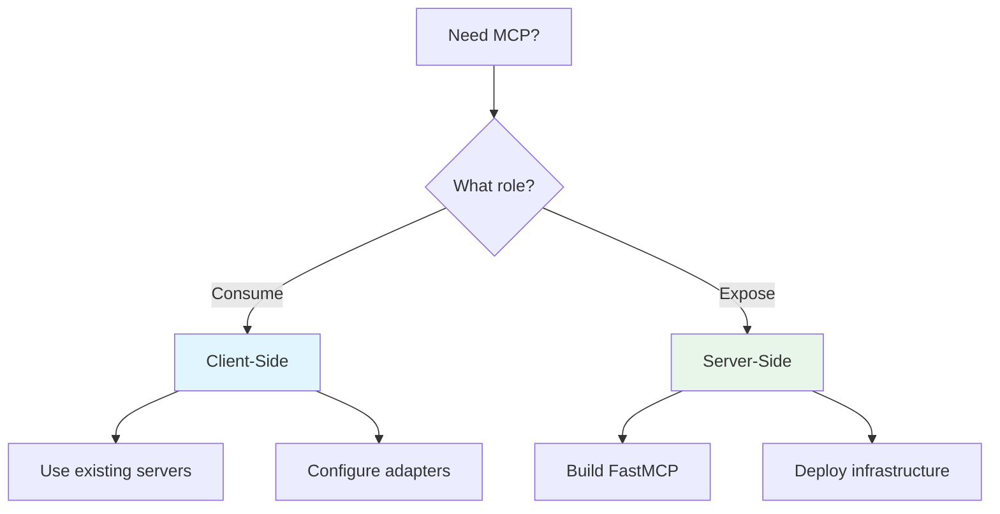

| Factor | Client-Side | Server-Side |
|--------|-------------|-------------|
| Ecosystem | 10,000+ servers | Your data |
| Setup | Config files | Python code |
| Maintenance | Update configs | Full lifecycle |
| Control | Server's design | Your design |

**Decision guide:**
- **Client-side**: Quick integration, community tools
- **Server-side**: Proprietary data, custom validation

**Speaker Notes:**
Most teams start client-side—connect to existing MCP servers and see the value immediately. Move to server-side when you need to expose proprietary data or implement domain-specific patterns like Fuzzy-to-Fact. The lifesciences-research repo shows 12 custom servers for specialized validation that couldn't be done with generic tools.

---

# Slide 15: Implementation Checklist

## Building Your First MCP Integration

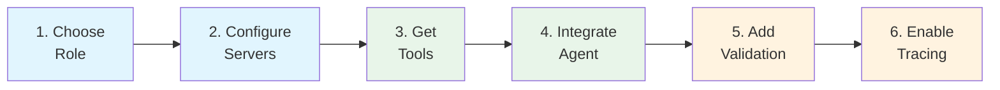

**Checklist:**
1. [ ] Decide: client-side or server-side MCP
2. [ ] Configure: `MultiServerMCPClient` or `FastMCP`
3. [ ] Connect: Get tools from servers
4. [ ] Integrate: Use tools with LangGraph agent
5. [ ] Validate: Add Fuzzy-to-Fact if needed
6. [ ] Observe: Enable LangSmith tracing

**Speaker Notes:**
Walk through this checklist for any MCP integration. The order matters—understand your role first, then configure, connect, integrate. Validation and observability come after the basic integration works. For the assignment, you'll complete steps 1-4 in Breakout Room 1, then 5-6 in Breakout Room 2.

---

# Slide 16: Summary & Resources

## Key Takeaways

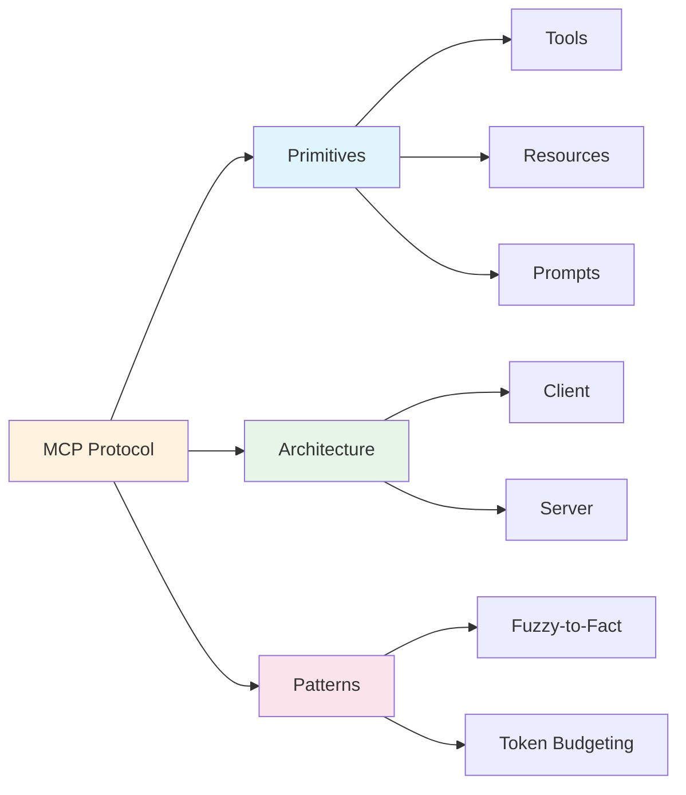

1. **MCP = USB-C for AI** — Universal connector standard
2. **Three primitives** — Tools (model), Resources (app), Prompts (user)
3. **Client-host-server** — Clean architecture with security boundaries
4. **Fuzzy-to-Fact** — Prevent hallucinated identifiers
5. **Token budgeting** — Slim mode for efficiency
6. **Security first** — Validate, authenticate, audit

## Essential Reading
- [MCP Specification](https://modelcontextprotocol.io/specification/2025-11-25)
- [LangChain MCP](https://docs.langchain.com/oss/python/langchain/mcp)
- [FastMCP](https://gofastmcp.com)
- [lifesciences-research](https://github.com/donbr/lifesciences-research)

**Questions?**

**Speaker Notes:**
These six takeaways capture the session. MCP is transforming AI integration—it's now the standard way to connect applications to data. Understanding the primitives and architecture lets you design effective systems. The patterns (Fuzzy-to-Fact, token budgeting) distinguish production systems from prototypes. Next session we'll deploy MCP servers for production use.

---

*Session 14 | MCP Connectors | Certification Challenge Module | Week 7*
