# Session 17: MCP Servers & A2A
## Building Server-Side MCP and Cross-Agent Communication

---

# Slide 1: Title

## MCP Servers & A2A
### From Tool Integration to Agent Collaboration

**Session 17 | AIE9 Bootcamp**

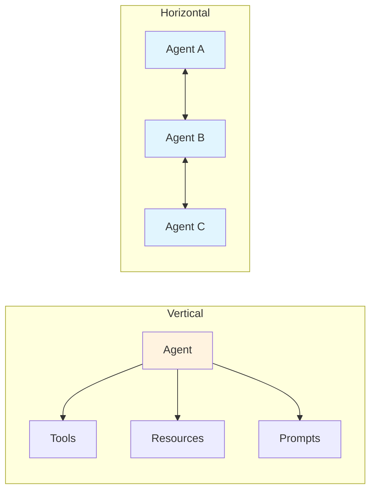

**Speaker Notes:**
Welcome to Session 17 where we bridge the gap between tool integration (MCP) and agent collaboration (A2A). We'll build our own MCP servers and understand how agents can communicate across organizational boundaries.

---

# Slide 2: Learning Objectives

## What You'll Learn

By the end of this session, you will be able to:

1. **Compare protocols**: MCP vs A2A vs ACP - when to use each
2. **Build MCP servers**: FastMCP with custom tools
3. **Create Agent Cards**: Capability manifests for discovery
4. **Handle A2A messaging**: Sync, streaming, and tasks
5. **Apply security**: Cross-agent authentication patterns
6. **Bridge protocols**: Connect MCP to A2A
7. **Design for production**: Scaling and monitoring

**Speaker Notes:**
These seven objectives build from understanding the protocol landscape to production deployment. We start conceptual, move to hands-on implementation, then consider real-world operational concerns.

---

# Slide 3: Protocol Landscape

## The Three Protocols

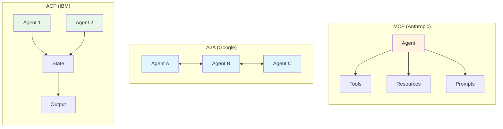

| Protocol | Focus | Best For |
|----------|-------|----------|
| **MCP** | Agent-to-Tool | External capabilities |
| **A2A** | Agent-to-Agent | Cross-domain collaboration |
| **ACP** | Stateful Workflows | Enterprise HITL |

**Speaker Notes:**
Think of MCP as "vertical integration" - agents reaching down to tools. A2A is "horizontal integration" - agents reaching sideways to other agents. ACP adds persistent state for complex workflows. In practice, you'll often use MCP + A2A together.

---

# Slide 4: MCP Server Architecture

## Building the Server Side

> "MCP is a new standard for connecting AI assistants to the systems where data lives."
> — Anthropic

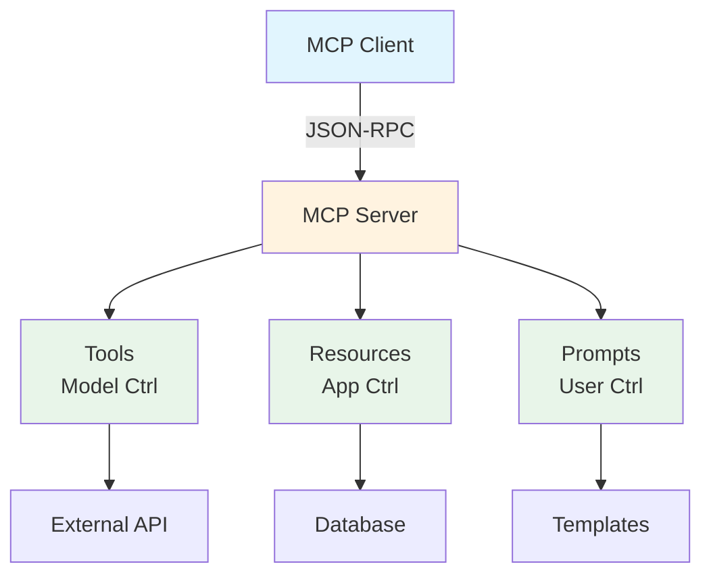

**Three Control Models:**
- **Tools**: LLM decides when to invoke
- **Resources**: Application manages access
- **Prompts**: User explicitly selects

**Speaker Notes:**
We covered client-side MCP in Session 14. Now we're building the server. The key insight is the three control models - who decides when something gets used. Tools are model-controlled, meaning the LLM chooses based on context. This is different from resources where the host application gates access.

---

# Slide 5: FastMCP Framework

## The Pythonic Way

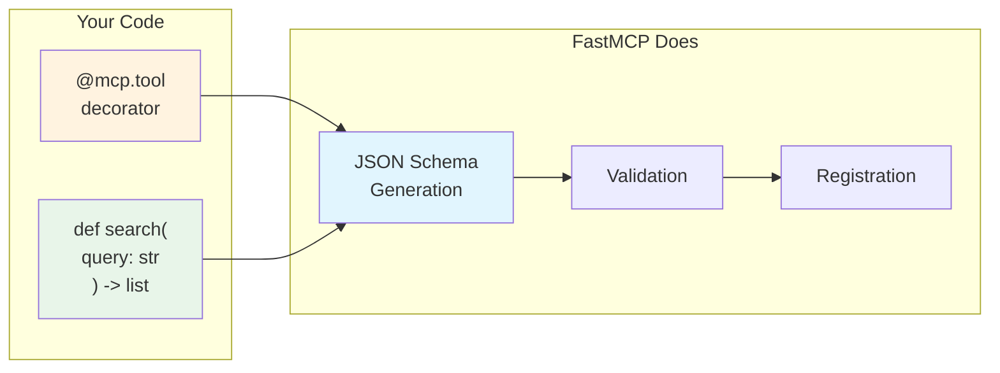

**Core Pattern:**
```python
from fastmcp import FastMCP

mcp = FastMCP("my-server")

@mcp.tool
def search(query: str, limit: int = 5) -> list[str]:
    """Search documents by query."""
    ...
```

**Type hints + docstrings = automatic schema**

**Speaker Notes:**
FastMCP makes server development feel Pythonic. You write normal Python functions with type hints, add the decorator, and FastMCP generates the JSON Schema automatically. Your docstring becomes the tool description that the LLM sees. This is a big improvement over manual schema definition.

---

# Slide 6: Agent Cards

## Capability Discovery for A2A

> "A2A is an open protocol for secure agent-to-agent communication and collaboration."
> — Linux Foundation

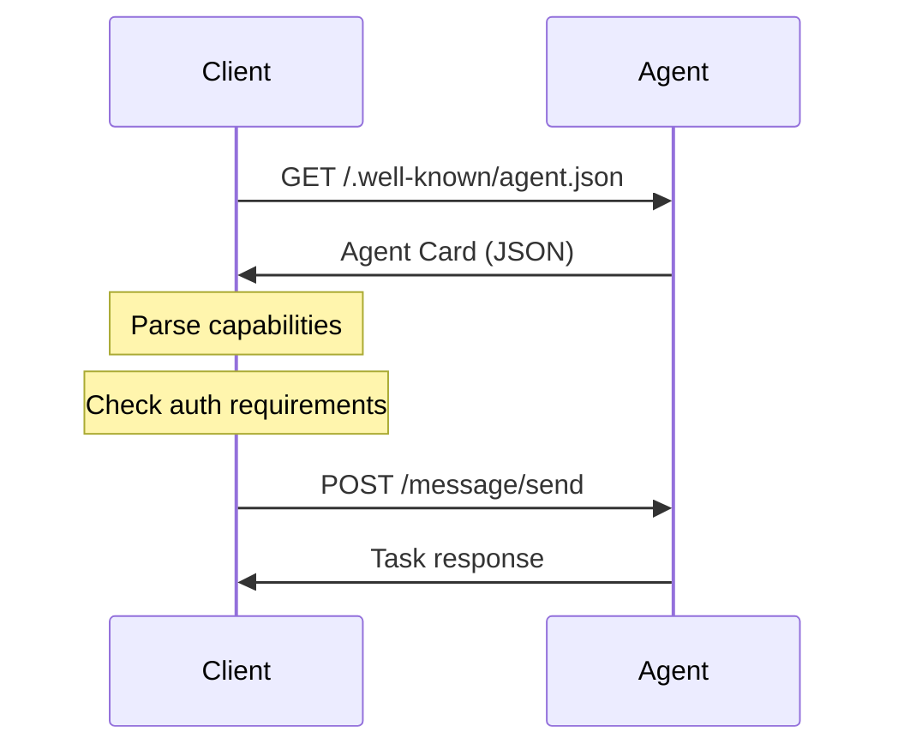

**Agent Card Structure:**
```json
{
  "name": "research-agent",
  "capabilities": {"streaming": true},
  "methods": ["message/send", "message/stream"]
}
```

**Speaker Notes:**
Agent Cards are like business cards for agents. They're JSON files at a well-known endpoint that describe what the agent can do. This enables discovery - a client can fetch the card, see what methods are supported, check authentication requirements, and then decide how to interact. It's inspired by similar patterns like OAuth discovery documents.

---

# Slide 7: A2A Protocol Methods

## Three Ways to Communicate

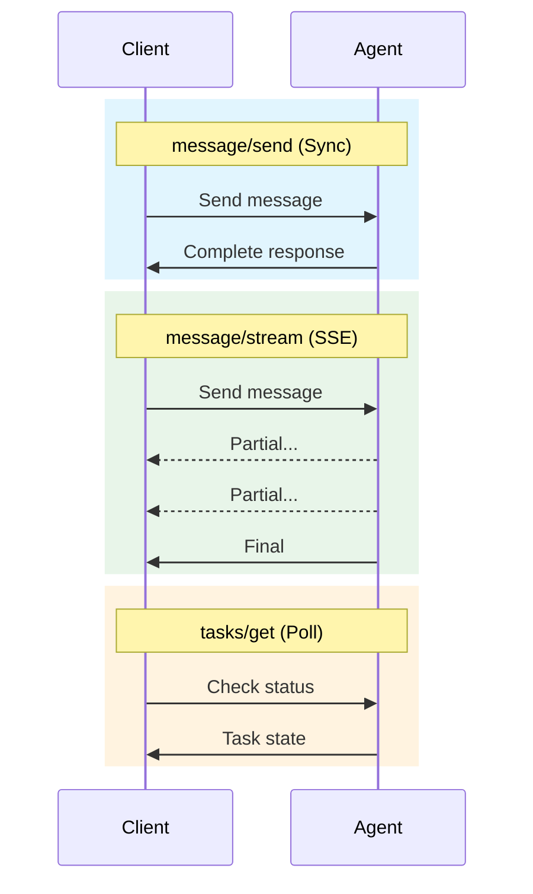

| Method | Pattern | When to Use |
|--------|---------|-------------|
| `message/send` | Sync | Quick responses |
| `message/stream` | SSE | Long tasks, UX |
| `tasks/get` | Poll | Async workflows |

**Speaker Notes:**
A2A gives you three methods depending on your use case. Synchronous send is simple but blocks. Streaming is better for user experience with long-running tasks - the user sees progress. Task polling is for truly async workflows where you fire and forget, then check back later.

---

# Slide 8: Task Lifecycle

## Managing A2A Tasks

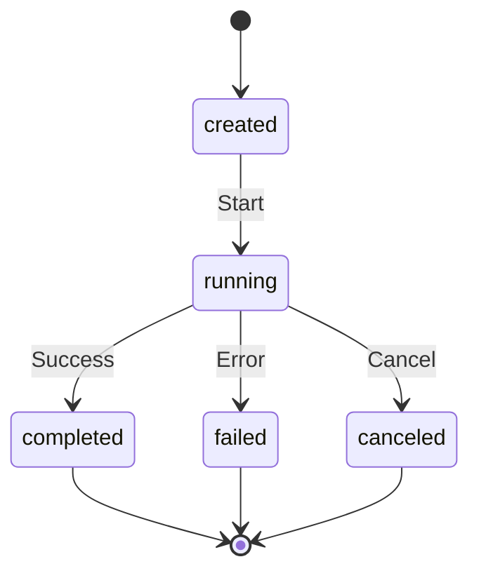

**State Handling Pattern:**
```python
match task.status:
    case "completed":
        return task.result
    case "failed":
        raise AgentError(task.error)
    case "canceled":
        log.info("Task canceled")
```

**Speaker Notes:**
Tasks in A2A have a clear lifecycle. Understanding these states is crucial for building robust integrations. A task starts as created, moves to running, then terminates in one of three states. Your code needs to handle all three terminal states - don't just assume success.

---

# Slide 9: Cross-Agent Security

## Five Layers of Protection

> "Tool poisoning attacks are a specialized form of prompt injection where malicious instructions are tucked away in tool descriptions."
> — Invariant Labs

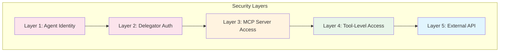

**Key Patterns:**
- OAuth 2.1 for headless agents
- mTLS between trusted agents
- Tool-level RBAC
- Human-in-the-loop for sensitive ops

**Speaker Notes:**
Security in distributed agents is layered like an onion. Each layer adds protection. Layer 1 ensures every agent has a distinct identity - never share API keys. Layer 2 captures user consent. Layer 3 gates which tools are exposed. Layer 4 controls individual tool access. Layer 5 ensures downstream systems respect the permissions.

---

# Slide 10: Protocol Bridging

## Connecting MCP to A2A

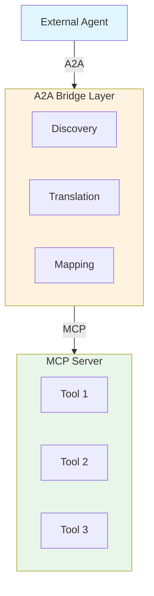

**PydanticAI Pattern:**
```python
from pydantic_ai import Agent

agent = Agent("openai:gpt-4o", tools=[...])
app = agent.to_a2a()  # Automatic wrapper
```

**Speaker Notes:**
Sometimes you have MCP tools but need to expose them to other agents via A2A. The bridge pattern handles this translation. PydanticAI makes it simple with to_a2a() which automatically wraps your agent. The bridge exposes MCP tools as A2A capabilities in the Agent Card and translates between protocols.

---

# Slide 11: Production Patterns

## Scaling and Monitoring

> "Use MCP when you need fast, stateless tool execution. Use A2A when you need complex, stateful orchestration."
> — PlexObject

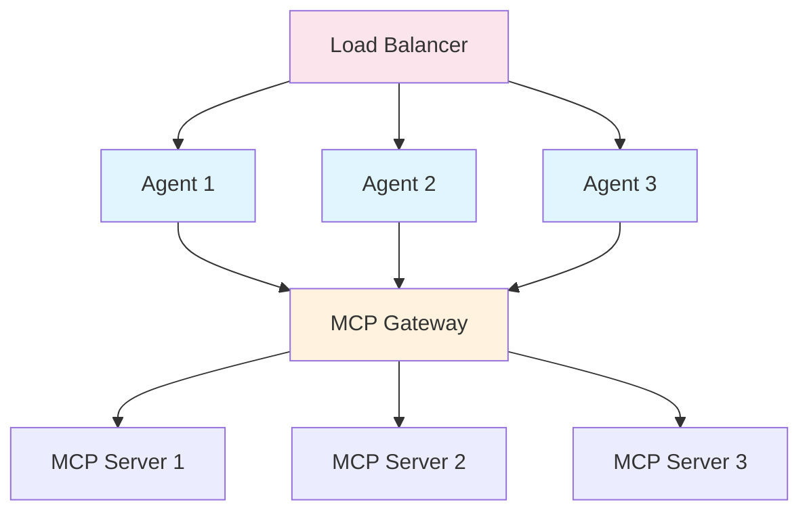

**Considerations:**
- Stateless agents for horizontal scaling
- Connection pooling for MCP servers
- Async processing for long tasks
- Circuit breakers for dependencies

**Speaker Notes:**
Production deployment requires thinking about scale. Agents should be stateless so you can run multiple instances behind a load balancer. MCP servers might be shared across agents through a gateway. Don't forget monitoring - you need to track task metrics, latencies, and failure rates to operate reliably.

---

# Slide 12: Decision Framework

## When to Use What

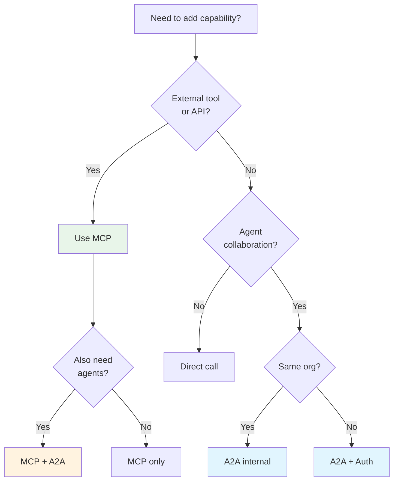

**Speaker Notes:**
Here's a decision tree to help you choose. Start with what you're trying to do. If it's tool access - databases, APIs, files - that's MCP. If it's agent collaboration, consider A2A. For cross-organization, definitely A2A with proper authentication. Often you'll use both - MCP for tools and A2A for coordination.

---

# Slide 13: Hands-On Demo

## Building an MCP Server with A2A

**Step 1: Create FastMCP Server**
```python
from fastmcp import FastMCP

mcp = FastMCP("research-server")

@mcp.tool
def search_papers(query: str) -> list[dict]:
    """Search academic papers."""
    ...
```

**Step 2: Add Agent Card**
```json
{
  "name": "research-server",
  "methods": ["message/send"]
}
```

**Step 3: Bridge to A2A**
```python
app = agent.to_a2a()
```

**Speaker Notes:**
Let's walk through building a real server. We start with FastMCP, add our tools with decorators, create an Agent Card for discovery, and then bridge to A2A if we need cross-agent access. The key is that type hints and docstrings do most of the heavy lifting.

---

# Slide 14: Summary

## Key Takeaways

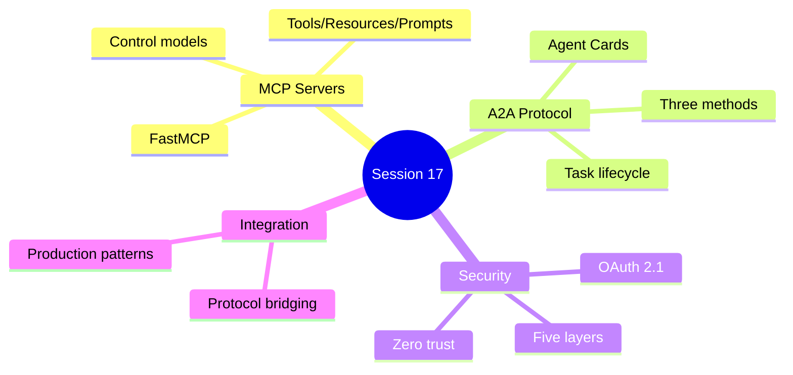

1. **MCP = Vertical** (tools), **A2A = Horizontal** (agents)
2. **FastMCP**: Decorators + type hints = automatic schemas
3. **Agent Cards**: Discovery at `/.well-known/agent.json`
4. **Task lifecycle**: created → running → completed/failed
5. **Security layers**: Agent identity through external APIs
6. **Use both**: MCP for tools + A2A for collaboration

**Speaker Notes:**
Let's recap the key points. MCP and A2A solve different problems - one is about tools, one is about agents talking to agents. FastMCP makes server development easy. Agent Cards enable discovery. Security is layered. In production, you'll often use both protocols together.

---

# Slide 15: Resources

## Continue Learning

### Core Specifications
- [MCP Specification](https://modelcontextprotocol.io/specification/2025-11-25)
- [A2A Protocol](https://a2a-protocol.org/latest/)
- [FastMCP Docs](https://gofastmcp.com)

### Implementation Guides
- [FastMCP Quickstart](https://gofastmcp.com/getting-started/quickstart)
- [PydanticAI A2A](https://ai.pydantic.dev/a2a/)
- [LangChain MCP](https://docs.langchain.com/oss/python/langchain/mcp)

### Security
- [OWASP MCP Guide](https://genai.owasp.org/resource/cheatsheet-a-practical-guide-for-securely-using-third-party-mcp-servers-1-0/)
- [MCP Security Best Practices](https://modelcontextprotocol.io/specification/draft/basic/security_best_practices)

**Speaker Notes:**
Here are the key resources for deeper learning. The MCP specification is comprehensive - start with the architecture section. FastMCP has excellent tutorials. For A2A, PydanticAI's documentation is practical. Don't skip the security resources - they cover real attack vectors you need to understand.

---

# Slide 16: Discussion

## Questions to Explore

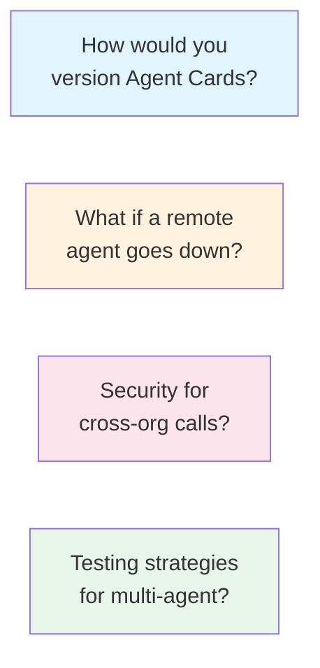

**Assignment Preview:**
Build an MCP server with:
- 3+ custom tools (FastMCP)
- Proper type hints & docstrings
- Streamable HTTP transport
- Agent Card for discovery

**Stretch:** OAuth 2.1, monitoring, second agent via A2A

**Speaker Notes:**
Let's discuss these questions before you start the assignment. Versioning is important - how do clients handle capability changes? Resilience matters - what's your fallback when a remote agent fails? Security is critical for cross-org - what authentication would you use? And testing multi-agent systems is tricky - how do you test in isolation?

---

# Session Connections

## Building on Previous Sessions

| Session | Connection |
|---------|------------|
| **5: Multi-Agent** | Local patterns (supervisor, router) |
| **7: Deep Agents** | Subagent spawning → A2A evolution |
| **14: MCP Connectors** | Client-side → Server-side |
| **15: Agent Servers** | Deployment patterns apply |
| **18: Guardrails** | Cross-agent validation |

**Speaker Notes:**
Remember how these sessions connect. Session 5 gave us local multi-agent patterns - A2A extends that across boundaries. Session 14 was MCP from the client perspective - now we're building servers. Session 15's deployment patterns apply directly to MCP servers. And Session 18's guardrails will extend to cross-agent security.

---

*Session 17 Slides | MCP Servers & A2A | AIE9 Bootcamp*
