# Google ADK: Agent Development Kit
## Slide Deck Specification

---

## Slide 1: Title

**Google ADK: Building Production AI Agents**

*From Prompt to Production with Agent Development Kit*

```
┌─────────────────────────────────────────────────┐
│                                                  │
│          Google Agent Development Kit            │
│                                                  │
│        Build • Deploy • Scale AI Agents          │
│                                                  │
│     ╔═══════════════════════════════════════╗   │
│     ║    Code-First    Multi-Language       ║   │
│     ║    Open Source   Production-Ready     ║   │
│     ╚═══════════════════════════════════════╝   │
│                                                  │
└─────────────────────────────────────────────────┘
```

**Speaker Notes:**
- ADK launched April 2025 at Google Cloud NEXT
- Available in Python, Java, Go, TypeScript
- 14,000+ GitHub stars, millions of downloads
- Code-first approach: treat agent development like software engineering

---

## Slide 2: Learning Objectives

**By the End of This Session**

You will be able to:

1. Explain the core architecture of AI agents
2. Build single agents with tools using ADK
3. Design multi-agent systems with workflow patterns
4. Implement state management for stateful agents
5. Debug agents using observability tools
6. Deploy agents to production

**Key Question:** What transforms an LLM into an Agent?

**Speaker Notes:**
- Focus on concepts before code
- Each objective maps to a course day
- The key question drives all our learning

---

## Slide 3: From LLM to Agent

**What Makes an Agent Different?**

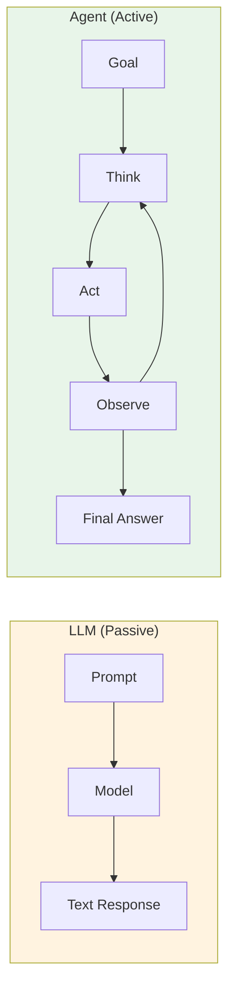

| LLM | Agent |
|-----|-------|
| Generates text | Takes actions |
| Static knowledge | Real-time data |
| Single response | Iterative reasoning |
| Human-guided | Goal-oriented |

**Speaker Notes:**
- LLM: pattern prediction engine
- Agent: complete application with reasoning and action
- The loop is key: think → act → observe → repeat

---

## Slide 4: The Agent Architecture

**Three Core Components**

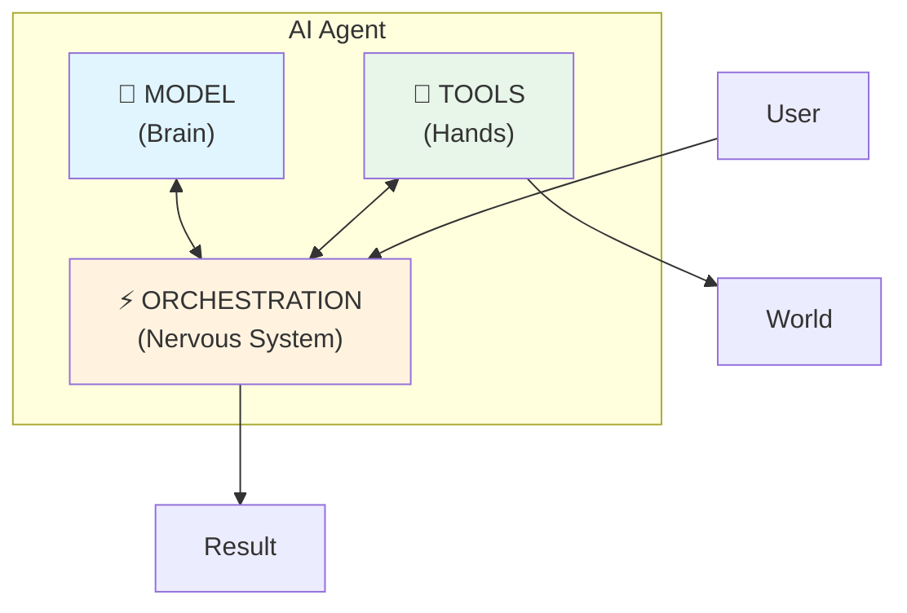

| Component | Purpose | ADK Implementation |
|-----------|---------|-------------------|
| Model | Reasoning engine | `Gemini()` |
| Tools | External actions | `google_search`, `FunctionTool` |
| Orchestration | Loop management | `Runner`, workflow agents |

**Speaker Notes:**
- Model: the "brain" that reasons
- Tools: the "hands" that interact with the world
- Orchestration: manages the think-act-observe loop

---

## Slide 5: The Agentic Loop

**How Agents Solve Problems**

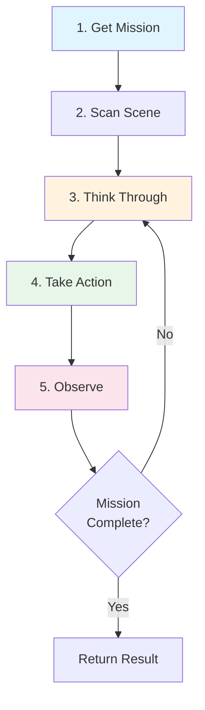

**Example: "Where is my order #12345?"**

1. **Get Mission:** Answer order status query
2. **Scan Scene:** Available tools, context
3. **Think:** Need to query database, then carrier API
4. **Act:** Call `find_order("12345")`
5. **Observe:** Order found, tracking #ZYX987
6. **Loop:** Call `get_shipping_status("ZYX987")`
7. **Result:** "Your order is Out for Delivery!"

**Speaker Notes:**
- This loop is universal across all agent frameworks
- Agents plan multi-step strategies, not single actions
- Each observation informs the next thought

---

## Slide 6: Taxonomy of Agents

**Five Levels of Agent Capability**

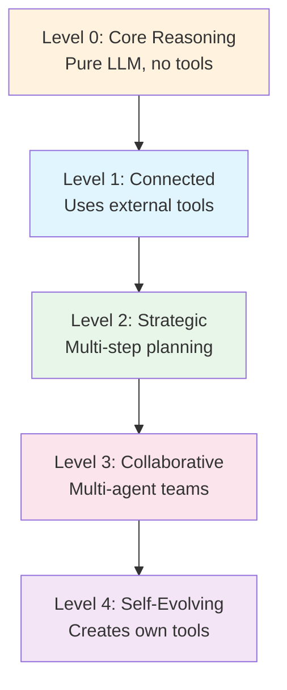

| Level | Example |
|-------|---------|
| 0 | "Explain baseball rules" |
| 1 | "What's the weather?" (uses search) |
| 2 | "Find coffee shop halfway between..." |
| 3 | "Launch product with research + marketing" |
| 4 | "Create new monitoring agent on-demand" |

**Speaker Notes:**
- Most production agents are Level 1-3
- Level 4 is cutting-edge research (AlphaEvolve, Co-Scientist)
- Higher levels build on lower capabilities

---

## Slide 7: ADK Design Principles

**Why ADK?**

```
┌─────────────────────────────────────────────────┐
│              ADK DESIGN PRINCIPLES               │
├─────────────────────────────────────────────────┤
│                                                  │
│  ✓ CODE-FIRST: Software engineering patterns    │
│  ✓ OPEN: Works with any model, tool, platform   │
│  ✓ INTEROPERABLE: LangChain, CrewAI, MCP, A2A   │
│  ✓ SCALABLE: Local dev → Production deploy      │
│  ✓ OBSERVABLE: Built-in tracing and debugging   │
│                                                  │
└─────────────────────────────────────────────────┘
```

**Key Differentiators:**
- Betting on model capabilities (not constraining them)
- Best of Google, fully extensible
- Agent as atomic unit, customizable internals

**Speaker Notes:**
- Not "low-code AI sprinkled on workflows"
- Full software engineering: testing, versioning, CI/CD
- Works with existing ecosystems, not locked-in

---

## Slide 8: Your First Agent

**10 Lines to Search the Web**

```python
from google.adk.agents import Agent
from google.adk.models.google_llm import Gemini
from google.adk.runners import InMemoryRunner
from google.adk.tools import google_search

root_agent = Agent(
    name="helpful_assistant",
    model=Gemini(model="gemini-2.5-flash-lite"),
    instruction="Use Google Search for current info.",
    tools=[google_search],
)

runner = InMemoryRunner(agent=root_agent)
response = await runner.run_debug("What's new with ADK?")
```

**Result:** Agent searches web, returns current ADK info

**Speaker Notes:**
- Notice: name, model, instruction, tools
- Runner orchestrates the execution
- `run_debug` for prototyping (handles session)

---

## Slide 9: Multi-Agent Patterns

**When One Agent Isn't Enough**

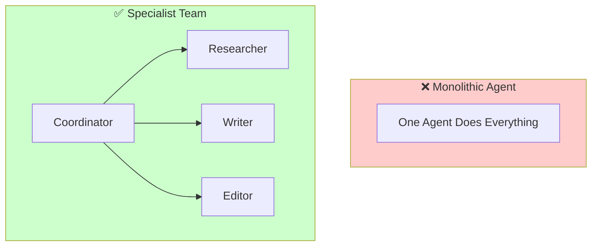

**Why Multi-Agent?**
- Simpler individual agents
- Easier to test and debug
- More reliable outcomes
- Parallel execution possible

**Speaker Notes:**
- Monolithic agents: long prompts, hard to debug
- Team of specialists: modular, maintainable
- Mirrors human organizations

---

## Slide 10: Workflow Patterns

**Sequential • Parallel • Loop**

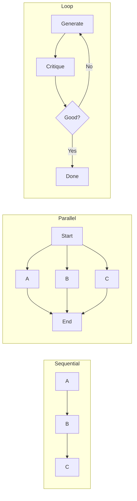

| Pattern | Use When | Example |
|---------|----------|---------|
| Sequential | Order matters | Outline → Write → Edit |
| Parallel | Independent tasks | Research 3 topics |
| Loop | Iterative refinement | Draft → Review → Improve |

**Speaker Notes:**
- Sequential: `SequentialAgent(sub_agents=[...])`
- Parallel: `ParallelAgent(sub_agents=[...])`
- Loop: `LoopAgent(sub_agents=[...], max_iterations=N)`

---

## Slide 11: State Management

**Making Agents Remember**

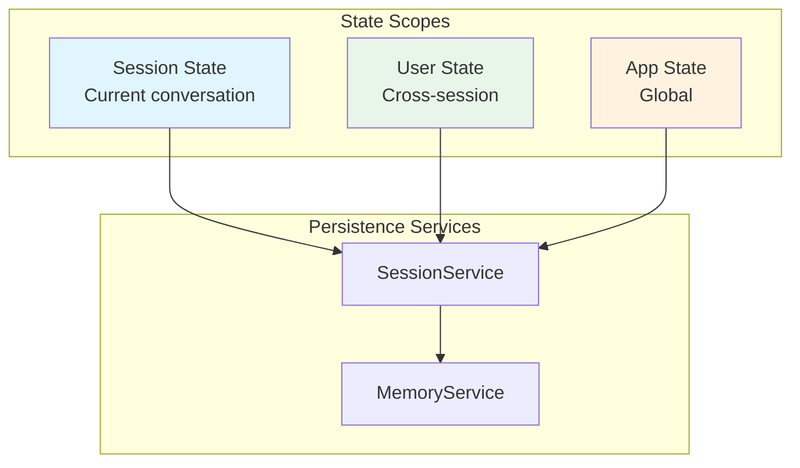

**Key Mechanisms:**
- `output_key`: Store agent output to state
- `{key}` in instruction: Read from state
- `ToolContext.state`: Access in tools

**Speaker Notes:**
- Session = conversation scratchpad
- User = preferences across sessions
- Memory = long-term knowledge retrieval (RAG)

---

## Slide 12: Tools Deep Dive

**Connecting Agents to the World**

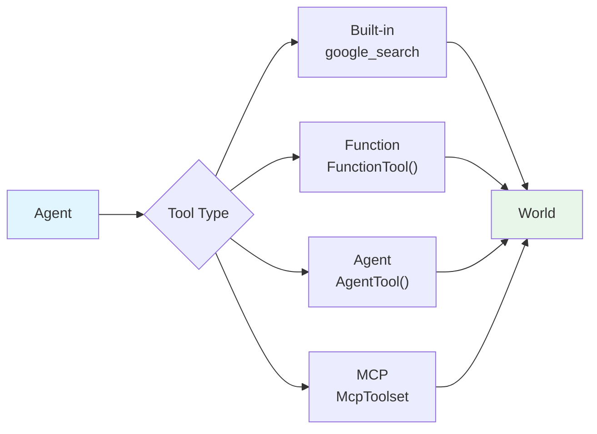

**Best Practices:**
- Document thoroughly (helps LLM choose)
- Keep granular (one tool = one action)
- Return structured data (JSON > free text)
- Use type hints (enable validation)

**Speaker Notes:**
- Tools transform static LLM into capable agent
- MCP = Model Context Protocol for standard integration
- AgentTool wraps agents as callable tools

---

## Slide 13: Observability

**Debugging the Non-Deterministic**

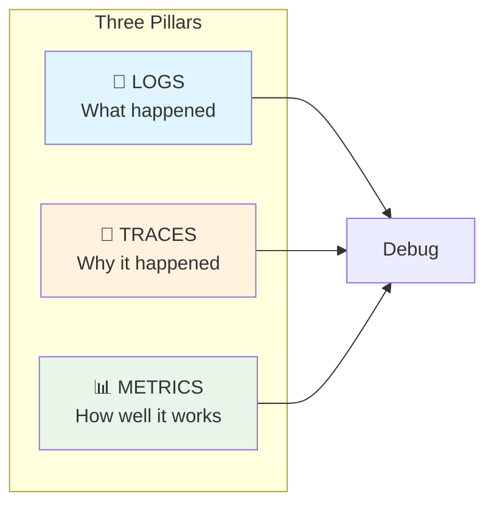

**Debugging Flow:**
```
User: "Find quantum computing papers"
Agent: "I cannot help with that"

Without observability: 😭 WHY??
With observability: "Functions: []" ← No tools!
Solution: Add google_search tool
```

**Speaker Notes:**
- Agents fail mysteriously (not predictably)
- Traces show full execution path
- ADK web UI visualizes all three pillars

---

## Slide 14: A2A Protocol

**Agent-to-Agent Communication**

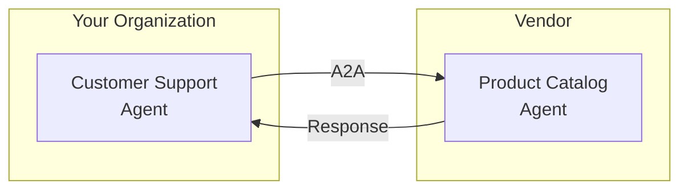

**When to Use A2A:**
- Cross-framework (ADK ↔ LangGraph)
- Cross-language (Python ↔ Java)
- Cross-organization (your infra ↔ vendor)

**Implementation:**
```python
# Server: expose agent
app = agent.to_a2a()

# Client: consume remote agent
remote = RemoteA2aAgent(url="https://vendor.com/a2a")
```

**Speaker Notes:**
- A2A = open standard for agent interoperability
- Agent Cards describe capabilities (like API contracts)
- Different from MCP (tools) vs A2A (agent tasks)

---

## Slide 15: Production Deployment

**From Prototype to Production**

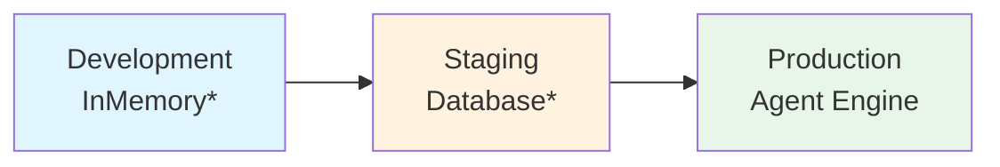

**Deployment Options:**

| Option | Use Case |
|--------|----------|
| Agent Engine | Fully managed, auto-scaling |
| Cloud Run | Containerized, serverless |
| GKE | Maximum control, multi-cloud |

**Production Checklist:**
- [ ] Replace InMemory with Database services
- [ ] Configure authentication and IAM
- [ ] Enable monitoring and alerting
- [ ] Set up CI/CD evaluation pipeline

**Speaker Notes:**
- Same code, swap services for production
- Evaluation gates deployments (metrics-driven)
- Model Armor for security guardrails

---

## Slide 16: Summary & Next Steps

**Key Takeaways**

```
┌─────────────────────────────────────────────────┐
│           GOOGLE ADK ESSENTIALS                  │
├─────────────────────────────────────────────────┤
│                                                  │
│  1. Agents = LLM + Tools + Orchestration        │
│  2. Think → Act → Observe loop                  │
│  3. Multi-agent > Monolithic                    │
│  4. Sequential • Parallel • Loop patterns       │
│  5. State: Session / User / App scopes          │
│  6. Observability: Logs • Traces • Metrics      │
│  7. A2A for cross-boundary communication        │
│  8. Code-first, production-ready                │
│                                                  │
└─────────────────────────────────────────────────┘
```

**Your Assignment:**
1. Build a single agent with Google Search
2. Create a sequential content pipeline
3. Add parallel research capabilities

**Resources:**
- [google.github.io/adk-docs](https://google.github.io/adk-docs/)
- [github.com/google/adk-samples](https://github.com/google/adk-samples)

**Speaker Notes:**
- Start simple, add complexity incrementally
- Use ADK web UI for debugging
- Join the community: GitHub discussions, Discord

---

## Appendix: Decision Tree

**Choosing the Right Pattern**

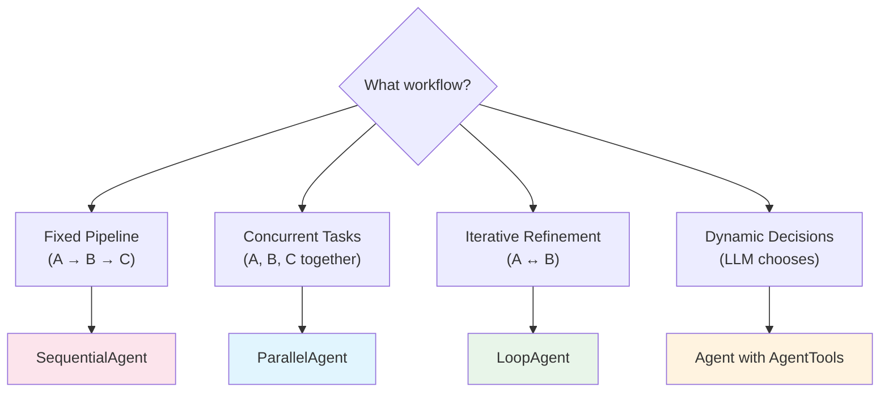

---

*Slides Version: 1.0 | Based on Kaggle 5-Day AI Agents Course with Google ADK*
