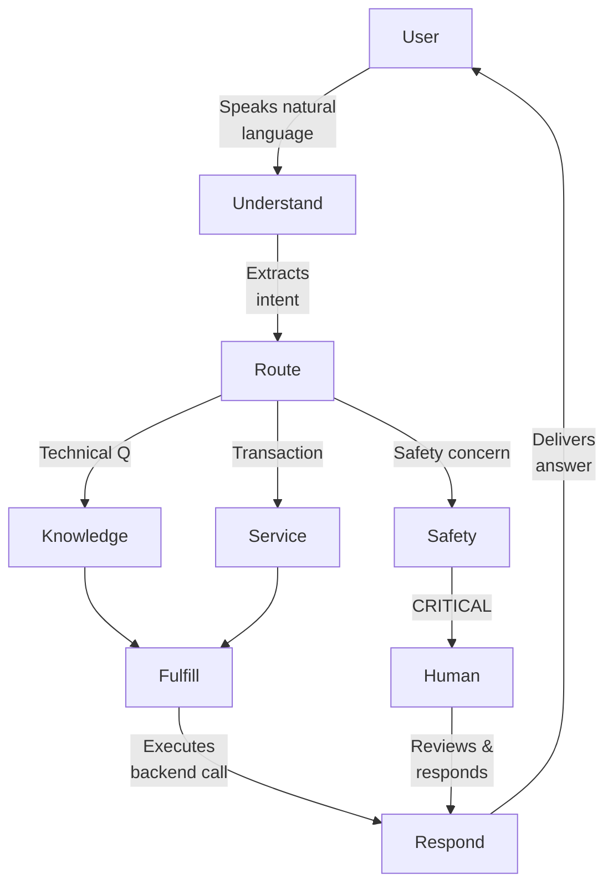

# C4 Diagram Plan: Automotive Virtual Assistant Architecture

**Purpose:** Create three layered diagrams showing what is STABLE vs. what CHANGED between 2022 Dialogflow and 2026 ADK implementations.

**Visual Communication Goal:** Readers should immediately see that 90% of the architecture (Conceptual + Logical layers) is identical across eras. Only the Physical layer shows significant evolution.

---

## COLOR LEGEND (Apply Consistently Across All Diagrams)

| Color | Hex Code | Meaning | Usage |
|-------|----------|---------|-------|
| **Gray** | `#D3D3D3` | Stable/Unchanged | Conceptual layer, timeless patterns |
| **Blue** | `#4A90D9` | Stable Interface | Logical layer API contracts |
| **Green** | `#90EE90` | New Addition (2026) | ADK-specific capabilities |
| **Orange** | `#FFA500` | Modified/Enhanced | Evolved implementations |
| **Red** | `#FF6B6B` | Deprecated | Removed from 2022 approach |

---

## FILE 1: conceptual_layer.md

### Purpose
Show what is **IDENTICAL** between 2022 Dialogflow and 2026 ADK at the highest abstraction level. This diagram should convince readers that the fundamental user experience and system behavior are timeless.

### Mermaid Diagram Type
`flowchart TB` (Top-to-Bottom flow) - Simple, clear user journey

### Diagram Title
**"Automotive Virtual Assistant - Conceptual Model (Era-Independent)"**

### Nodes and Labels

#### Primary Actors
```
User["Vehicle Owner<br/>(User)"]
Human["Human Specialist<br/>(Safety Reviewer)"]
```

#### System Boundary
```
subgraph System["Automotive Virtual Assistant"]
    Understand["Intent<br/>Recognition"]
    Route["Request<br/>Classification"]
    Fulfill["Tool<br/>Invocation"]
    Respond["Response<br/>Synthesis"]
end
```

#### Request Type Classification
```
subgraph RequestTypes["Request Categories"]
    Knowledge["Knowledge Request<br/>(How does X work?)"]
    Service["Service Request<br/>(Book appointment)"]
    Safety["Safety Report<br/>(Strange noise)"]
end
```

### Flow Arrows


### Styling Specification
```mermaid
%%{init: {'theme': 'neutral'}}%%

style User fill:#D3D3D3,stroke:#666,stroke-width:2px
style Human fill:#D3D3D3,stroke:#666,stroke-width:2px
style Understand fill:#D3D3D3,stroke:#666
style Route fill:#D3D3D3,stroke:#666
style Fulfill fill:#D3D3D3,stroke:#666
style Respond fill:#D3D3D3,stroke:#666
style Knowledge fill:#D3D3D3,stroke:#666
style Service fill:#D3D3D3,stroke:#666
style Safety fill:#D3D3D3,stroke:#666
```

### Supporting Text for conceptual_layer.md

```markdown
## What This Diagram Shows

This conceptual model represents the **timeless patterns** that exist in ANY automotive
virtual assistant, regardless of implementation technology:

### Stable Patterns (Present in 2022 AND 2026)

| Pattern | Description |
|---------|-------------|
| **Intent Recognition** | User speaks naturally; system extracts meaning |
| **Request Classification** | Three categories: knowledge, service, safety |
| **Tool Invocation** | System calls backend APIs to fulfill requests |
| **Response Synthesis** | System generates human-readable output |
| **Safety Escalation** | Critical concerns always reach a human |

### Why This Matters

A developer who designed a Dialogflow bot in 2022 would recognize this exact flow
in an ADK agent in 2026. The technology changes; the user experience does not.

**Color Note:** All elements are gray to emphasize this is a STABLE foundation that
transcends any specific implementation.
```

---

## FILE 2: logical_layer.md

### Purpose
Show the **API interfaces** that serve as contracts between the conversational layer and backend systems. These interfaces would be **virtually identical** whether implemented as Dialogflow webhooks or ADK FunctionTools.

### Mermaid Diagram Type
`C4Container` - Shows containers/services with API relationships

### Diagram Title
**"Automotive Virtual Assistant - Logical Interfaces (API Contracts)"**

### Nodes and Labels

#### External Systems
```
Person(user, "Vehicle Owner", "Asks questions, requests services")
Person_Ext(human, "Safety Specialist", "Reviews escalated tickets")
```

#### Main System Boundary
```
System_Boundary(assistant, "Virtual Assistant System") {
    Container(router, "Intent Router", "Classifier", "Routes to specialist by intent type")
}
```

#### Specialist Boundaries (Three Domains)
```
System_Boundary(knowledge_domain, "Knowledge Domain") {
    Container(knowledge_agent, "Knowledge Specialist", "Agent", "Answers technical questions")
    ContainerDb(manual_db, "Technical Manual", "Vector Store", "Vehicle specs, procedures")
}

System_Boundary(service_domain, "Service Domain") {
    Container(service_agent, "Service Specialist", "Agent", "Handles transactions")
    ContainerDb(warranty_db, "Warranty System", "Database", "Coverage status by VIN")
    ContainerDb(booking_db, "Scheduling System", "Database", "Service appointments")
}

System_Boundary(safety_domain, "Safety Domain") {
    Container(safety_agent, "Escalation Handler", "Agent", "Creates safety tickets")
    ContainerDb(ticket_db, "Ticket System", "Queue", "P0 safety escalations")
}
```

### Tool Interface Boxes (Key Visual Element)

Create a dedicated section showing the four tool signatures:

```mermaid
subgraph Interfaces["API Contracts (Identical 2022-2026)"]
    I1["check_warranty_status(vin)<br/>→ {status, coverage, expiration}"]
    I2["schedule_service_appointment(vin, type, date)<br/>→ {booking_id, confirmation}"]
    I3["search_technical_manual(query, model?)<br/>→ excerpts: string"]
    I4["log_safety_escalation(vin, risk, description)<br/>→ {ticket_id, status: ESCALATED}"]
end
```

### Relationships
```
Rel(user, router, "Submits request", "Natural language")
Rel(router, knowledge_agent, "Technical questions", "")
Rel(router, service_agent, "Transactions", "")
Rel(router, safety_agent, "Safety concerns", "")
Rel(knowledge_agent, manual_db, "Queries", "search_technical_manual()")
Rel(service_agent, warranty_db, "Checks", "check_warranty_status()")
Rel(service_agent, booking_db, "Creates", "schedule_service_appointment()")
Rel(safety_agent, ticket_db, "Escalates", "log_safety_escalation()")
Rel(ticket_db, human, "Notifies", "P0 Alert")
```

### Styling Specification
```mermaid
UpdateElementStyle(router, $bgColor="#4A90D9", $fontColor="white")
UpdateElementStyle(knowledge_agent, $bgColor="#4A90D9", $fontColor="white")
UpdateElementStyle(service_agent, $bgColor="#4A90D9", $fontColor="white")
UpdateElementStyle(safety_agent, $bgColor="#4A90D9", $fontColor="white")
UpdateElementStyle(I1, $bgColor="#B8D4E8", $borderColor="#4A90D9")
UpdateElementStyle(I2, $bgColor="#B8D4E8", $borderColor="#4A90D9")
UpdateElementStyle(I3, $bgColor="#B8D4E8", $borderColor="#4A90D9")
UpdateElementStyle(I4, $bgColor="#B8D4E8", $borderColor="#4A90D9")
```

### Supporting Text for logical_layer.md

```markdown
## What This Diagram Shows

The logical layer defines **API contracts** - the input/output specifications that remain
stable regardless of how they're implemented.

### The Four Core Interfaces

| Interface | Input | Output | Purpose |
|-----------|-------|--------|---------|
| `check_warranty_status` | VIN | coverage info | Determine eligibility |
| `schedule_service_appointment` | VIN, type, date | booking confirmation | Create appointments |
| `search_technical_manual` | query, model? | text excerpts | Answer how-to questions |
| `log_safety_escalation` | VIN, risk, description | ticket ID | Human handoff |

### Why This Matters

A Dialogflow webhook from 2022 and an ADK FunctionTool from 2026 would have **identical
function signatures**. The caller doesn't know or care about the implementation.

**Interface Mapping:**

| 2022 (Dialogflow) | 2026 (ADK) | Same Contract? |
|-------------------|------------|----------------|
| Fulfillment Webhook | FunctionTool | YES |
| Intent Handler | LlmAgent | YES |
| Context Parameters | State Injection | YES |

**Color Note:** Blue indicates stable interfaces - these contracts don't change.
```

---

## FILE 3: physical_layer.md

### Purpose
Show what **CHANGED** between 2022 and 2026 - this is where the ADK provides new capabilities. Use a **side-by-side comparison** format.

### Mermaid Diagram Type
`flowchart LR` (Left-to-Right) for side-by-side comparison

### Diagram Title
**"Physical Layer Evolution: 2022 Dialogflow vs 2026 ADK"**

### Layout Structure

```
+---------------------------+     +---------------------------+
|     2022 DIALOGFLOW       |     |       2026 ADK            |
+---------------------------+     +---------------------------+
| [Cloud-Only Processing]   |     | [Edge + Cloud Hybrid]     |
| Intent Detection          |  →  | LlmAgent Routing          |
| Webhook Fulfillment       |  →  | FunctionTool Wrappers     |
| Static Context Variables  |  →  | Dynamic State Injection   |
| Single Model              |  →  | Model Selection Strategy  |
|                           |     | + AgentTool Composition   |
|                           |     | + HttpRetryOptions        |
|                           |     | + AdkWebServer Runtime    |
+---------------------------+     +---------------------------+
```

### Nodes and Labels

#### 2022 Column (Left Side)
```mermaid
subgraph Dialogflow2022["2022: Dialogflow CX"]
    DF_Intent["Intent Detection<br/>(Rule-based + ML)"]
    DF_Webhook["Fulfillment Webhooks<br/>(Cloud Functions)"]
    DF_Context["Context Parameters<br/>(Session variables)"]
    DF_Response["Response Generation<br/>(Template-based)"]
    DF_Deploy["Deployment<br/>(Cloud-only)"]
end
```

#### 2026 Column (Right Side)
```mermaid
subgraph ADK2026["2026: Google ADK"]
    ADK_Router["LlmAgent Routing<br/>(LLM-based classification)"]
    ADK_Tools["FunctionTool Wrappers<br/>(Auto schema generation)"]
    ADK_State["State Injection<br/>(Dynamic {vin} binding)"]
    ADK_AgentTool["AgentTool Composition<br/>(Agents as tools)"]
    ADK_Models["Model Selection<br/>(Flash vs Pro)"]
    ADK_Retry["HttpRetryOptions<br/>(Resilience layer)"]
    ADK_Server["AdkWebServer<br/>(Edge + Cloud)"]
end
```

#### Arrows Showing Evolution
```mermaid
DF_Intent -.->|"Enhanced by"| ADK_Router
DF_Webhook -.->|"Replaced by"| ADK_Tools
DF_Context -.->|"Evolved to"| ADK_State
DF_Deploy -.->|"Expanded to"| ADK_Server
```

### Styling Specification

```mermaid
%% 2022 Components - Orange (modified/replaced)
style DF_Intent fill:#FFA500,stroke:#CC8400
style DF_Webhook fill:#FFA500,stroke:#CC8400
style DF_Context fill:#FFA500,stroke:#CC8400
style DF_Response fill:#FFA500,stroke:#CC8400
style DF_Deploy fill:#FFA500,stroke:#CC8400

%% 2026 Components - Green (new capabilities)
style ADK_Router fill:#90EE90,stroke:#228B22
style ADK_Tools fill:#90EE90,stroke:#228B22
style ADK_State fill:#90EE90,stroke:#228B22
style ADK_AgentTool fill:#90EE90,stroke:#228B22
style ADK_Models fill:#90EE90,stroke:#228B22
style ADK_Retry fill:#90EE90,stroke:#228B22
style ADK_Server fill:#90EE90,stroke:#228B22
```

### Detailed Comparison Table

Include this as a supporting element:

```markdown
| Aspect | 2022 Dialogflow | 2026 ADK | Change Type |
|--------|-----------------|----------|-------------|
| **Routing** | Intent detection (rules + ML) | LlmAgent (LLM-based) | ENHANCED |
| **Tool Binding** | Webhook URL configuration | FunctionTool(fn) auto-schema | SIMPLIFIED |
| **State Management** | Context parameters (manual) | State injection `{vin}` | STREAMLINED |
| **Agent Composition** | N/A (flat architecture) | AgentTool(agent=specialist) | NEW |
| **Model Selection** | Single model per bot | Flash (speed) vs Pro (quality) | NEW |
| **Resilience** | Platform-managed | HttpRetryOptions (configurable) | NEW |
| **Deployment** | Cloud-only (Dialogflow service) | Edge + Cloud (AdkWebServer) | EXPANDED |
```

### Supporting Text for physical_layer.md

```markdown
## What This Diagram Shows

The physical layer is where **technology choices manifest**. This is the ONLY layer with
significant differences between 2022 and 2026.

### What Changed

| Category | Evolution | Business Value |
|----------|-----------|----------------|
| **Routing Intelligence** | Rule-based → LLM-based | More natural conversations, fewer intents to maintain |
| **Tool Definition** | Webhook configs → Python decorators | Developer velocity, type safety |
| **Agent Composition** | Flat → Hierarchical | Specialist agents for different domains |
| **Model Flexibility** | Single model → Model per agent | Cost optimization (Flash for simple, Pro for complex) |
| **Deployment Options** | Cloud-only → Edge + Cloud | Lower latency, offline capability |

### What Stayed The Same

Even at the physical layer, notice that:
- **Backend APIs** are unchanged (same warranty system, same booking system)
- **Data formats** are unchanged (VIN, dates, ticket IDs)
- **Business logic** is unchanged (safety always escalates to humans)

### Color Key for This Diagram

- **Orange** = 2022 components (being replaced/modified)
- **Green** = 2026 components (new ADK capabilities)
- **Dotted arrows** = Evolution path showing how concepts transformed

### Key Insight

If you drew the Conceptual and Logical diagrams for both eras, they would be
**virtually identical**. Only this Physical diagram shows meaningful differences.

This demonstrates the value of **layered architecture thinking** - stable
abstractions protect against implementation churn.
```

---

## IMPLEMENTATION CHECKLIST

When creating the three markdown files:

- [ ] **conceptual_layer.md**
  - [ ] Use gray (#D3D3D3) for ALL elements
  - [ ] Include flowchart showing user journey
  - [ ] Add table of stable patterns
  - [ ] Emphasize this is "era-independent"

- [ ] **logical_layer.md**
  - [ ] Use blue (#4A90D9) for interfaces and agents
  - [ ] Show all four tool signatures with I/O specs
  - [ ] Include interface mapping table (Dialogflow ↔ ADK)
  - [ ] Use C4Container diagram type

- [ ] **physical_layer.md**
  - [ ] Side-by-side layout (2022 left, 2026 right)
  - [ ] Orange for 2022 components
  - [ ] Green for 2026 components
  - [ ] Dotted arrows showing evolution
  - [ ] Detailed comparison table

---

## VISUAL NARRATIVE

When someone views these three diagrams in sequence, they should conclude:

1. **Conceptual Layer:** "The user experience is exactly the same - speak naturally, get answers, safety goes to humans."

2. **Logical Layer:** "The API contracts are identical - check_warranty_status() in 2022 looks just like check_warranty_status() in 2026."

3. **Physical Layer:** "Oh, HERE'S what changed - better routing, cleaner tool definitions, multi-model support, edge deployment."

**The teaching moment:** Good architecture separates what changes from what stays stable. The ADK didn't reinvent automotive virtual assistants - it improved the physical implementation while preserving the conceptual and logical foundations.
