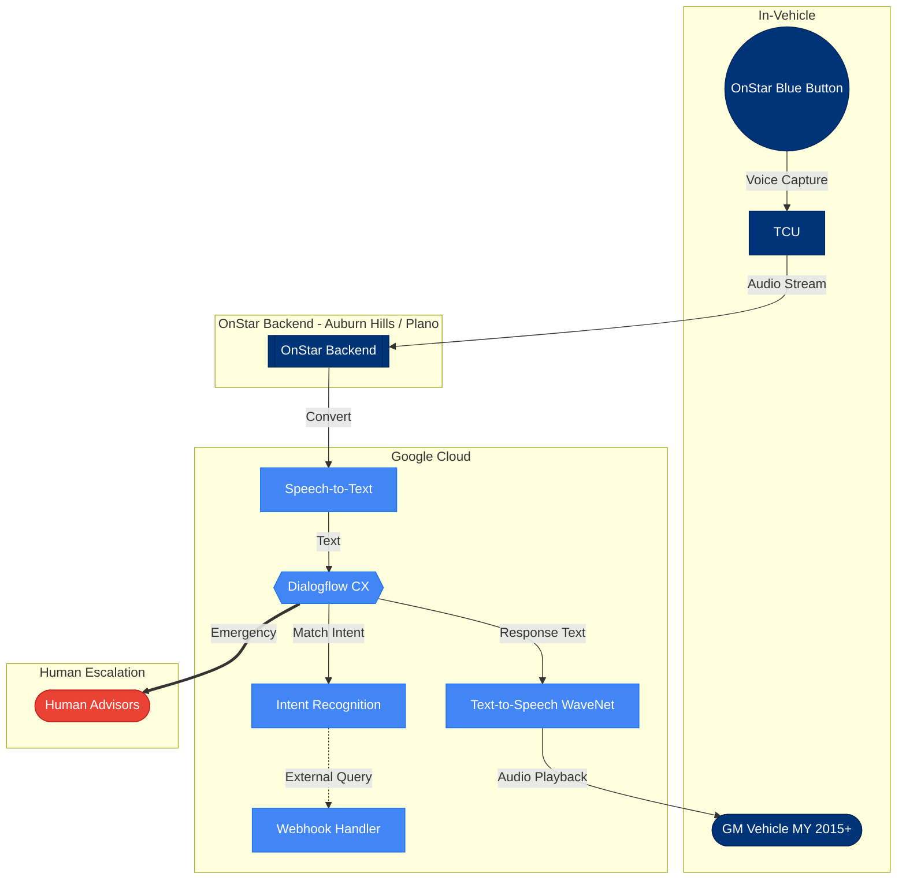
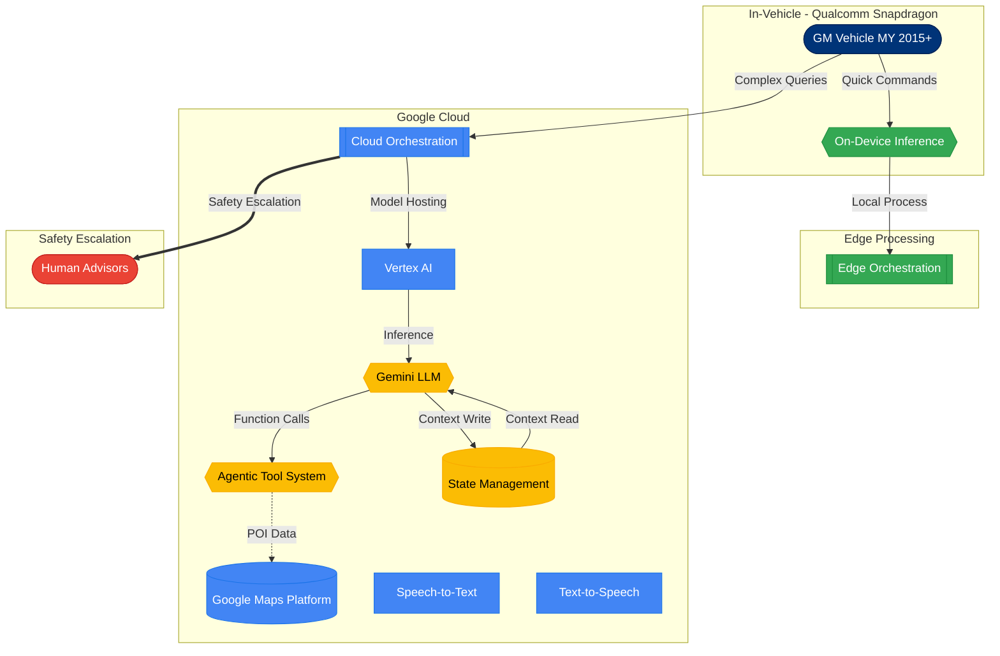
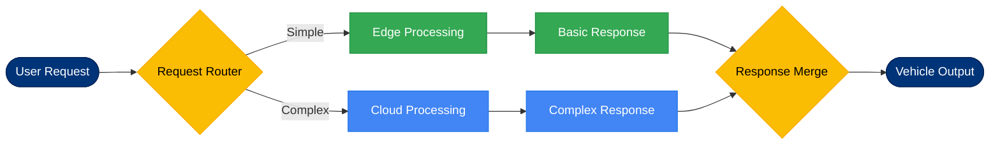
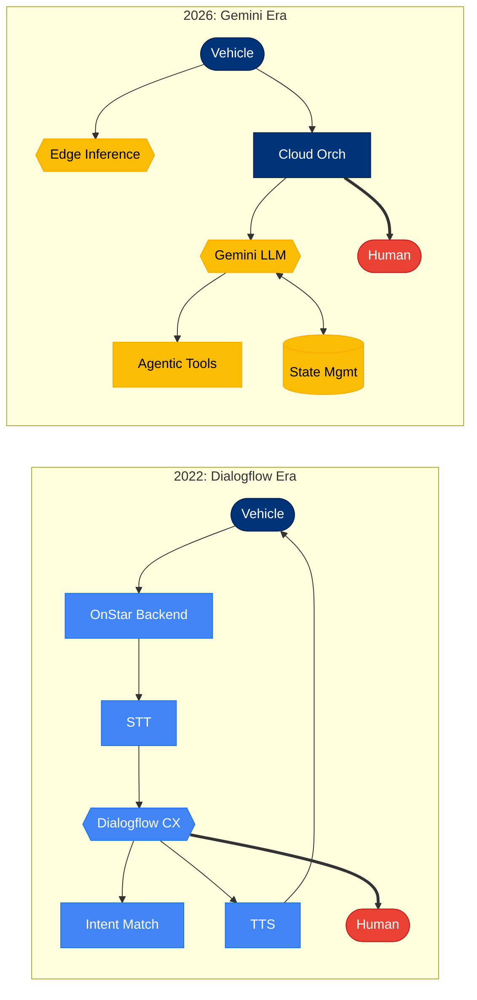
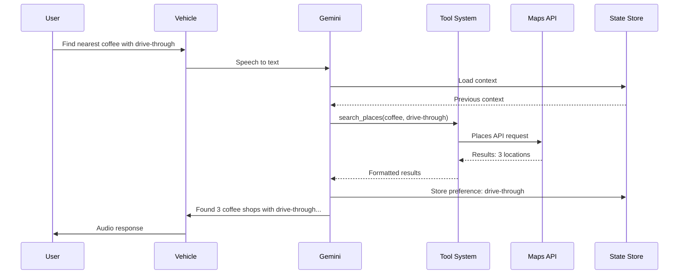

# Diagram Plan V2: GM-Google Automotive Architecture Evolution

**Document Version**: 2.0
**Created**: 2026-01-24
**Purpose**: Detailed specifications for diagram generation agents

---

## FILE STRUCTURE

### Files to Create (4 total)

| File | Purpose | Diagrams |
|------|---------|----------|
| `diagrams/01_architecture_2022_dialogflow.md` | 2022 Dialogflow-era architecture | 1 flowchart |
| `diagrams/02_architecture_2026_gemini.md` | 2026 Gemini-era architecture | 2 flowcharts |
| `diagrams/03_evolution_comparison.md` | Side-by-side delta visualization | 1 flowchart + delta table |
| `diagrams/04_agentic_tool_flow.md` | Detailed tool orchestration | 1 sequence diagram |

### Directory Structure

```
google-adk/automotive-use-case/
  diagrams/
    01_architecture_2022_dialogflow.md
    02_architecture_2026_gemini.md
    03_evolution_comparison.md
    04_agentic_tool_flow.md
```

---

## DIAGRAM 1: 2022 Dialogflow Architecture

**File**: `diagrams/01_architecture_2022_dialogflow.md`
**Type**: `flowchart TB`
**Complexity**: 10 nodes, 8 edges (Simple - within limits)

### Node Definitions

| Node ID | Label | Shape |
|---------|-------|-------|
| `vehicle` | `GM Vehicle MY 2015+` | `([...])` stadium |
| `tcu` | `TCU` | `[...]` square |
| `blueBtn` | `OnStar Blue Button` | `((...))` circle |
| `backend` | `OnStar Backend` | `[[...]]` subroutine |
| `stt` | `Speech-to-Text` | `[...]` square |
| `dialogflow` | `Dialogflow CX` | `{{...}}` hexagon |
| `intent` | `Intent Recognition` | `[...]` square |
| `webhook` | `Webhook Handler` | `[...]` square |
| `tts` | `Text-to-Speech WaveNet` | `[...]` square |
| `human` | `Human Advisors` | `([...])` stadium |

### Subgraph Structure

```
subgraph VEHICLE["In-Vehicle"]
  direction TB
  vehicle
  tcu
  blueBtn
end

subgraph ONSTAR["OnStar Backend (Auburn Hills / Plano)"]
  direction TB
  backend
end

subgraph GCLOUD["Google Cloud"]
  direction TB
  stt
  dialogflow
  intent
  webhook
  tts
end

subgraph ESCALATION["Human Escalation"]
  direction TB
  human
end
```

### Edge Definitions

| From | To | Label | Style |
|------|-----|-------|-------|
| `blueBtn` | `tcu` | `Voice Capture` | `-->` |
| `tcu` | `backend` | `Audio Stream` | `-->` |
| `backend` | `stt` | `Convert` | `-->` |
| `stt` | `dialogflow` | `Text` | `-->` |
| `dialogflow` | `intent` | `Match Intent` | `-->` |
| `intent` | `webhook` | `External Query` | `-.->` |
| `dialogflow` | `tts` | `Response Text` | `-->` |
| `tts` | `vehicle` | `Audio Playback` | `-->` |
| `dialogflow` | `human` | `Emergency Escalation` | `==>` |

### Styling

```
classDef google fill:#4285F4,stroke:#1a73e8,color:#fff
classDef gm fill:#003478,stroke:#002255,color:#fff
classDef escalation fill:#EA4335,stroke:#c5221f,color:#fff

class stt,dialogflow,intent,webhook,tts google
class vehicle,tcu,blueBtn,backend gm
class human escalation
```

### Complete Mermaid Code



---

## DIAGRAM 2A: 2026 Gemini Architecture - High Level Hybrid View

**File**: `diagrams/02_architecture_2026_gemini.md`
**Type**: `flowchart TB`
**Complexity**: 12 nodes, 10 edges (Medium - within limits)

### Node Definitions

| Node ID | Label | Shape |
|---------|-------|-------|
| `vehicle` | `GM Vehicle MY 2015+` | `([...])` stadium |
| `edgeInfer` | `On-Device Inference` | `{{...}}` hexagon |
| `edgeOrch` | `Edge Orchestration` | `[[...]]` subroutine |
| `cloudOrch` | `Cloud Orchestration` | `[[...]]` subroutine |
| `vertexai` | `Vertex AI` | `[...]` square |
| `gemini` | `Gemini LLM` | `{{...}}` hexagon |
| `maps` | `Google Maps Platform` | `[(...)` database |
| `stt` | `Speech-to-Text` | `[...]` square |
| `tts` | `Text-to-Speech` | `[...]` square |
| `tools` | `Agentic Tool System` | `{{...}}` hexagon |
| `state` | `State Management` | `[(...)` database |
| `human` | `Human Advisors` | `([...])` stadium |

### Subgraph Structure

```
subgraph VEHICLE["In-Vehicle (Qualcomm Snapdragon)"]
  direction TB
  vehicle
  edgeInfer
end

subgraph EDGE["Edge Processing"]
  direction TB
  edgeOrch
end

subgraph CLOUD["Google Cloud"]
  direction TB
  cloudOrch
  vertexai
  gemini
  maps
  stt
  tts
  tools
  state
end

subgraph ESCALATION["Safety Escalation"]
  direction TB
  human
end
```

### Edge Definitions

| From | To | Label | Style |
|------|-----|-------|-------|
| `vehicle` | `edgeInfer` | `Quick Commands` | `-->` |
| `vehicle` | `cloudOrch` | `Complex Queries` | `-->` |
| `edgeInfer` | `edgeOrch` | `Local Process` | `-->` |
| `cloudOrch` | `vertexai` | `Model Hosting` | `-->` |
| `vertexai` | `gemini` | `Inference` | `-->` |
| `gemini` | `tools` | `Function Calls` | `-->` |
| `tools` | `maps` | `POI Data` | `-.->` |
| `gemini` | `state` | `Context Write` | `-->` |
| `state` | `gemini` | `Context Read` | `-->` |
| `cloudOrch` | `human` | `Safety Escalation` | `==>` |

### Styling

```
classDef google fill:#4285F4,stroke:#1a73e8,color:#fff
classDef gm fill:#003478,stroke:#002255,color:#fff
classDef edge fill:#34A853,stroke:#1e8e3e,color:#fff
classDef escalation fill:#EA4335,stroke:#c5221f,color:#fff
classDef ai fill:#FBBC04,stroke:#f9ab00,color:#000

class vertexai,maps,stt,tts,cloudOrch google
class vehicle gm
class edgeInfer,edgeOrch edge
class human escalation
class gemini,tools,state ai
```

### Complete Mermaid Code



---

## DIAGRAM 2B: 2026 Gemini Architecture - Request Routing

**File**: `diagrams/02_architecture_2026_gemini.md` (second diagram in same file)
**Type**: `flowchart LR`
**Complexity**: 8 nodes, 7 edges (Simple - optimized for LR)

### Node Definitions

| Node ID | Label | Shape |
|---------|-------|-------|
| `user` | `User Request` | `([...])` stadium |
| `router` | `Request Router` | `{...}` diamond |
| `edge` | `Edge Processing` | `[...]` square |
| `cloud` | `Cloud Processing` | `[...]` square |
| `basic` | `Basic Response` | `[...]` square |
| `complex` | `Complex Response` | `[...]` square |
| `merge` | `Response Merge` | `{...}` diamond |
| `vehicle` | `Vehicle Output` | `([...])` stadium |

### Edge Definitions

| From | To | Label | Style |
|------|-----|-------|-------|
| `user` | `router` | `` | `-->` |
| `router` | `edge` | `Simple` | `-->` |
| `router` | `cloud` | `Complex` | `-->` |
| `edge` | `basic` | `` | `-->` |
| `cloud` | `complex` | `` | `-->` |
| `basic` | `merge` | `` | `-->` |
| `complex` | `merge` | `` | `-->` |
| `merge` | `vehicle` | `` | `-->` |

### Complete Mermaid Code



---

## DIAGRAM 3: Evolution Comparison

**File**: `diagrams/03_evolution_comparison.md`
**Type**: `flowchart LR`
**Complexity**: 14 nodes total (split into 2 subgraphs of 7 each)

### Node Definitions - 2022 Side

| Node ID | Label | Shape |
|---------|-------|-------|
| `v22_vehicle` | `Vehicle` | `([...])` |
| `v22_backend` | `OnStar` | `[...]` |
| `v22_stt` | `STT` | `[...]` |
| `v22_df` | `Dialogflow` | `{{...}}` |
| `v22_intent` | `Intent` | `[...]` |
| `v22_tts` | `TTS` | `[...]` |
| `v22_human` | `Human` | `([...])` |

### Node Definitions - 2026 Side

| Node ID | Label | Shape |
|---------|-------|-------|
| `v26_vehicle` | `Vehicle` | `([...])` |
| `v26_edge` | `Edge` | `{{...}}` |
| `v26_cloud` | `Cloud` | `[...]` |
| `v26_gemini` | `Gemini` | `{{...}}` |
| `v26_tools` | `Tools` | `[...]` |
| `v26_state` | `State` | `[(...)` |
| `v26_human` | `Human` | `([...])` |

### Subgraph Structure

```
subgraph Y2022["2022: Dialogflow Era"]
  direction TB
  v22_vehicle --> v22_backend --> v22_stt --> v22_df
  v22_df --> v22_intent
  v22_df --> v22_tts --> v22_vehicle
  v22_df --> v22_human
end

subgraph Y2026["2026: Gemini Era"]
  direction TB
  v26_vehicle --> v26_edge
  v26_vehicle --> v26_cloud --> v26_gemini
  v26_gemini --> v26_tools
  v26_gemini --> v26_state
  v26_cloud --> v26_human
end
```

### Complete Mermaid Code



### Delta Summary Table (include in markdown file)

| Aspect | 2022 | 2026 | Change |
|--------|------|------|--------|
| **Processing Location** | Cloud-only | Hybrid edge-cloud | Lower latency |
| **Language Understanding** | Intent-based | LLM-based | Natural language |
| **Context Handling** | Session params | Multi-turn memory | Richer conversations |
| **Tool Invocation** | Webhooks | Agentic tools | Dynamic orchestration |
| **Entity Count** | 10 | 12 | +20% complexity |
| **Relationship Count** | 8 | 10 | +25% complexity |

---

## DIAGRAM 4: Agentic Tool Flow Sequence

**File**: `diagrams/04_agentic_tool_flow.md`
**Type**: `sequenceDiagram`
**Complexity**: 6 participants, 12 messages (within limits)

### Participants

| Alias | Label |
|-------|-------|
| `U` | `User` |
| `V` | `Vehicle` |
| `G` | `Gemini` |
| `T` | `Tool System` |
| `M` | `Maps API` |
| `S` | `State Store` |

### Message Sequence

```
U->>V: "Find nearest coffee shop with drive-through"
V->>G: Speech converted to text
G->>S: Load conversation context
S-->>G: Previous context (none)
G->>T: call: search_places(type=coffee, feature=drive-through)
T->>M: Places API request
M-->>T: Results (3 locations)
T-->>G: Formatted results
G->>S: Store: user prefers drive-through
G->>V: "I found 3 coffee shops with drive-through..."
V->>U: Audio response
```

### Complete Mermaid Code



---

## QUALITY CHECKLIST

### Mermaid Syntax Rules (from Scout Report)

- [ ] Every diagram starts with valid type declaration (`flowchart TB`, `sequenceDiagram`, etc.)
- [ ] All node text with special characters wrapped in quotes
- [ ] No unescaped quotes in labels (use `#quot;` if needed)
- [ ] Subgraph names do not contain special characters
- [ ] Links to subgraph itself, not internal nodes, for external connections
- [ ] Comments use `%%` prefix
- [ ] classDef defined before class assignments

### Complexity Limits (from Scout Report)

| Metric | Limit | Diagram 1 | Diagram 2A | Diagram 2B | Diagram 3 | Diagram 4 |
|--------|-------|-----------|------------|------------|-----------|-----------|
| Nodes | <50 | 10 | 12 | 8 | 14 | 6 |
| Edges | <100 | 9 | 10 | 8 | 13 | 11 |
| LR nodes | <10 | N/A | N/A | 8 | N/A | N/A |
| Parallel branches | <8 | 2 | 3 | 2 | 2 | 1 |

All diagrams are within complexity limits.

### Testing Approach

1. **Incremental Validation**: Build each diagram section by section, validating in [Mermaid Live Editor](https://mermaid.live) after each addition
2. **Syntax Check**: Run `mermaid.parse()` before committing
3. **Visual Review**: Verify:
   - Labels are readable (not overlapping)
   - Flow direction is clear
   - Color contrast meets accessibility standards
   - Subgraphs are visually distinct
4. **Cross-Browser**: Test rendering in Chrome, Firefox, Safari
5. **Dark Mode**: Verify styling works in both light and dark themes

### Color Palette Reference

| Element Type | Fill | Stroke | Text |
|--------------|------|--------|------|
| Google Services | `#4285F4` | `#1a73e8` | `#fff` |
| GM Components | `#003478` | `#002255` | `#fff` |
| Edge Processing | `#34A853` | `#1e8e3e` | `#fff` |
| AI/LLM | `#FBBC04` | `#f9ab00` | `#000` |
| Escalation | `#EA4335` | `#c5221f` | `#fff` |

---

## EXECUTION INSTRUCTIONS

### For Diagram Generation Agent

1. Create `diagrams/` directory if it does not exist
2. Generate files in order: 01, 02, 03, 04
3. Each file should include:
   - Title and description
   - The mermaid code block
   - Any supporting tables or text
4. After generating each diagram, validate in Mermaid Live Editor
5. Fix any syntax errors before proceeding to next diagram

### File Template

```markdown
# [Diagram Title]

**Purpose**: [One sentence description]
**Complexity**: [X nodes, Y edges]
**View Type**: [Conceptual/Logical/Physical]

## Diagram

[mermaid code block here]

## Legend

| Symbol | Meaning |
|--------|---------|
| ... | ... |

## Notes

- [Any relevant notes about the diagram]
```

---

*Plan complete. Ready for diagram generation phase.*
