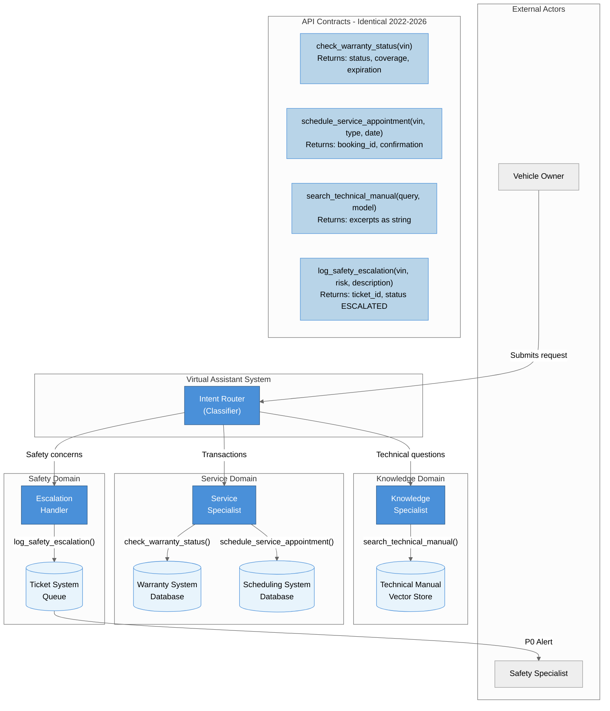

# Logical Layer: API Interface Specifications

**Layer Purpose:** This diagram shows the **API contracts** - the input/output specifications that remain stable regardless of how they're implemented. A Dialogflow webhook from 2022 and an ADK FunctionTool from 2026 share **identical function signatures**.

---

## Architecture Diagram



---

## Why Everything is Blue

**Color Key:** All elements use blue (`#4A90D9`) to visually communicate that this layer defines **stable interfaces** - the contracts that both 2022 and 2026 implementations must honor.

The blue color emphasizes: **"These are the API boundaries that don't change."**

---

## The Four Core Tool Interfaces

These are the exact function signatures used by both Dialogflow webhooks (2022) and ADK FunctionTools (2026):

### 1. check_warranty_status

```python
def check_warranty_status(vin: str) -> dict:
    """
    Check warranty coverage for a vehicle.

    Args:
        vin: Vehicle Identification Number (17 characters)

    Returns:
        {
            "status": "active" | "expired" | "unknown",
            "coverage": "basic" | "extended" | "powertrain",
            "expiration": "2025-06-15"
        }
    """
```

### 2. schedule_service_appointment

```python
def schedule_service_appointment(
    vin: str,
    service_type: str,
    preferred_date: str
) -> dict:
    """
    Book a service appointment at the dealership.

    Args:
        vin: Vehicle Identification Number
        service_type: "oil_change" | "tire_rotation" | "brake_inspection" | ...
        preferred_date: ISO 8601 date string

    Returns:
        {
            "booking_id": "SVC-2026-001234",
            "confirmation": "Appointment confirmed for 2026-02-15 at 9:00 AM"
        }
    """
```

### 3. search_technical_manual

```python
def search_technical_manual(
    query: str,
    model: str | None = None
) -> str:
    """
    Search vehicle documentation for answers.

    Args:
        query: Natural language question
        model: Optional vehicle model to filter results

    Returns:
        Relevant excerpts from technical documentation
    """
```

### 4. log_safety_escalation

```python
def log_safety_escalation(
    vin: str,
    risk_level: str,
    description: str
) -> dict:
    """
    Create a safety ticket for human review.

    Args:
        vin: Vehicle Identification Number
        risk_level: "critical" | "high" | "medium"
        description: User's safety concern in their words

    Returns:
        {
            "ticket_id": "SAFE-2026-000789",
            "status": "ESCALATED",
            "message": "A safety specialist will contact you within 24 hours."
        }
    """
```

---

## Interface Mapping: Dialogflow to ADK

The magic of stable interfaces is that the **implementation changes, but the contract remains identical**:

| Aspect | 2022 (Dialogflow) | 2026 (ADK) | Same Contract? |
|--------|-------------------|------------|----------------|
| Tool Definition | Fulfillment Webhook URL | `FunctionTool(fn)` decorator | **YES** |
| Request Handler | Intent Handler | `LlmAgent` | **YES** |
| State Access | Context Parameters | State Injection `{vin}` | **YES** |
| Response Format | Fulfillment Response JSON | Return dict | **YES** |

### Example: Same Interface, Different Binding

**2022 Dialogflow Webhook:**
```javascript
// Cloud Function handling Dialogflow fulfillment
exports.checkWarranty = (req, res) => {
  const vin = req.body.queryResult.parameters.vin;
  const result = warrantyService.check(vin);
  res.json({
    fulfillmentText: `Your warranty is ${result.status}`
  });
};
```

**2026 ADK FunctionTool:**
```python
# Python function with automatic schema generation
@tool
def check_warranty_status(vin: str) -> dict:
    result = warranty_service.check(vin)
    return {"status": result.status, "coverage": result.coverage}
```

**The interface is identical:** `(vin) -> status info`

---

## Domain Specialists

The logical layer divides responsibilities into three specialist domains:

| Domain | Specialist | Capabilities | Data Sources |
|--------|------------|--------------|--------------|
| **Knowledge** | Knowledge Agent | Answer technical questions | Technical Manual (vector store) |
| **Service** | Service Agent | Execute transactions | Warranty DB, Scheduling DB |
| **Safety** | Escalation Handler | Create human tickets | Ticket System (queue) |

Each specialist owns its domain's tools and data sources, creating clear **bounded contexts**.

---

## Why This Matters

### For Architects
The logical layer is your **migration guide**. When moving from Dialogflow to ADK:
1. Inventory your existing webhook signatures
2. Verify ADK FunctionTools can implement identical contracts
3. Backend systems remain untouched

### For Developers
The logical layer is your **integration contract**. Backend teams can work independently as long as they honor the interface specifications.

### For Business Stakeholders
The logical layer proves **implementation-agnostic value**. The same APIs that worked in 2022 will work in 2026 and beyond.

---

## Key Insight

> "Good interfaces are like electrical outlets - the plug specification stays the same even as power generation technology evolves."

The four tool interfaces (`check_warranty_status`, `schedule_service_appointment`, `search_technical_manual`, `log_safety_escalation`) are the "electrical outlets" of this system. The power source changed from Dialogflow to ADK, but the outlets work exactly the same.

---

## Navigation

- **Previous:** [01_conceptual_layer.md](./01_conceptual_layer.md) - User journey patterns
- **Next:** [03_physical_layer.md](./03_physical_layer.md) - Implementation comparison
- **Index:** [README.md](./README.md) - Overview of all layers
