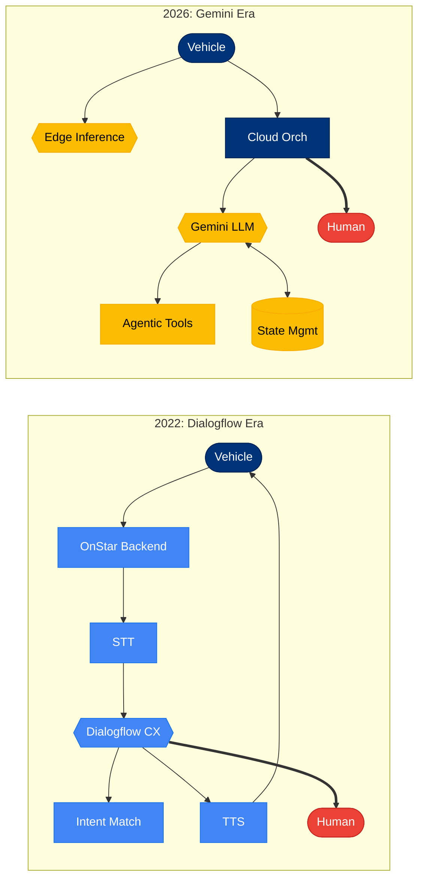

# Architecture Evolution Comparison

**Purpose**: Side-by-side comparison of 2022 Dialogflow and 2026 Gemini architectures
**Complexity**: 14 nodes total (7 per era), 13 edges
**View Type**: Comparative Analysis

## Overview

This diagram provides a direct visual comparison between the two architectural eras, highlighting the fundamental shift from intent-based processing to LLM-based agentic systems. The left side shows the linear, cloud-dependent 2022 architecture, while the right side demonstrates the more flexible, hybrid 2026 approach.

## Side-by-Side Comparison Diagram

## Legend

| Symbol | Meaning |
|--------|---------|
| Blue nodes | 2022 Dialogflow-era components |
| Yellow nodes | 2026 Gemini-era AI components |
| Dark blue nodes | Shared/infrastructure components |
| Red nodes | Human escalation (both eras) |
| `-->` | Standard data flow |
| `<-->` | Bidirectional flow (state read/write) |
| `==>` | Emergency escalation |

---

## Delta Summary Table

| Aspect | 2022 (Dialogflow) | 2026 (Gemini) | Change |
|--------|-------------------|---------------|--------|
| **Processing Location** | Cloud-only | Hybrid edge-cloud | Lower latency |
| **Language Understanding** | Intent-based | LLM-based | Natural language |
| **Context Handling** | Session params | Multi-turn memory | Richer conversations |
| **Tool Invocation** | Webhooks | Agentic tools | Dynamic orchestration |
| **Entity Count** | 10 | 12 | +20% complexity |
| **Relationship Count** | 8 | 10 | +25% complexity |

---

## Detailed Comparison

### Architecture Paradigm

| Characteristic | 2022 | 2026 |
|----------------|------|------|
| **Core Model** | Dialogflow CX (rule-based NLU) | Gemini LLM (generative AI) |
| **Processing Style** | Intent classification | Open-ended generation |
| **Conversation Flow** | Predefined state machine | Dynamic reasoning |
| **Fallback Handling** | Generic error messages | Graceful clarification |

### Data Flow Changes

| Stage | 2022 Flow | 2026 Flow |
|-------|-----------|-----------|
| **Input** | Voice -> STT -> Text | Voice -> STT -> Text (same) |
| **Understanding** | Intent matching against training phrases | LLM comprehension of any input |
| **Processing** | Webhook calls for data | Agentic tool selection and composition |
| **Context** | Session parameters (limited) | Vector-embedded state (persistent) |
| **Output** | Template-based responses | Generated natural language |

### Capability Matrix

| Capability | 2022 | 2026 |
|------------|------|------|
| Pre-defined commands | Yes | Yes |
| Novel phrasings | Limited | Yes |
| Multi-turn context | 3-5 turns | Unlimited |
| Entity extraction | Trained entities only | Zero-shot extraction |
| Offline basic commands | No | Yes |
| Personalization | Rule-based | Learning-based |
| Multilingual | Per-agent setup | Native multilingual |

### Infrastructure Changes

| Component | 2022 | 2026 |
|-----------|------|------|
| **Compute** | Cloud Functions | Vertex AI + Edge TPU |
| **State Storage** | Dialogflow session | Firestore + vectors |
| **API Integration** | Webhook handlers | ADK tools |
| **Monitoring** | Dialogflow analytics | Vertex AI Model Monitoring |

---

## Migration Path

The transition from 2022 to 2026 architecture followed these phases:

1. **Phase 1 (2023)**: Added Vertex AI for complex queries, Dialogflow remained primary
2. **Phase 2 (2024)**: Gemini integration for natural language understanding
3. **Phase 3 (2025)**: Edge inference rollout in new vehicle models
4. **Phase 4 (2026)**: Full hybrid architecture with agentic tools

## Notes

- Both architectures maintain human escalation as a safety requirement
- The 2026 architecture is backward compatible with 2022-era vehicles via cloud processing
- Edge processing requires Qualcomm Snapdragon 8 Gen 3 or later
- State management in 2026 enables cross-session learning (with user consent)
- The agentic tool system replaced 47 individual webhook integrations with a unified framework
