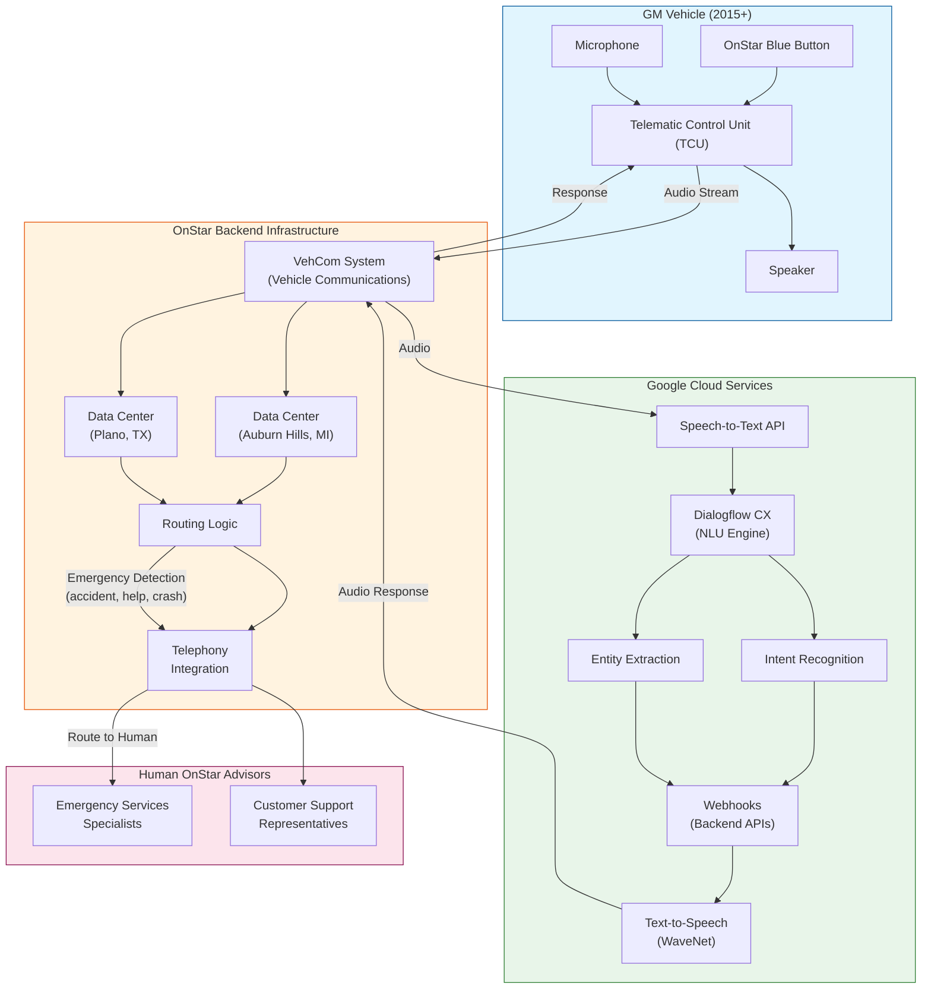
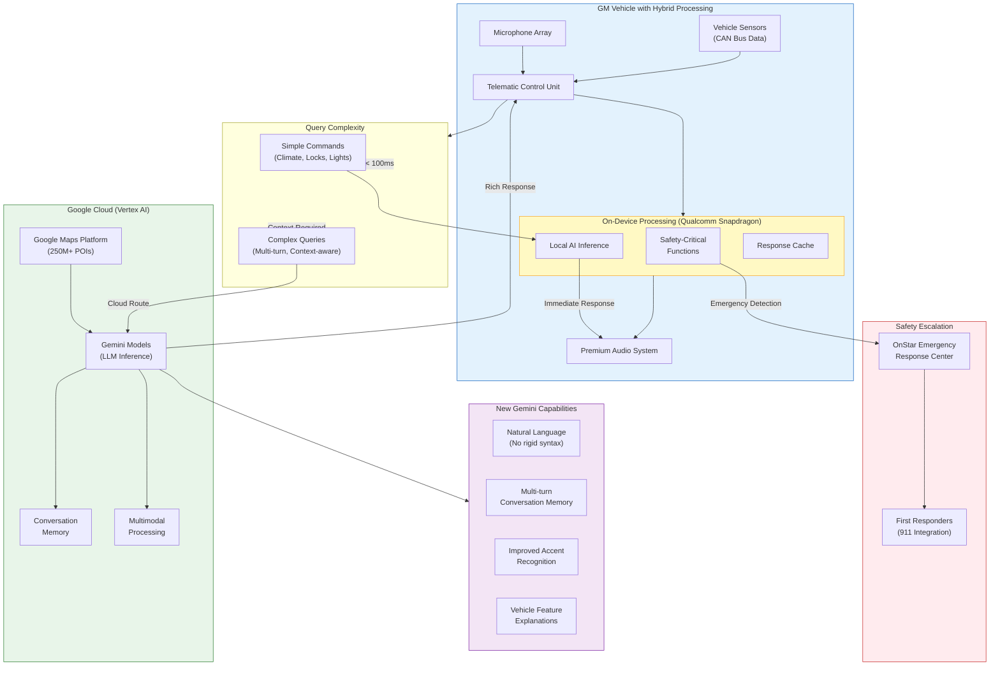
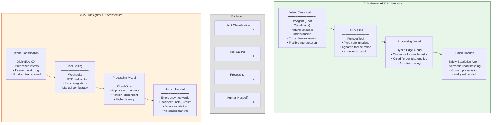
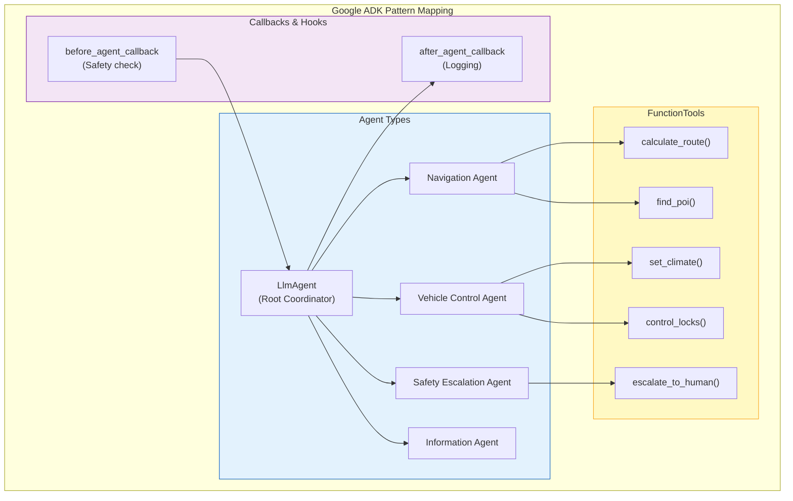

# GM OnStar Architecture Evolution: Dialogflow to Gemini

This document provides architectural diagrams illustrating the evolution of GM's OnStar conversational AI system from Dialogflow (2022) to Gemini (2026).

---

## Diagram 1: 2022 Dialogflow Architecture

This diagram shows the original OnStar Interactive Virtual Assistant architecture using Google Cloud Dialogflow. All AI processing occurs server-side, enabling backward compatibility with vehicles from 2015 onwards.

### Key Architectural Characteristics (2022)

| Aspect | Implementation |
|--------|----------------|
| **Processing Model** | 100% Cloud-based |
| **NLU Engine** | Dialogflow CX with predefined intents |
| **Voice Synthesis** | Google WaveNet for natural voice |
| **Intent Matching** | Keyword and phrase-based classification |
| **Human Escalation** | Emergency keyword detection triggers routing |
| **Vehicle Requirements** | No hardware upgrades needed (MY 2015+) |

---

## Diagram 2: 2026 Gemini Hybrid Architecture

This diagram shows the evolved architecture with Gemini AI, featuring hybrid edge-cloud processing. Simple commands are handled on-device for low latency, while complex queries leverage cloud-based Gemini models.

### Hybrid Processing Decision Matrix

| Query Type | Processing Location | Latency Target | Example |
|------------|---------------------|----------------|---------|
| Climate Control | Edge (On-device) | < 100ms | "Set temperature to 72" |
| Door Locks | Edge (On-device) | < 100ms | "Lock all doors" |
| Multi-turn Dialog | Cloud (Gemini) | < 2s | "Find a restaurant... Italian... with outdoor seating" |
| Feature Explanation | Cloud (Gemini) | < 2s | "How does one-pedal driving work?" |
| Navigation | Cloud (Maps + Gemini) | < 3s | "Navigate to the nearest charging station" |
| Emergency | Edge + Cloud | Immediate | "I've been in an accident" |

---

## Diagram 3: Side-by-Side Evolution Comparison

This diagram provides a direct comparison of the architectural components and their evolution from Dialogflow (2022) to Gemini ADK (2026).

### Detailed Component Comparison

| Component | Dialogflow CX (2022) | Gemini ADK (2026) | Key Improvement |
|-----------|---------------------|-------------------|-----------------|
| **Intent Classification** | Dialogflow CX | LlmAgent (Root Coordinator) | No rigid syntax; natural conversation |
| **NLU Model** | Intent-based matching | Gemini LLM | Contextual understanding, multi-turn memory |
| **Tool Calling** | Webhooks (HTTP) | FunctionTool | Type-safe, agent-orchestrated |
| **Processing Location** | Cloud-only | Hybrid edge-cloud | Reduced latency, offline capability |
| **Human Handoff** | Emergency keyword detection | Safety Escalation Agent | Semantic understanding with context |
| **Accent Handling** | Limited | Advanced | Improved recognition across dialects |
| **Conversation Memory** | Session-based | Persistent context | Cross-session continuity |
| **Vehicle Data Access** | Limited | Full CAN bus integration | Rich vehicle state awareness |

### ADK Pattern Mapping

---

## Summary

The evolution from Dialogflow to Gemini represents a fundamental shift in automotive conversational AI:

1. **From Intent-Based to LLM-Based**: Moving from rigid keyword matching to flexible natural language understanding
2. **From Cloud-Only to Hybrid**: Distributing processing between edge and cloud for optimal latency and capability
3. **From Webhooks to Agents**: Transitioning from static HTTP integrations to dynamic, orchestrated agent systems
4. **From Binary Escalation to Intelligent Handoff**: Enabling context-preserving transfers to human specialists

This architectural evolution enables GM to deliver a more natural, responsive, and capable in-vehicle assistant while maintaining backward compatibility with vehicles dating back to model year 2015.

---

*Diagrams created: January 2026*
*Based on research from GM and Google Cloud partnership announcements*
