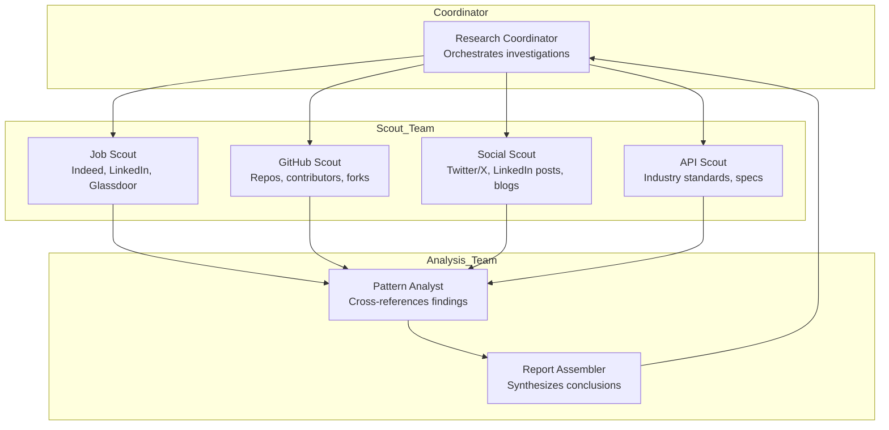

# Automotive ADK Provenance Research Team

## Research Objective

Identify the likely origin and contributors to the automotive multi-agent ADK example by triangulating signals across multiple data sources: job postings, API standards, GitHub repositories, social media, and industry publications.

## Research Questions

1. **Primary Attribution**: Did this scenario originate from Google (ADK team), an automotive OEM (GM, Ford, Toyota, Stellantis), a consulting firm (Accenture, Deloitte), or a technology partner?
2. **API Provenance**: Which existing automotive APIs (OnStar, SmartDeviceLink, W3C Vehicle Information) influenced the warranty and service tool designs?
3. **Industry Alignment**: What automotive technology consortiums or standards bodies may have contributed domain expertise?
4. **Timeline**: When did similar automotive agent concepts first appear in public discussions?

---

## Research Team Architecture



---

## Agent Specifications

### 1. Research Coordinator

**Role**: Orchestrates the research workflow, assigns tasks to scouts, and synthesizes findings.

**Capabilities**:
- Breaks down research questions into actionable scout tasks
- Manages research timeline and dependencies
- Identifies gaps requiring additional investigation
- Produces final provenance report

**Tools Required**:
- Task delegation (to scout agents)
- Graphiti memory (for storing findings)
- Report generation

---

### 2. Job Scout Agent

**Role**: Searches job posting platforms for positions mentioning ADK, automotive agents, or related technologies.

**Search Targets**:
- Indeed: "Google ADK" + automotive
- LinkedIn: Agent Development Kit + vehicle
- Glassdoor: Automotive AI agent engineer
- Google Careers: ADK-related positions

**Signal Detection**:
| Signal | Indicates |
|--------|-----------|
| "Experience with OnStar API" | GM involvement |
| "SmartDeviceLink integration" | Ford/Toyota involvement |
| "Vertex AI Agent Engine" | Google-first design |
| "Automotive OEM partnerships" | Consulting firm origin |

**Output**: List of companies actively hiring for automotive agent roles with technology stack details.

---

### 3. GitHub Scout Agent

**Role**: Searches GitHub for repositories with similar patterns, contributors, and code signatures.

**Search Queries**:
- `"google.adk" automotive`
- `"LlmAgent" warranty VIN`
- `"AgentTool" vehicle service`
- `automotive "multi-agent" gemini`

**Analysis Tasks**:
- Identify repositories with similar architectural patterns
- Map contributor affiliations (Google, OEMs, consultancies)
- Track fork/star patterns for influence mapping
- Search for commit messages referencing automotive use cases

**Output**: Repository list with contributor analysis and pattern matches.

---

### 4. Social Scout Agent

**Role**: Monitors social media and blogs for discussions about automotive ADK implementations.

**Platforms**:
- Twitter/X: @GoogleDeepMind, @GoogleCloud, automotive tech accounts
- LinkedIn: Google ADK announcements, automotive AI posts
- Medium/Dev.to: Technical blog posts about vehicle agents
- YouTube: Google Cloud Next sessions, automotive AI demos

**Search Terms**:
- "automotive agent" + Google
- "vehicle support" + ADK
- "warranty chatbot" + Gemini
- "GM OnStar" + AI agent

**Output**: Timeline of public discussions with attribution and sentiment.

---

### 5. API Scout Agent

**Role**: Researches automotive industry APIs and standards that may have influenced the design.

**Standards to Investigate**:

| Standard | Description | Relevance Check |
|----------|-------------|-----------------|
| **OnStar API** | GM's connected vehicle platform | VIN lookup, warranty check patterns |
| **SmartDeviceLink (SDL)** | Open automotive middleware | Multi-vendor interop, Ford/Toyota |
| **W3C Vehicle Information** | Web standard for vehicle data | Schema influence on tool definitions |
| **COVESA/GENIVI** | Automotive open source consortium | Industry-wide API patterns |
| **Tesla Fleet API** | EV-specific telematics | Modern API design patterns |

**Analysis Tasks**:
- Compare tool schemas to published API specs
- Identify terminology matches (VIN format, service codes)
- Map warranty status fields to industry standards

**Output**: API comparison matrix showing influence probability.

---

### 6. Pattern Analyst Agent

**Role**: Cross-references findings from all scouts to identify patterns and correlations.

**Analysis Methods**:
- **Entity Resolution**: Link mentions across sources (same company, different contexts)
- **Timeline Reconstruction**: When did concepts first appear?
- **Influence Mapping**: Which organizations appear most frequently?
- **Confidence Scoring**: Rate attribution hypotheses

**Output**: Ranked list of likely contributors with evidence chains.

---

### 7. Report Assembler Agent

**Role**: Synthesizes all findings into a structured provenance report.

**Report Sections**:
1. Executive Summary (1 paragraph)
2. Key Findings (bullet points)
3. Attribution Analysis (ranked hypotheses)
4. Evidence Table (source-by-source findings)
5. Confidence Assessment
6. Recommendations for Further Research

---

## Execution Workflow

### Phase 1: Initial Scout Deployment (Parallel)

```
┌─────────────┬─────────────┬─────────────┬─────────────┐
│  Job Scout  │GitHub Scout │Social Scout │  API Scout  │
│   (15 min)  │   (20 min)  │   (15 min)  │   (20 min)  │
└─────────────┴─────────────┴─────────────┴─────────────┘
```

All scouts run in parallel to gather initial signals.

### Phase 2: Pattern Analysis (Sequential)

Pattern Analyst receives all scout outputs and identifies:
- Companies appearing in 3+ sources
- Technical patterns matching the automotive example
- Timeline of concept emergence

### Phase 3: Gap Filling (Targeted)

Coordinator identifies gaps and assigns follow-up tasks:
- "GitHub Scout: Search for specific contributor X"
- "Social Scout: Find Google Cloud Next 2024 automotive sessions"

### Phase 4: Report Assembly

Report Assembler produces final document with:
- Primary attribution hypothesis
- Supporting evidence
- Confidence level (High/Medium/Low)

---

## Data Storage (Graphiti)

All findings should be stored in Graphiti for future reference:

**Group ID**: `automotive-adk-provenance-2026`

**Episode Types**:
- `job_posting`: Parsed job listing with company, skills, dates
- `github_repo`: Repository analysis with contributors, patterns
- `social_mention`: Social media post with author, date, sentiment
- `api_analysis`: API comparison finding

**Entity Types**:
- `Company`: Google, GM, Ford, Accenture, etc.
- `Person`: Contributors, authors, speakers
- `Technology`: OnStar API, ADK, SmartDeviceLink
- `Standard`: W3C Vehicle Info, COVESA specs

---

## Initial Search Queries

### Job Scout Starting Queries
```
site:indeed.com "Google ADK" automotive
site:linkedin.com/jobs "Agent Development Kit" vehicle
site:careers.google.com ADK agent automotive
```

### GitHub Scout Starting Queries
```
"google.adk" language:python automotive
"LlmAgent" "warranty" OR "VIN" OR "service"
automotive agent gemini vertex
```

### Social Scout Starting Queries
```
"automotive ADK" OR "vehicle agent" site:twitter.com
"Google Agent Development Kit" automotive site:linkedin.com
"multi-agent automotive" Google Cloud
```

### API Scout Starting Targets
```
https://developer.gm.com/
https://smartdevicelink.com/docs/
https://www.w3.org/TR/vehicle-information-api/
https://covesa.global/
```

---

## Success Criteria

The research is complete when we can answer:

1. **Who**: Most likely organization(s) that created/influenced this example
2. **When**: Timeline of when similar concepts appeared
3. **Why**: Business motivation (marketing, partnership, internal training)
4. **Confidence**: How certain are we in the attribution (with evidence)

---

## Next Steps

1. [ ] Instantiate scout agents with search tools
2. [ ] Execute Phase 1 parallel search
3. [ ] Store findings in Graphiti (`automotive-adk-provenance-2026`)
4. [ ] Run pattern analysis
5. [ ] Generate provenance report
