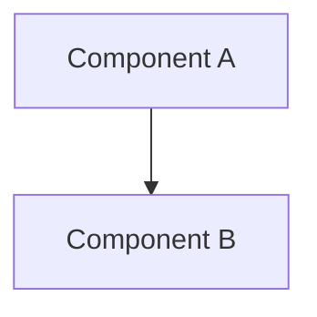

# RFC-NNN: [Feature Name]

## Overview

1-2 paragraphs summarizing what this RFC proposes.

## Background

Why is this needed? What problem does it solve? Include relevant context and links to prior art.

## Goals

- [ ] Goal 1: What this RFC WILL accomplish
- [ ] Goal 2: Another objective

## Non-Goals

- Non-goal 1: What this RFC will NOT address (and why)
- Non-goal 2: Explicitly out of scope

## Proposed Solution

### Architecture

Detailed technical description. Include diagrams where helpful.

### API Design

If applicable, show interfaces, data structures, or contracts.

### Implementation Details

Step-by-step approach or phased rollout plan.

## Alternatives Considered

### Alternative 1: [Name]
- **Description**: What is this approach?
- **Pros**: Benefits
- **Cons**: Drawbacks
- **Why not chosen**: Reasoning

### Alternative 2: [Name]
- **Description**: ...

## Security Considerations

Any security implications of this design.

## Open Questions

1. Question that needs discussion before implementation
2. Another unresolved issue

## Implementation Plan

| Phase | Milestone | Dependencies |
|-------|-----------|--------------|
| 1 | ... | ... |
| 2 | ... | Phase 1 |

## Success Metrics

How will we know this was successful?

## Appendix

Supporting data, benchmarks, or extended examples.
