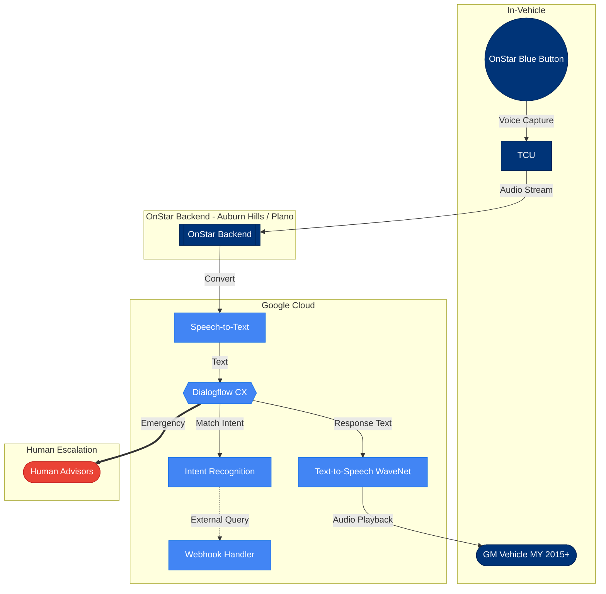

# 2022 Dialogflow Architecture

**Purpose**: Depicts the GM-OnStar voice assistant architecture using Google Dialogflow CX (2022 era)
**Complexity**: 10 nodes, 9 edges
**View Type**: Logical Architecture

## Overview

This diagram illustrates the cloud-centric architecture that powered GM's OnStar voice services from approximately 2017-2024. The system relied on Google's Dialogflow CX for natural language understanding, with intent-based recognition as the core paradigm. All processing occurred in the cloud, with human advisors available for emergency escalation.

## Diagram

## Legend

| Symbol | Meaning |
|--------|---------|
| Blue nodes | Google Cloud services |
| Dark blue nodes | GM/OnStar components |
| Red node | Human escalation path |
| `-->` | Standard data flow |
| `-.->` | Optional/conditional flow |
| `==>` | Emergency escalation |

## Key Components

| Component | Role | Technology |
|-----------|------|------------|
| **Blue Button** | Physical trigger for voice interaction | Hardware in vehicle |
| **TCU** | Telematics Control Unit - handles cellular connectivity | Embedded system |
| **OnStar Backend** | GM's service orchestration layer | Data centers in Auburn Hills, MI and Plano, TX |
| **Dialogflow CX** | Natural language understanding and conversation management | Google Cloud |
| **Webhook Handler** | Integration with external services (navigation, reservations) | Cloud Functions |

## Notes

- All voice processing required cloud connectivity - no offline capability
- Intent recognition limited to pre-defined training phrases
- Average round-trip latency: 800ms-1200ms
- Human escalation triggered by keywords like "emergency" or "help"
- System handled approximately 1 million monthly voice interactions across GM fleet
