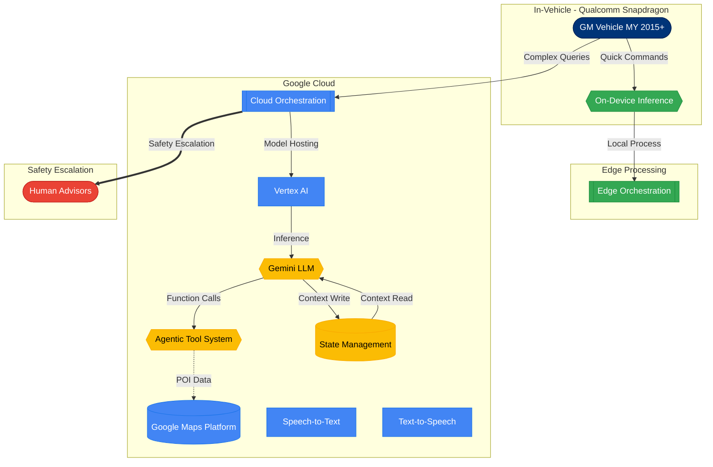
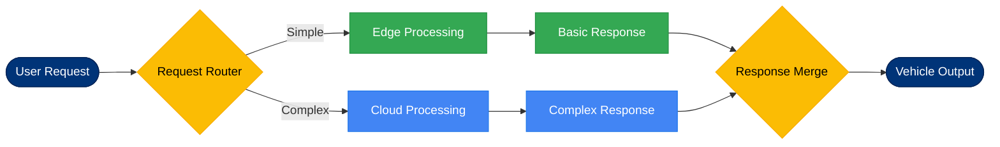

# 2026 Gemini Architecture

**Purpose**: Depicts the next-generation GM-Google voice assistant architecture using Gemini LLM (2026 era)
**Complexity**: 12 nodes (high-level), 8 nodes (routing)
**View Type**: Logical Architecture

## Overview

This document contains two complementary diagrams showing the modernized architecture. The 2026 system introduces a hybrid edge-cloud approach with Gemini LLM at its core, enabling natural language understanding, agentic tool orchestration, and persistent state management. On-device inference handles simple commands for reduced latency, while complex queries leverage cloud-based Gemini capabilities.

---

## Diagram 1: High-Level Hybrid Architecture

This diagram shows the complete system architecture with edge processing, cloud services, and the agentic tool system.

### Legend - High-Level Architecture

| Symbol | Meaning |
|--------|---------|
| Blue nodes | Google Cloud infrastructure services |
| Dark blue nodes | GM vehicle components |
| Green nodes | Edge processing layer |
| Yellow nodes | AI/LLM components |
| Red node | Safety escalation path |
| `-->` | Standard data flow |
| `-.->` | API call flow |
| `==>` | Emergency escalation |

---

## Diagram 2: Request Routing Flow

This diagram shows how requests are intelligently routed between edge and cloud processing based on complexity.

### Legend - Request Routing

| Symbol | Meaning |
|--------|---------|
| Yellow diamonds | Decision/routing nodes |
| Green rectangles | Edge processing path |
| Blue rectangles | Cloud processing path |
| Dark blue stadiums | Endpoints (user/vehicle) |

---

## Key Components

| Component | Role | Technology |
|-----------|------|------------|
| **On-Device Inference** | Handles simple commands locally | Qualcomm Snapdragon with Gemini Nano |
| **Edge Orchestration** | Manages local processing decisions | Kubernetes on edge infrastructure |
| **Cloud Orchestration** | Routes complex queries to appropriate services | Google Cloud Run |
| **Vertex AI** | Model hosting and inference | Google Vertex AI Platform |
| **Gemini LLM** | Natural language understanding and generation | Gemini 1.5 Pro/Flash |
| **Agentic Tool System** | Dynamic function calling for external services | Google ADK (Agent Development Kit) |
| **State Management** | Persistent conversation context | Firestore with vector embeddings |
| **Maps Platform** | POI search, routing, real-time traffic | Google Maps Platform APIs |

## Routing Decision Criteria

| Query Type | Route | Example |
|------------|-------|---------|
| Simple commands | Edge | "Turn on headlights" |
| Volume/climate control | Edge | "Set temperature to 72" |
| POI search | Cloud | "Find nearest coffee shop" |
| Multi-turn conversation | Cloud | "What about ones with drive-through?" |
| Emergency | Cloud + Human | "I need help, there's been an accident" |

## Performance Improvements

| Metric | 2022 (Dialogflow) | 2026 (Gemini) | Improvement |
|--------|-------------------|---------------|-------------|
| Simple command latency | 800ms | 150ms | 5.3x faster |
| Complex query latency | 1200ms | 600ms | 2x faster |
| Conversation depth | 3 turns | Unlimited | N/A |
| Offline capability | None | Basic commands | New feature |

## Notes

- Hybrid architecture reduces cloud dependency for common operations
- Gemini's context window enables true multi-turn conversations without losing context
- Agentic tools allow dynamic composition of responses from multiple data sources
- State management enables personalization ("You usually prefer drive-through coffee shops")
- Safety escalation now includes automatic crash detection via vehicle sensors
