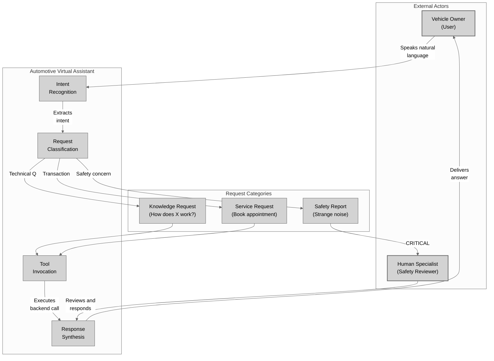

# Conceptual Layer: Automotive Virtual Assistant (Era-Independent)

**Layer Purpose:** This diagram shows the highest level of abstraction - the user journey and system behavior patterns that are **100% identical** between 2022 Dialogflow and 2026 ADK implementations.

---

## Architecture Diagram



---

## What This Diagram Shows

This conceptual model represents the **timeless patterns** that exist in ANY automotive virtual assistant, regardless of implementation technology.

### Why Everything is Gray

**Color Key:** All elements use gray (`#D3D3D3`) to visually communicate that this layer is **completely stable** - it looks exactly the same whether you're examining a 2022 Dialogflow implementation or a 2026 ADK agent.

The gray color emphasizes: **"This is the foundation that does not change."**

---

## Stable Patterns (Present in 2022 AND 2026)

| Pattern | Description | Why It's Timeless |
|---------|-------------|-------------------|
| **Intent Recognition** | User speaks naturally; system extracts meaning | Users always speak in natural language |
| **Request Classification** | Three categories: knowledge, service, safety | These cover all automotive customer needs |
| **Tool Invocation** | System calls backend APIs to fulfill requests | Backend systems exist independently of the assistant |
| **Response Synthesis** | System generates human-readable output | Users always need understandable answers |
| **Safety Escalation** | Critical concerns always reach a human | Regulatory and liability requirements don't change |

---

## The Three Request Categories

### 1. Knowledge Requests
> "How do I reset the tire pressure monitoring system?"

- User wants information
- System searches documentation
- No transaction occurs

### 2. Service Requests
> "Schedule an oil change for next Tuesday"

- User wants action taken
- System executes business transaction
- State changes in backend systems

### 3. Safety Reports
> "I hear a grinding noise when braking"

- User reports potential hazard
- System ALWAYS escalates to human
- Never automated (liability protection)

---

## Why This Matters for Developers

A developer who designed a Dialogflow bot in 2022 would recognize this exact flow in an ADK agent in 2026:

```
User speaks → System understands → System classifies →
System acts (or escalates) → System responds
```

**The technology changes; the user experience does not.**

This is the power of conceptual architecture: it captures WHAT the system does, independent of HOW it does it.

---

## Key Insight

When evaluating any new conversational AI framework, ask:

1. Does it support natural language understanding? (Intent Recognition)
2. Can it route to different handlers? (Request Classification)
3. Can it call external APIs? (Tool Invocation)
4. Can it generate natural responses? (Response Synthesis)
5. Can it escalate to humans? (Safety Escalation)

If yes to all five, the framework can implement this conceptual model. The only remaining questions are about the **Logical** and **Physical** layers.

---

## Navigation

- **Next:** [02_logical_layer.md](./02_logical_layer.md) - API interface specifications
- **Index:** [README.md](./README.md) - Overview of all layers
