# Physical Layer: 2022 Dialogflow vs 2026 ADK

**Layer Purpose:** This diagram shows what **actually changed** between implementations. This is the ONLY layer with significant differences - and it's where the ADK provides new capabilities that justify the migration.

---

## Side-by-Side Architecture Comparison

```mermaid
%%{init: {'theme': 'neutral'}}%%
flowchart LR
    subgraph Dialogflow2022["2022: Dialogflow CX"]
        DF_Intent["Intent Detection<br/>(Rule-based + ML)"]
        DF_Webhook["Fulfillment Webhooks<br/>(Cloud Functions)"]
        DF_Context["Context Parameters<br/>(Session variables)"]
        DF_Response["Response Generation<br/>(Template-based)"]
        DF_Deploy["Deployment<br/>(Cloud-only)"]

        DF_Intent --> DF_Webhook
        DF_Webhook --> DF_Context
        DF_Context --> DF_Response
        DF_Response --> DF_Deploy
    end

    subgraph ADK2026["2026: Google ADK"]
        ADK_Router["LlmAgent Routing<br/>(LLM-based classification)"]
        ADK_Tools["FunctionTool Wrappers<br/>(Auto schema generation)"]
        ADK_State["State Injection<br/>(Dynamic binding)"]
        ADK_AgentTool["AgentTool Composition<br/>(Agents as tools)"]
        ADK_Models["Model Selection<br/>(Flash vs Pro)"]
        ADK_Retry["HttpRetryOptions<br/>(Resilience layer)"]
        ADK_Server["AdkWebServer<br/>(Edge + Cloud)"]

        ADK_Router --> ADK_Tools
        ADK_Tools --> ADK_State
        ADK_State --> ADK_AgentTool
        ADK_AgentTool --> ADK_Models
        ADK_Models --> ADK_Retry
        ADK_Retry --> ADK_Server
    end

    %% Evolution arrows between eras
    DF_Intent -.->|"Enhanced by"| ADK_Router
    DF_Webhook -.->|"Replaced by"| ADK_Tools
    DF_Context -.->|"Evolved to"| ADK_State
    DF_Deploy -.->|"Expanded to"| ADK_Server

    %% 2022 Components - ORANGE (being replaced)
    style DF_Intent fill:#FFA500,stroke:#CC8400,color:#000
    style DF_Webhook fill:#FFA500,stroke:#CC8400,color:#000
    style DF_Context fill:#FFA500,stroke:#CC8400,color:#000
    style DF_Response fill:#FFA500,stroke:#CC8400,color:#000
    style DF_Deploy fill:#FFA500,stroke:#CC8400,color:#000

    %% 2026 Components - GREEN (new capabilities)
    style ADK_Router fill:#90EE90,stroke:#228B22,color:#000
    style ADK_Tools fill:#90EE90,stroke:#228B22,color:#000
    style ADK_State fill:#90EE90,stroke:#228B22,color:#000
    style ADK_AgentTool fill:#90EE90,stroke:#228B22,color:#000
    style ADK_Models fill:#90EE90,stroke:#228B22,color:#000
    style ADK_Retry fill:#90EE90,stroke:#228B22,color:#000
    style ADK_Server fill:#90EE90,stroke:#228B22,color:#000
```



---

## Color Key for This Diagram

| Color | Hex Code | Meaning |
|-------|----------|---------|
| **Orange** | `#FFA500` | 2022 Dialogflow components (being replaced/modified) |
| **Green** | `#90EE90` | 2026 ADK components (new capabilities) |
| **Dotted arrows** | `-.->` | Evolution path showing how concepts transformed |

---

## Detailed Component Evolution

### What Changed and Why

| Aspect | 2022 Dialogflow | 2026 ADK | Change Type | Business Value |
|--------|-----------------|----------|-------------|----------------|
| **Routing** | Intent detection (rules + ML) | LlmAgent (LLM-based) | ENHANCED | More natural conversations, fewer intents to maintain |
| **Tool Binding** | Webhook URL configuration | `FunctionTool(fn)` auto-schema | SIMPLIFIED | Developer velocity, type safety |
| **State Management** | Context parameters (manual) | State injection `{vin}` | STREAMLINED | Cleaner code, less boilerplate |
| **Agent Composition** | N/A (flat architecture) | `AgentTool(agent=specialist)` | NEW | Specialist agents for different domains |
| **Model Selection** | Single model per bot | Flash (speed) vs Pro (quality) | NEW | Cost optimization per task complexity |
| **Resilience** | Platform-managed | `HttpRetryOptions` (configurable) | NEW | Fine-grained control over retries |
| **Deployment** | Cloud-only (Dialogflow service) | Edge + Cloud (`AdkWebServer`) | EXPANDED | Lower latency, offline capability |

---

## Deep Dive: Component Transformations

### 1. Routing: Rule-Based to LLM-Based

**2022 Dialogflow:**
```yaml
# Intent definition in Dialogflow console
intents:
  - name: "check-warranty"
    training_phrases:
      - "What's my warranty status?"
      - "Is my car still under warranty?"
      - "Check warranty for my vehicle"
    # Requires many training phrases to cover variations
```

**2026 ADK:**
```python
# LlmAgent understands intent from instruction
router = LlmAgent(
    name="router",
    model="gemini-2.0-flash",
    instruction="""
    Route to knowledge_specialist for technical questions.
    Route to service_specialist for transactions.
    Route to safety_handler for safety concerns.
    """,
    sub_agents=[knowledge_specialist, service_specialist, safety_handler]
)
# LLM generalizes from instruction - no training phrases needed
```

**Value Added:** Fewer intents to maintain, handles novel phrasings automatically.

---

### 2. Tool Binding: Webhooks to FunctionTools

**2022 Dialogflow:**
```javascript
// Webhook configured in Dialogflow console
// Cloud Function URL: https://us-central1-project.cloudfunctions.net/checkWarranty
// Parameter mapping done manually in console
exports.checkWarranty = functions.https.onRequest((req, res) => {
    const vin = req.body.queryResult.parameters.vin;
    // ... implementation
});
```

**2026 ADK:**
```python
# Automatic schema generation from type hints
@tool
def check_warranty_status(vin: str) -> dict:
    """Check warranty coverage for a vehicle.

    Args:
        vin: Vehicle Identification Number (17 characters)
    """
    return warranty_service.check(vin)

# FunctionTool wraps it automatically
warranty_tool = FunctionTool(check_warranty_status)
```

**Value Added:** Type safety, automatic documentation, IDE autocompletion.

---

### 3. State Management: Context to Injection

**2022 Dialogflow:**
```javascript
// Manually passing context between turns
const outputContexts = [{
    name: `${session}/contexts/vehicle-context`,
    lifespanCount: 5,
    parameters: { vin: extractedVin }
}];
res.json({ fulfillmentText: response, outputContexts });

// Later turns must extract from context
const vin = req.body.queryResult.outputContexts
    .find(c => c.name.includes('vehicle-context'))
    ?.parameters?.vin;
```

**2026 ADK:**
```python
# State injection with template syntax
service_agent = LlmAgent(
    instruction="Help with service for vehicle {vin}",
    tools=[warranty_tool, booking_tool]
)

# State automatically injected from session
runner.run(user_id="user123", state={"vin": "1HGBH41JXMN109186"})
```

**Value Added:** Cleaner code, automatic propagation, less error-prone.

---

### 4. Agent Composition: NEW in 2026

**2022 Dialogflow:**
```
// Flat architecture - single bot handles everything
// No concept of sub-agents or delegation
Bot → Intent → Webhook → Response
```

**2026 ADK:**
```python
# Hierarchical agent composition
knowledge_specialist = LlmAgent(name="knowledge", tools=[manual_search])
service_specialist = LlmAgent(name="service", tools=[warranty_tool, booking_tool])
safety_handler = LlmAgent(name="safety", tools=[escalation_tool])

# Router delegates to specialists
router = LlmAgent(
    sub_agents=[knowledge_specialist, service_specialist, safety_handler]
)

# Or use AgentTool for on-demand delegation
expert_tool = AgentTool(agent=knowledge_specialist)
```

**Value Added:** Separation of concerns, specialized prompts per domain, easier testing.

---

### 5. Model Selection: NEW in 2026

**2022 Dialogflow:**
```
// Single model embedded in platform
// No control over model choice
// Cost is per-request at platform rate
```

**2026 ADK:**
```python
# Different models for different tasks
router = LlmAgent(
    model="gemini-2.0-flash",  # Fast, cheap for routing
    sub_agents=[...]
)

knowledge_specialist = LlmAgent(
    model="gemini-2.0-pro",  # Quality for complex answers
    tools=[manual_search]
)

# Cost optimization: Flash for simple, Pro for complex
```

**Value Added:** 10x cost reduction for simple tasks, quality where it matters.

---

### 6. Deployment: Cloud-Only to Edge+Cloud

**2022 Dialogflow:**
```
// Deployment is invisible - managed by Google
// Always requires internet connection
// Latency depends on Google Cloud regions
```

**2026 ADK:**
```python
# Multiple deployment options
from adk.web import AdkWebServer

# Option 1: Cloud deployment
server = AdkWebServer(agent=router)
server.run(host="0.0.0.0", port=8080)

# Option 2: Edge deployment (in-vehicle)
# Same code, different runtime
# Enables offline operation, lower latency
```

**Value Added:** In-vehicle deployment, offline capability, sub-100ms latency.

---

## What Stayed The Same

Even at the physical layer, core elements remain unchanged:

| Element | 2022 | 2026 | Status |
|---------|------|------|--------|
| Backend Warranty API | REST endpoint | REST endpoint | UNCHANGED |
| Backend Booking API | REST endpoint | REST endpoint | UNCHANGED |
| VIN Format | 17-character string | 17-character string | UNCHANGED |
| Date Format | ISO 8601 | ISO 8601 | UNCHANGED |
| Safety Escalation Rule | Always to human | Always to human | UNCHANGED |

**The backends don't know or care** which conversational AI framework is calling them.

---

## Key Insight

> If you drew the Conceptual and Logical diagrams for both eras, they would be **virtually identical**. Only this Physical diagram shows meaningful differences.

This demonstrates the value of **layered architecture thinking**:
- **Conceptual layer** = User experience (timeless)
- **Logical layer** = API contracts (stable)
- **Physical layer** = Implementation details (evolvable)

Stable abstractions protect against implementation churn. The ADK migration required zero changes to backend systems and zero changes to user experience - only the middle layer (the conversational AI framework) was replaced.

---

## Migration Decision Matrix

Use this to evaluate whether ADK migration is worthwhile for your use case:

| If You Need... | Dialogflow 2022 | ADK 2026 | Recommendation |
|----------------|-----------------|----------|----------------|
| Simple FAQ bot | Sufficient | Overkill | Stay with Dialogflow |
| Multi-turn transactions | Works | Better | Consider ADK |
| Multi-domain specialist routing | Hacky | Native | Migrate to ADK |
| Model cost optimization | Not possible | Native | Migrate to ADK |
| Edge/offline deployment | Not possible | Native | Migrate to ADK |
| Custom retry/resilience | Platform-managed | Configurable | Migrate to ADK |

---

## Navigation

- **Previous:** [02_logical_layer.md](./02_logical_layer.md) - API interface specifications
- **Index:** [README.md](./README.md) - Overview of all layers
