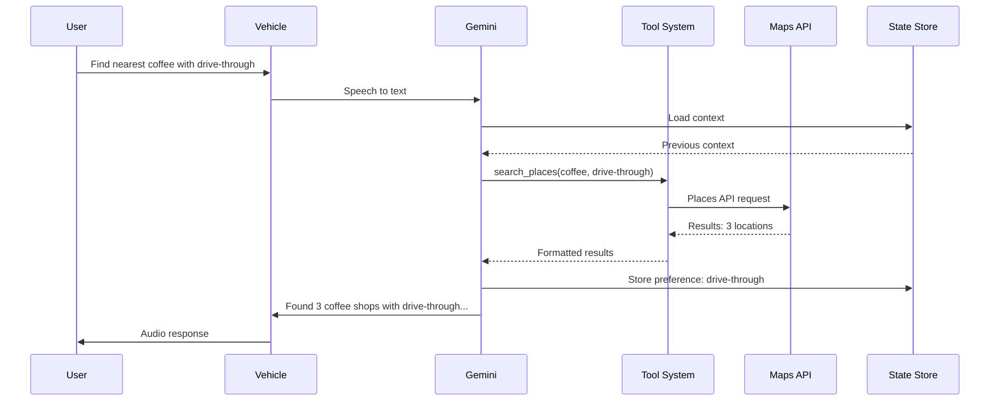

# Agentic Tool Flow Sequence

**Purpose**: Detailed sequence diagram showing how the agentic tool system processes a user query
**Complexity**: 6 participants, 11 messages
**View Type**: Behavioral/Sequence

## Overview

This sequence diagram illustrates the step-by-step flow of a typical agentic query in the 2026 Gemini architecture. The example shows a user requesting to find a nearby coffee shop with drive-through, demonstrating how Gemini orchestrates tool calls, retrieves data from external APIs, and maintains conversational state for future personalization.

## Sequence Diagram



## Legend

| Arrow Type | Meaning |
|------------|---------|
| `->>` | Synchronous request |
| `-->>` | Asynchronous response |

| Participant | Role |
|-------------|------|
| **User** | Human driver/passenger initiating request |
| **Vehicle** | In-vehicle systems (microphone, speakers, STT/TTS) |
| **Gemini** | Gemini LLM for understanding and generation |
| **Tool System** | Google ADK orchestrating function calls |
| **Maps API** | Google Maps Platform services |
| **State Store** | Firestore-based conversation memory |

---

## Detailed Step Breakdown

| Step | From | To | Description |
|------|------|----|-------------|
| 1 | User | Vehicle | User speaks: "Find nearest coffee shop with drive-through" |
| 2 | Vehicle | Gemini | Audio converted to text via Speech-to-Text |
| 3 | Gemini | State Store | Request previous conversation context |
| 4 | State Store | Gemini | Return context (may be empty for new session) |
| 5 | Gemini | Tool System | LLM decides to call `search_places` tool |
| 6 | Tool System | Maps API | Execute Places API search with parameters |
| 7 | Maps API | Tool System | Return structured results (3 locations) |
| 8 | Tool System | Gemini | Format results for LLM consumption |
| 9 | Gemini | State Store | Store learned preference (drive-through) |
| 10 | Gemini | Vehicle | Generate natural language response |
| 11 | Vehicle | User | Convert text to speech and play audio |

---

## Tool Call Details

### Function Signature

```python
def search_places(
    query: str,
    features: list[str] = None,
    location: tuple[float, float] = None,  # Uses vehicle GPS if None
    radius_meters: int = 5000,
    max_results: int = 5
) -> list[Place]:
    """
    Search for places using Google Maps Places API.

    Args:
        query: Search term (e.g., "coffee shop", "gas station")
        features: Desired features (e.g., ["drive-through", "24-hour"])
        location: Lat/lng tuple, defaults to current vehicle location
        radius_meters: Search radius
        max_results: Maximum results to return

    Returns:
        List of Place objects with name, address, distance, rating
    """
```

### Example Tool Call (Step 5)

```json
{
  "tool": "search_places",
  "parameters": {
    "query": "coffee shop",
    "features": ["drive-through"],
    "location": null,
    "radius_meters": 5000,
    "max_results": 3
  }
}
```

### Example API Response (Step 7)

```json
{
  "results": [
    {
      "name": "Starbucks",
      "address": "123 Main St",
      "distance_meters": 800,
      "rating": 4.2,
      "features": ["drive-through", "wifi"]
    },
    {
      "name": "Dunkin'",
      "address": "456 Oak Ave",
      "distance_meters": 1200,
      "rating": 4.0,
      "features": ["drive-through", "24-hour"]
    },
    {
      "name": "Dutch Bros",
      "address": "789 Pine Rd",
      "distance_meters": 2100,
      "rating": 4.5,
      "features": ["drive-through"]
    }
  ]
}
```

---

## State Management

### Context Storage (Step 9)

When Gemini stores the preference, it updates the user's profile:

```json
{
  "user_id": "user_abc123",
  "session_id": "sess_xyz789",
  "preferences": {
    "coffee": {
      "feature_preferences": ["drive-through"],
      "last_updated": "2026-01-24T10:30:00Z",
      "confidence": 0.8
    }
  },
  "conversation_history": [
    {
      "turn": 1,
      "user": "Find nearest coffee with drive-through",
      "assistant": "I found 3 coffee shops with drive-through...",
      "tools_used": ["search_places"],
      "timestamp": "2026-01-24T10:30:00Z"
    }
  ]
}
```

### Future Query Optimization

On subsequent queries like "Find me coffee," Gemini can automatically include the drive-through preference:

```
User: "Find me coffee"
Gemini (internal reasoning): "User previously preferred drive-through. Including in search."
Tool call: search_places(query="coffee", features=["drive-through"])
```

---

## Timing Analysis

| Step | Typical Latency | Notes |
|------|-----------------|-------|
| 1-2 | 150ms | Speech capture and STT |
| 3-4 | 20ms | State store read (cached) |
| 5 | 100ms | LLM tool selection |
| 6-8 | 200ms | Maps API round-trip |
| 9 | 30ms | State store write (async) |
| 10-11 | 150ms | Response generation and TTS |
| **Total** | **~650ms** | End-to-end latency |

## Notes

- The tool system supports parallel tool calls for complex queries
- State writes are asynchronous to avoid blocking the response
- Maps API results are cached for 5 minutes to reduce latency on follow-up queries
- If Maps API fails, Gemini gracefully falls back to asking for more specific criteria
- All tool calls are logged for debugging and improvement
