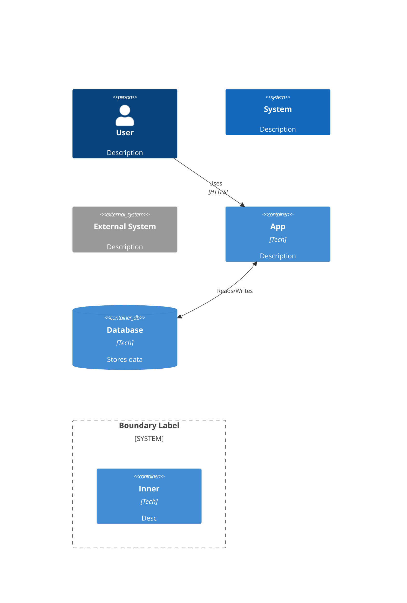

# C4 Model Scout Report

**Date:** 2026-01-24
**Focus:** C4 Architecture Diagrams for Evolutionary Systems

---

## C4 LEVEL DEFINITIONS

| Level | Name | Shows | Audience |
|-------|------|-------|----------|
| **L1** | Context | System as single box + users + external systems | Everyone |
| **L2** | Container | Applications, databases, microservices within system | Technical team |
| **L3** | Component | Internal structure within a single container | Developers |
| **L4** | Code | Class diagrams, UML (rarely used) | Implementers |

**Key Insight:** Most teams only need L1 (Context) and L2 (Container). L3/L4 add value only for complex containers.

---

## STABILITY PATTERNS

Visual techniques for showing unchanged components across system versions:

1. **Consistent Styling:** Use neutral colors (gray, light blue) for stable elements
2. **Explicit Labels:** Add "(unchanged)" or version annotations
3. **Boundary Grouping:** Group stable components in a "Core Services" boundary
4. **Dotted vs Solid:** Use solid borders for stable, dotted for evolving

**Mermaid approach:**
```mermaid
UpdateElementStyle(stable_component, $bgColor="gray", $borderColor="darkgray")
```

---

## CHANGE PATTERNS

Techniques for highlighting what evolved between versions:

1. **Color Coding:** Bright colors (orange, green) for new/changed elements
2. **"NEW" Labels:** Append "(new)" or "(v2)" to element descriptions
3. **Separate Boundaries:** Group changes in "New Capabilities" boundary
4. **Side-by-Side:** Create before/after diagrams at same abstraction level

**Visual Legend Convention:**
- Gray = Stable/Unchanged
- Green = New Addition
- Orange = Modified
- Red = Deprecated/Removed

---

## MERMAID C4 SYNTAX

### Diagram Types
```
C4Context    # Level 1 - System Context
C4Container  # Level 2 - Containers
C4Component  # Level 3 - Components
C4Dynamic    # Sequence flows
```

### Core Elements


### Styling for Evolution
```mermaid
UpdateElementStyle(new_component, $bgColor="#90EE90", $fontColor="black")
UpdateElementStyle(stable_component, $bgColor="#D3D3D3")
UpdateRelStyle(from, to, $lineColor="green", $textColor="green")
```

---

## SOURCES

- [C4 Model Official](https://c4model.com/)
- [Mermaid C4 Syntax](https://mermaid.js.org/syntax/c4.html)
- [C4 Model Wikipedia](https://en.wikipedia.org/wiki/C4_model)
